[TOC]


# 滑动窗口

## 239、滑动窗口的最大值

给你一个整数数组 nums，有一个大小为 k 的滑动窗口从数组的最左侧移动到数组的最右侧。你只可以看到在滑动窗口内的 k 个数字。滑动窗口每次只向右移动一位。

返回滑动窗口中的最大值。

示例 1：

```
输入：nums = [1,3,-1,-3,5,3,6,7], k = 3
输出：[3,3,5,5,6,7]
解释：
滑动窗口的位置                最大值

[1  3  -1] -3  5  3  6  7       3
 1 [3  -1  -3] 5  3  6  7       3
 1  3 [-1  -3  5] 3  6  7       5
 1  3  -1 [-3  5  3] 6  7       5
 1  3  -1  -3 [5  3  6] 7       6
 1  3  -1  -3  5 [3  6  7]      7

```

1、使用大顶堆（优先队列）,队列元素为键值对，每次插入新元素，并在判断最大值时弹出已经失效的元素。

```c++
class Solution {
public:

    vector<int> maxSlidingWindow(vector<int>& nums, int k) {
        auto cmp = [](const pair<int, int>& lf, const pair<int, int>& rh)
        {
            return lf.second < rh.second;
        };
        priority_queue<pair<int, int>, vector<pair<int , int>>, decltype(cmp)> queue(cmp);
        int index = 0;
        vector<int> result;
        for(int i = index; i < k; i++)
        {
            queue.push(make_pair(i, nums[i]));
        }
        result.push_back(queue.top().second);
        for(index = 1; index <= nums.size()-k; index++)
        {
            queue.push(make_pair(index + k - 1,nums[index + k - 1]));
            while(queue.top().first < index)
            {
                queue.pop();
            }
            result.push_back(queue.top().second);
        }

        return result;
    }
};
```

时间复杂度分析：每次插入一个元素需要O(logn)，遍历一遍数组需要O(n)，则时间复杂度为O(nlogn)

2、使用双端队列

一个重要的逻辑，当nums[i] < nums[j]， 且i < j 时，则i永远不可能是最大值，因此用双端队列维护一个单调队列，每次将新的元素与队尾元素比较，若队尾元素比新元素小，则该队尾元素满足前述逻辑，可以直接从队列中删除。则维护的队列中，队首是最大值。

```c++
class Solution {
public:
    vector<int> maxSlidingWindow(vector<int>& nums, int k) {
        int n = nums.size();
        deque<int> q;
        for (int i = 0; i < k; ++i) {
            while (!q.empty() && nums[i] >= nums[q.back()]) {
                q.pop_back();
            }
            q.push_back(i);
        }

        vector<int> ans = {nums[q.front()]};
        for (int i = k; i < n; ++i) {
            while (!q.empty() && nums[i] >= nums[q.back()]) {
                q.pop_back();
            }
            q.push_back(i);
            while (q.front() <= i - k) {
                q.pop_front();
            }
            ans.push_back(nums[q.front()]);
        }
        return ans;
    }
};
```

# 递归

## 带模的快速幂函数

```c++
long fastPow(int x, int n, int m)
{
    // (x ^ n) % m
    if(x == 0 || x == 1) return x;
    long ans = 1;
    x %= m;
    while(n > 0)
    {
        if(n % 2)
        {
            ans = (ans * x) % m;
        }
        
        n = n >> 1;
        x = (x * x) % m
    }
    
    return ans % m;
}
```


# 动态规划

动态规划是一种常见的**算法设计技巧**，动态规划往往遵循一种固定的流程：

**进行递归暴力求解->带备忘录的递归解法->非递归的动态规划解法**

当对一个问题进行暴力求解时，会出现许多影响算法效率的问题：

1、重叠子问题

画出递归树，可以了解到在暴力递归中有许多的节点是被重复运算的。

通过**建立备忘录**的方法，可以通过记录和查询来直接跳过已经计算的节点，对递归树进行“剪枝”。

2、最优子结构（零用钱题详解）

即如何使用已经计算好的最优子结构来减少父节点的计算量。

## 10、正则表达式匹配

<https://leetcode-cn.com/problems/regular-expression-matching/>

在本题中学习了有关动态规划的相关原理和使用技巧。

```c++
class Solution {
public:
    vector<vector<int>> dp;
    string s;
    string p;
    bool isMatch(string ss, string pp) {
        s = ss;
        p = pp;
        vector<int> ve1(pp.size()+1, -1);
        dp.resize(ss.size()+1, ve1);
        return isMatch(0, 0);
    }

    bool isMatch(int i, int j){
        bool ans;
        if(dp[i][j] != -1) 
            ans = (dp[i][j] == 1);
        else
        {
            if(j == p.size()) 
                ans = (i == s.size());
            else
            {
                auto match = (i<s.size()) && (s[i] == p[j] || p[j] == '.');
                if(j+1<p.size()&&p[j+1] == '*')
                    ans = isMatch(i, j+2) || (match && isMatch(i+1, j));
                else   
                    ans =  match && isMatch(i+1, j+1);
            }
            dp[i][j] = ans==true? 1:0;
        }
        return ans;
    }
};
```

在本题当中，在进行字符串匹配时会出现以下三种情况，设输入为f(i,j)

```
bool f(i,j)

    当前字符匹配（无论是相同还是为‘.’）
        p后一个字符为‘*’
            '*'使用0次 f(i,j+2)
            '*'使用1次 f(i+1,j)
        p后一个字符不为'*'
        	f(i+1,j+1)
```


## 279 完全平方数

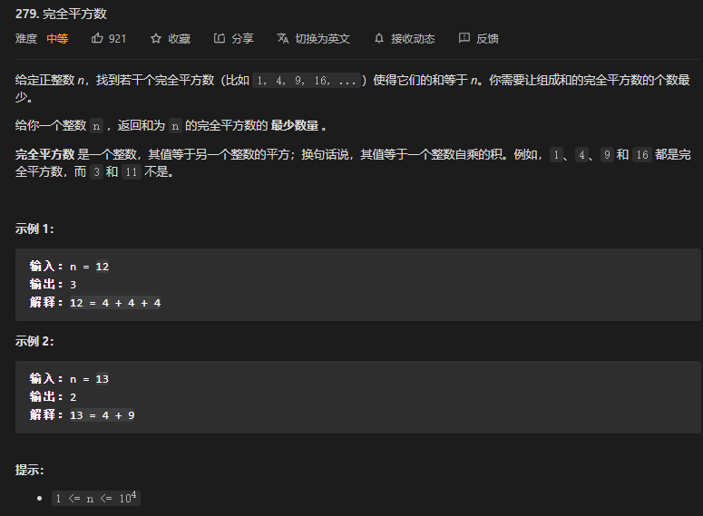

典型的动态规划问题

设`dp[i]`为和为 `i` 的完全平方数的 **最少数量**

初始状态
$$
dp[0] = 0
$$
则dp[i]可以划分为相似的子问题
$$
dp[i] = 1 + \min_{j=1}^{j \le \sqrt{i}}{dp[i-j^2]}
$$

```cpp
class Solution {
public:
    int numSquares(int n) {
        //一个数组，长度为n开方向下取整
        int len = sqrt(n);
        vector<int> dp(n+1,0);
        for(int i = 1; i <=n;i++)
        {
            int minN = n;
            for(int j = 1; j <= sqrt(i); j++)
            {
                minN = min(minN, dp[i - j*j]);
            }
            dp[i] = 1 + minN;
        }

        return dp[n];
    }
};
```


## 322、零钱兑换

https://leetcode-cn.com/problems/coin-change/

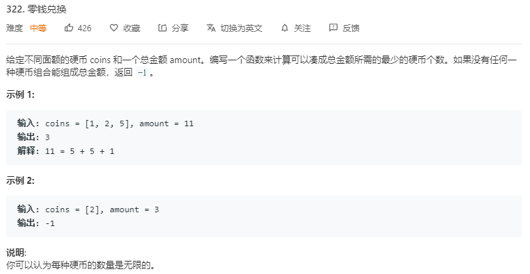

动态规划的解决方法：

1、建立递归公式

设题设函数为
$$
count = F(S)
$$
其中S为总金额，count为凑成总金额所需的最少硬币个数。

设硬币序列为
$$
[c_0, c_1, ..., c_{n-1}]
$$
则递归需要求解子公式即，当前总额枚举减去所有硬币序列中的硬币后的总额的最少硬币数+1。
$$
count = \min_{i=0\to{n-1}}F(S-c_i) + 1, S-c_i>0
$$

$$
count = 0, when\  S=0
$$

$$
count = -1, when\  n=0
$$


2、建立备忘录削减无效分支计算

```c++
class Solution {
public:
    vector<int> count;	//建立一个容器用作备忘录
    int dp(vector<int>& coins, int amount)
    {
        if(amount<0) return -1;	//当前硬币不能用作凑整
        if(amount == 0) return 0;	//当前硬币已成功凑整
        if(count[amount] != 0) return count[amount];	//该分支已存在于备忘录中

        int Min = INT_MAX;
        int res = 0;
        vector<int>::iterator it;
        for(it = coins.begin(); it != coins.end(); it++)
        {
            res = dp(coins, amount-*it);	//枚举所有硬币并计算其子分支
            if(res >= 0 && res < Min)
            {
                Min = res + 1;	//若子分支最优解有效则更新当前分支最小值
            }
        }
        count[amount] = Min == INT_MAX ? -1 : Min;	
        return count[amount];	//返回当前分支最小值


    }
    int coinChange(vector<int>& coins, int amount) {
        int n = coins.size();
        if(n==0) return -1;
        count.resize(amount+1, 0);
        return dp(coins, amount);

        
    }
};
```

动态规划的最终结果并不优秀，本题还有采用贪心算法+深度优先搜索（dfs）的更好解决方法。


## 474 ones and zeros

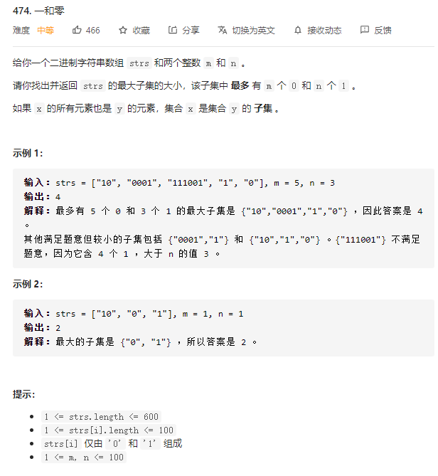

与背包问题十分相似，背包问题是一个二维的dp，包括物品和重量。该题则是有两个限制条件，是一个三维的dp

`dp[i][j][k]`表示前i个字符串包含j个0,k个1的最大子集大小。

那么对于第i个字符串，设其0数量为zeros，1数量为ones

则当`j < zeros || k < ones`，第i个字符串不能取

当`j >= zeros && k >= ones`，第i个字符串可以取也可以不取，满足如下公式


$$
dp[i][j][k] = \begin{cases}
dp[i-1][j][k], j < zeros | k < ones\\
max(dp[i-1][j][k], dp[i-1][j-zeros][k-ones]), j >= zeros & k >= ones \\
\end{cases}
$$


同时因为dp[i]只和dp[i-1]有关，可以优化掉一个维度

```cpp
class Solution {
public:
    vector<int> getZerosOnes(string& str) {
        vector<int> zerosOnes(2);
        int length = str.length();
        for (int i = 0; i < length; i++) {
            zerosOnes[str[i] - '0']++;
        }
        return zerosOnes;
    }

    int findMaxForm(vector<string>& strs, int m, int n) {
        int length = strs.size();
        vector<vector<vector<int>>> dp(length + 1, vector<vector<int>>(m + 1, vector<int>(n + 1)));
        for (int i = 1; i <= length; i++) {
            vector<int>&& zerosOnes = getZerosOnes(strs[i - 1]);
            int zeros = zerosOnes[0], ones = zerosOnes[1];
            for (int j = 0; j <= m; j++) {
                for (int k = 0; k <= n; k++) {
                    dp[i][j][k] = dp[i - 1][j][k];
                    if (j >= zeros && k >= ones) {
                        dp[i][j][k] = max(dp[i][j][k], dp[i - 1][j - zeros][k - ones] + 1);
                    }
                }
            }
        }
        return dp[length][m][n];
    }
};
```

空间复杂度：O(lmn + L)

时间复杂度：O(mn)


## 494 Target Sum

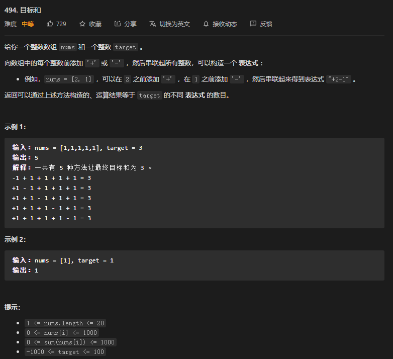

这题可以用暴力的回溯法完成，其时间复杂度为`O(2^n)`

使用动态规划完成，该题可以转化为典型的背包问题。

背包问题是在一系列元素中选择某些元素，达到目标结果。

该题初看需要选择为元素添加+或者-，但实际上只有两种选择，因此可以只选择哪些元素为-，剩下的就都是+

如此转化为背包问题。

设数组的总和为`sum`，标记为-的元素和为`neg`，注意neg只是标记为负号，不是负数。

那么满足下式
$$
(sum - neg) - neg = target
$$

$$
neg = (sum - target) / 2
$$

推到状态转移方程

`dp[i][j]`表示前i个元素中，和为j的不同表达式的数目。

起始状态，i = 0时，没有任何元素可以选取时，元素和只能是0，且只有一种方案数
$$
dp[0][j] = \begin{cases}
1, j = 0 \\
0, j >= 1 \\
\end{cases}
$$
转移方程
$$
dp[i][j] = \begin{cases}
dp[i-1][j], j < nums[i] \\
dp[i-1][j] + dp[i-1][j - nums[i]], j >= nums \\
\end{cases}
$$
最后，因为`dp[i][]`只与`dp[i-1][]`有关，因此可以使用滚动数组的方法来减小空间复杂度

```cpp
class Solution {
public:
    int findTargetSumWays(vector<int>& nums, int target) {
        int sum = 0;
        for(auto &num : nums)
        {
            sum += num;
        }
        int diff = sum - target;
        if(diff < 0 || diff % 2 != 0)
        {
            return 0;
        }

        int neg = diff/2;

        vector<int> dp(neg+1, 0);
        dp[0] = 1;

        for(auto num : nums)
        {
            for(int j = neg; j >= num; j--)
            {
                dp[j] += dp[j-num];
            }
        }

        return dp[neg];
    }
};
```

## 518 零钱兑换Ⅱ

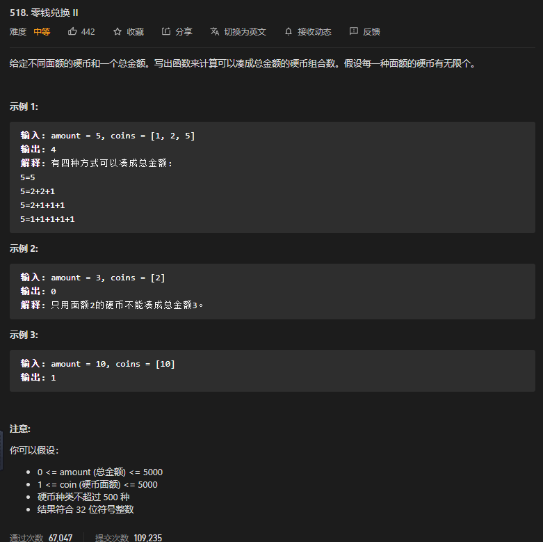

背包问题，区别在于每个元素可以选用无数次

`dp[i]`表示金额之和为x的组合数，目标为求`dp[amount]`

```cpp

class Solution {
public:
    int change(int amount, vector<int>& coins) {
        vector<int> dp(amount + 1);
        dp[0] = 1;
        for (int& coin : coins) {
            for (int i = coin; i <= amount; i++) {
                dp[i] += dp[i - coin];
            }
        }
        return dp[amount];
    }
};
```


## 879 盈利计划

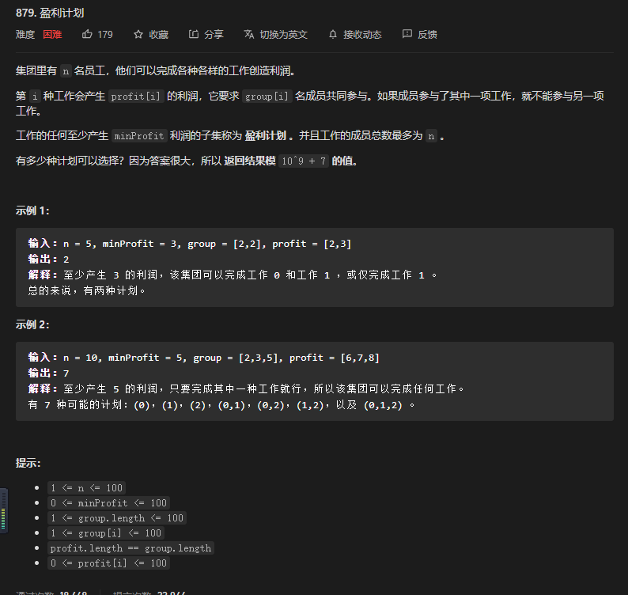

背包问题，三维dp

`dp[i][j][k]`表示前i种工作，工作成员总数j，产生k利润的计划总数

工作总数`len`则最后结果为
$$
\sum_{i=0}^n{dp[len][i][minProfit]}
$$
初始状态：

`dp[0][0][0] = 1`

状态转移方程

相关的解释：

第一种情况，当前可以用的人数上限不足以完成第i个工作，则不会新增计划。

当前工作可以安排时，减少可用人数上限，注意因为要求时至少盈利，当盈利超过时也满足要求，因此是`max(0, k-profit[i])`
$$
dp[i][j][k] = \begin{cases}
dp[i-1][j][k], j < group[i]\\
dp[i-1][j][k] + dp[i-1][j-group[i]][max(0, k-profit[i])], j >= group[i] \\
\end{cases}
$$

```cpp
class Solution {
public:
    int profitableSchemes(int n, int minProfit, vector<int>& group, vector<int>& profit) {
        int len = group.size(), MOD = (int)1e9 + 7;
        vector<vector<vector<int>>> dp(len + 1, vector<vector<int>>(n + 1, vector<int>(minProfit + 1)));
        dp[0][0][0] = 1;
        for (int i = 1; i <= len; i++) {
            int members = group[i - 1], earn = profit[i - 1];
            for (int j = 0; j <= n; j++) {
                for (int k = 0; k <= minProfit; k++) {
                    if (j < members) {
                        dp[i][j][k] = dp[i - 1][j][k];
                    } else {
                        dp[i][j][k] = (dp[i - 1][j][k] + dp[i - 1][j - members][max(0, k - earn)]) % MOD;
                    }
                }
            }
        }
        int sum = 0;
        for (int j = 0; j <= n; j++) {
            sum = (sum + dp[len][j][minProfit]) % MOD;
        }
        return sum;
    }
};
```

又因为`dp[i][][]`只与`dp[i-1][][]`有关，因此可以进行空间复杂度优化，并更改遍历顺序为逆序

```cpp
class Solution {
public:
    int profitableSchemes(int n, int minProfit, vector<int>& group, vector<int>& profit) {
        vector<vector<int>> dp(n + 1, vector<int>(minProfit + 1));
        for (int i = 0; i <= n; i++) {
            dp[i][0] = 1;
        }
        int len = group.size(), MOD = (int)1e9 + 7;
        for (int i = 1; i <= len; i++) {
            int members = group[i - 1], earn = profit[i - 1];
            for (int j = n; j >= members; j--) {
                for (int k = minProfit; k >= 0; k--) {
                    dp[j][k] = (dp[j][k] + dp[j - members][max(0, k - earn)]) % MOD;
                }
            }
        }
        return dp[n][minProfit];
    }
};
```


## 714、[Best Time to Buy and Sell Stock with Transaction Fee](https://leetcode-cn.com/problems/best-time-to-buy-and-sell-stock-with-transaction-fee/)

use two state equations

1. dp1[i] means Maximum profit without holding stock at i

There are two situations，without holding stock at i-1 , or holding stock at i-1 and sell stock at i.
$$
dp1[i] = max(dp1[i-1], dp2[i-1] + prices[i] - fee)
$$


2. dp2[i] means Maximum profit with holding stock at i

Also Two situations, holding stock at i-1, or without holding stock at i-1 and buy stock at i
$$
dp2[i] = max(dp2[i-1], dp1[i-1] - prices[i])
$$


Initialization
$$
dp1[i] = 0
$$

$$
dp2[i] = -1 * prices[0]
$$


result: $dp1[n-1]$

```c++
class Solution {
public:
    int maxProfit(vector<int>& prices, int fee) {
        vector<int> dp1(prices.size(), 0);
        vector<int> dp2(prices.size(), 0);
        dp1[0] = 0;
        dp2[0] = -1 * prices[0];

        for(int i = 1; i < prices.size(); i++)
        {
            dp1[i] = max(dp1[i-1], dp2[i-1] + prices[i] - fee);
            dp2[i] = max(dp2[i-1], dp1[i-1] - prices[i]);
        }

        return dp1[prices.size() - 1];
    }
};
```


## 983、 [Minimum Cost For Tickets](https://leetcode-cn.com/problems/minimum-cost-for-tickets/)

```c++
class Solution {
public:
    int mincostTickets(vector<int>& days, vector<int>& costs) {
        int dp[366];
        int Mincost = 0;
        int cost2 = 0;
        int cost3 = 0;
        int n = 0;
        for(; n < days[0]; n++)
        {
            dp[n] = 0;
        }
        Mincost = costs[0] < costs[1] ? costs[0] : costs[1];
        Mincost = Mincost < costs[2] ? Mincost : costs[2];
        dp[days[0]] = Mincost;
        for(int i = 1; i < days.size(); i++)
        {
            for(n = n + 1;n < days[i]; n++)
            {
                dp[n] = dp[days[i-1]];
            }
            Mincost = dp[days[i-1]] + costs[0];
            if(days[i] - 7 >= 0)
            {
                cost2 = dp[days[i] - 7] + costs[1];
            }
            else
            {
                cost2 = dp[0] + costs[1];
            }
            Mincost = Mincost < cost2 ? Mincost: cost2;
            if(days[i] - 30 >= 0)
            {
                cost3 = dp[days[i] - 30] + costs[2];
            }
            else
            {
                cost3 = dp[0] + costs[2];
            }   
            Mincost = Mincost < cost3 ? Mincost: cost3;        
            dp[days[i]] = Mincost;
        }
        return dp[days.back()];
    }
};
```

典型的动态规划题

建立dp表，索引为天数。

dp[days[i]]表示旅行到目前天数所花费的最小票价

状态转换方程

$dp[days[i]] = min(dp[days[i-1]] + costs[0], dp[days[i]-7] + costs[1], dp[days[i]-30] + costs[2])$

将两天之间的所有其他未在表中出现的天数都设置为其出现的最近一天的天数的消费

## 1049 Last Stone Weight Ⅱ

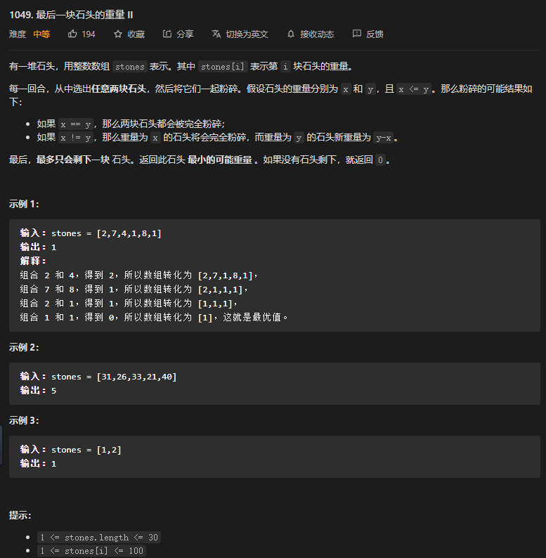

转化为背包问题

将所有石子分为两堆，两堆石子重量之和的差的最小值即最后剩下石头的最小可能重量。

则可以对石头重量取+或-，设取-的石子重量之和为neg

则找到满足`neg < sum / 2`的最大的neg，结果即`sum - 2 * neg`

那么转化为背包容量为`sum/2`的背包问题

定义`dp[i+1][j]`表示前i个石头能否凑出重量j

则初始状态

`dp[0][0] = true` 其余`dp[0][] = false`

状态转移方程
$$
dp[i+1][j] = \begin{cases}
dp[i][j], j<stones[i] \\
dp[i][j] \vee dp[i][j-stomes[i]], j >= stones[i] \\
\end{cases}
$$
求出` dp[n][] `后，所有为真的` dp[n][j] `中，最大的 j 即为` neg `能取到的最大值。代入` sum−2⋅neg `中即得到最后一块石头的最小重量。


同样可以用滚动数组来进行空间复杂度优化，倒序遍历即可

```cpp
class Solution {
public:
    int lastStoneWeightII(vector<int>& stones) {
        //该问题可以转化为将石子分成两堆的背包问题，最后剩下的最小重量就是两堆石子总和的差
        //背包容量为sum / 2
		int sum = accumulate(stones.begin(), stones.end(), 0);
        int n = stones.size();
        int m = sum / 2;

        vector<int> dp(m+1, 0);
        dp[0] = true;
        for(auto &stones : stones)
        {
            for(int j = m; j >=0; j--)
            {
                dp[j] = dp[j] || dp[j-stone];
            }
        }
        
        for (int j = m;; --j) {
            if (dp[j]) {
                return sum - 2 * j;
            }
        }   
    }
};
```


# 中位数

中位数表示一个序列中，小于其的数量与大于其的数量相同的数。

双堆寻找中位数，对顶堆，用一个最大堆lo和一个最小堆hi，最大堆包含所有较小的数字，最小堆包含所有较大的数字，两个堆保持平衡`lo.size() - hi.size()∈[0,1] `，当两者大小相同时，中位数为两个堆顶的的均值，当最大堆大小比最小堆大小大1时，中位数为最大堆的堆顶。


如何维持两个堆的相对平衡：

1、将num添加到最大堆lo，将lo的堆顶移交给hi

2、如果经过上述步骤后hi数量比lo多，则将hi的堆顶给lo


## 295、数据流的中位数

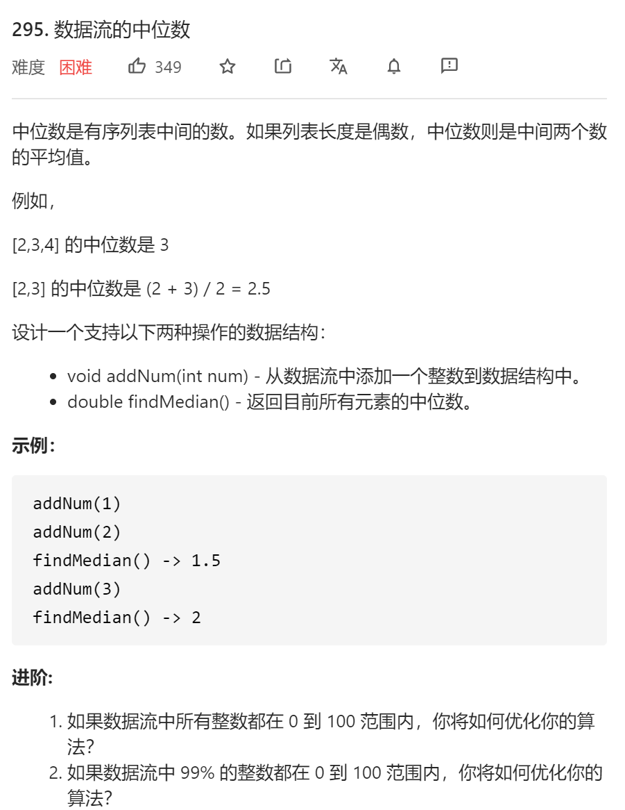

```c++
class MedianFinder {
public:
    /** initialize your data structure here. */
    MedianFinder() {

    }
    
    void addNum(int num) {
		lo.push(num);
        
        hi.push(lo.top());
        lo.pop();
        
        if(hi.size() > lo.size())
        {
            lo.push(hi.top());
            hi.pop();
        }
    }
    
    double findMedian() {
		if(hi.size() == lo.size())
        {
            return (lo.top() + hi.top()) * 0.5;
        }
        else
        {
            return lo.top();
        }
    }
private:
    priority_queue<int> lo;	//max heap
    priority_queue<int, vector<int>, greater<int>> hi; //min heap
};

/**
 * Your MedianFinder object will be instantiated and called as such:
 * MedianFinder* obj = new MedianFinder();
 * obj->addNum(num);
 * double param_2 = obj->findMedian();
 */
```


# 哈希表

哈希表(Hash Table)也叫做散列表，是根据**键(Key)**而直接访问在内存存储位置的数据结构。其通过计算一个关于键值的函数，将所需查询的数据映射到表中的一个位置来访问记录。这个映射函数叫做**哈希函数**，存放记录的数组叫做**哈希表**。

哈希表对数据的插入、删除和查到的时间为O(1)，哈希表不保证表中数据的有序性，从中查找最大数据或最小数据的时间是O(N)。


## 3.无重复字符的最长子串

https://leetcode-cn.com/problems/longest-substring-without-repeating-characters/

哈希表的查找实现，判断新字符是否在表中存在

用start和end标识目前字符串形成hash表，通过查找end+1的字符是否在表中来进行判断是否重复。


## 146. LRU实现 hash+双向链表

Least Recently Used

最近最少使用缓存

使用一个哈希表+一个双向链表来实现

- 其中双向链表按照被使用的顺序存储键值对，靠近头部的是最近使用的，靠近尾部的是最久未使用的
- 哈希表建立映射，通过缓存数据的键映射其在双向链表中的位置


其原理就是使用哈希表来定位，然后将其移动到双向链表的头部。完成get和put操作

- get操作
  - 首先判断key是否存在
    - 不存在返回-1
    - 存在，则key对应的结点移动到双向链表头部
- put操作
  - 如果key不存在，创建一个新的结点，在双向链表头部添加节点。然后判断链表是否超出容量，超出则删除尾部节点，并删除哈希表中的项。
  - 如果key存在，则使用哈希表定位后将其移动到双向链表头部。


```c++
struct DLinkNode{
    int key;
    int val;
    DLinkNode *next;
    DLinkNode *pre;
    
    DLinkNode() : key(0), val(0), next(nullptr), pre(nullptr){}
    
    DLinkNode(int key_, int val_) : key(key_), val(val_), next(nullptr), pre(nullptr){}
};

class LRUCache{
public:
	LRUCache(int capacity) :
    m_cap(capacity),
    m_size(0),
    m_head(nullptr),
    m_tail(nullptr)
    {
        
    }
    
    int get(int key)
    {
        //1.如果key不存在，返回-1
        if(m_map.find(key) == m_map.end())
        {
            return -1;
        }
        else
        {
            DLinkNode* node = m_map[key];
            //将其移动到链表首部
            moveNodeToHead(node);
        }
    }
    
    void put(int key, int val)
    {
        //1.已经存在，则直接移到头部
        if(m_map.find(key) != m_map.end())
        {
            moveNodeToHead(m_map[key]);
            return m_map[key]->val;
        }
        else
        {
            if(m_size >= m_cap)
            {
                //删除尾部节点
                m_map.erase(m_tail[key]);
                if(m_tail == m_head)
                {
                    delete m_tail;
                    m_tail = nullptr;
                    m_head = nullptr;
                }
                else
                {
                    DLinkNode *node = m_tail;
                    m_tail = m_tail->pre;
                    m_tail->next = nullptr;
                    delete node;
                }
                m_size--;      
            }
            
            //插入到头部
            createNewNodeAtHead(key, val);
        }
    }
    
private:
    unordered_map<int, DLinkNode*> m_map;
    int m_cap;
    int m_size;
    DLinkNode *m_head;
    DLinkNode *m_tail;
    
    void moveNodeToHead(DLinkNode *node)
    {
        //1.已经是头部
        if(node != m_head)
        {
            node->pre->next = node->next;
            if(node == m_tail)
            {
                m_tail = m_tail->pre;
            }
            else
            {
                node->next->pre = node->pre;
            }
            
            node->pre = nullptr;
            node->next = m_head;
            m_head->pre = node;
            m_head = node;
        }
		
    }
    
    void createNewNodeAtHead(int key, int val)
    {
        DLinkNode* node = DLinkNode(key, val);
        m_map[key] = node;
        m_size++;
        if(m_head == nullptr)
        {
            m_head = node;
            m_tail = node;
        }
        else
        {
           	m_head->pre = node;
            node->next = m_head;
            m_head = node;
        }
        return;
    }
}
```

## 525 连续数组

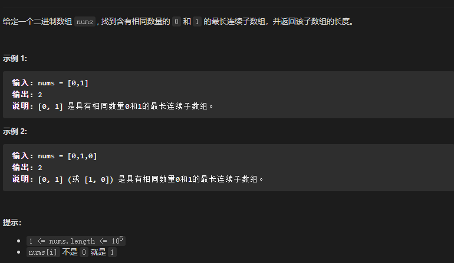


使用哈希表和前缀和

维护一个前缀和preSum，其值为num(0) - num(1)，其键为改前缀和第一次出现的下标位置。

公式如下，设从0到i的区间内，0的数量为ai，1的数量为bi，则preSumi = ai - bi，

同理，从0到j的区间内，0的数量为aj，1的数量为bj，则preSumj = aj - bj，

当满足preSumi == preSumj时，即有ai+aj == bi + bj

那么通过哈希表，即可得到最长的连续子数组，代码如下

```cpp
class Solution {
public:
    int findMaxLength(vector<int>& nums) {
        //使用哈希表，前缀和，键为num(0) - num(1)，值为下标，
        //若m[i]已经有值，说明该值到当前下标段满足条件，每次只记录最左侧的下标

        unordered_map<int ,int> m;
        int preSum = nums[0] == 0 ? 1 : -1;
        m[0] = -1;
        m[preSum] = 0;
        int maxLen = 0;

        for(int i = 1; i < nums.size(); i++)
        {
            preSum = nums[i] == 0 ? (preSum + 1) : (preSum - 1);
            if(m.find(preSum) != m.end())
            {
                maxLen = max(maxLen, i - m[preSum]);
            }
            else
            {
                m[preSum] = i;
            }
        }
        return maxLen;
    }
};
```

# 双指针

## 160 相交链表

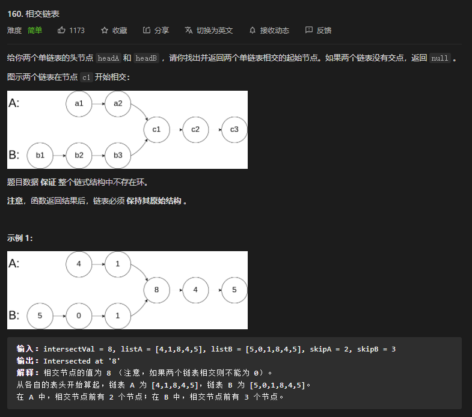

假设链表A的不重复长度为a，链表B的不重复长度为b，两链表的重复长度为c，

则遍历一遍A的长度为a+c，遍历一遍B的长度为b+c

当A到达结尾后，从B的头部开始继续遍历长度b，则最终遍历长度为a+b+c

同理B也一样，两个链表同时遍历长度a+b+c，并且会到达第一个相同节点。

当没有相同节点时，即c等于0，最终会同时到达链表结尾null

```cpp
class Solution {
public:
    ListNode *getIntersectionNode(ListNode *headA, ListNode *headB) {
        ListNode* pA = headA;
        ListNode* pB = headB;

        while(pA != pB)
        {
            if(pA->next == nullptr && pB->next == nullptr)
            {
                return nullptr;
            }
            
            if(pA->next != nullptr)
            {
                pA = pA->next;
            }
            else
            {
                pA = headB;
            }

            if(pB->next != nullptr)
            {
                pB = pB->next;
            }
            else
            {
                pB = headA;
            }
        }

        return pA;
    }
};
```


# 广度优先搜索


广度优先搜索也成为宽度优先搜索，其策略为先生成的节点先扩张。在广度优先搜索中，树上的结点根据它们在树种的层次被搜索。

广度优先搜素的步骤：

1. 从队列头取出一个结点，检查它按照扩展规则是否能够扩展，如果能则产生新结点到队列中。
2. 检查新生成的结点是否已在队列中存在，如果已存在则放弃该结点返回（1）
3. 检查新结点是否目标结点，是则搜索成功程序结束，不是则回到（1），继续取出结点。


若目标结点能被找到，一次广度优先搜索能直接找到通向它的最佳路径，因此广度优先搜索算法特别适用于只需求出最优解的问题。

广度优先搜索算法的框架一般如下：

```C++
void BFS()
{
	队列初始化;
	初始结点入队列;
	while(队列非空)
	{
		队列头元素出队，赋给current;
		while(current还可以扩展)
		{
			由结点current扩展出新结点new;
			if(new重复于已有结点状态) continue;
			new结点入队;
			if(new是目标结点)
			{
				flag=tue;
				break;
			}
		}
	}
}
```

## 994、腐烂的橘子

使用多源广度优先搜索算法解答，在初始队列中放入多个源节点。

# 深度优先搜索


典型的深搜，固定深度为k，通过输入建图。

```cpp
public:
    int result = 0;
    void dfs(vector<vector<int>> &pic, int depth, int k, int n, int no)
    {
        // cout << depth << ", " << no << endl; 
        if(depth == k)
        {
            if(no == n-1)
                result++;
            return;
        }

        for(int i = 0; i < n; i++)
        {
            if(pic[no][i])
                dfs(pic, depth+1, k, n, i);
        }
        return;
    }

    int numWays(int n, vector<vector<int>>& relation, int k) {
        //图论，深度优先搜索，深度k时停止
        vector<vector<int>> pic(n, vector<int>(n,0));
        //构造二维数组
        for(auto &re : relation)
        {
            pic[re[0]][re[1]] = 1;
        }

        dfs(pic, 0, k, n, 0);
        return result;
    }
};
```


# 二分查找


278 第一个错误的版本

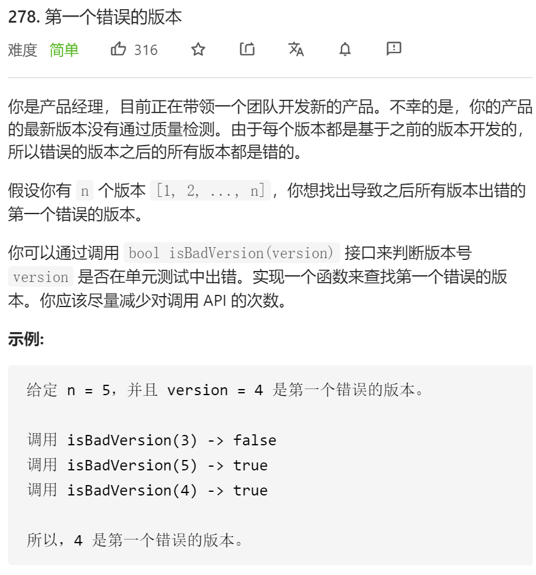

```cpp
// The API isBadVersion is defined for you.
// bool isBadVersion(int version);

class Solution {
public:
    int firstBadVersion(int n) {
        int start = 1;
        int end = n;
        
        int mid;
        while(start <= end)
        {
            mid = start + (end - start)/2;
            if(isBadVersion(mid))
            {
                if(mid == 1 || !isBadVersion(mid-1))
                {
                    break;
                }
                else
                {
                    end = mid; 
                }
            }
            else
            {
                start = mid + 1;
            }
        }

        return mid;
    }
};
```

简单二分法

# 栈

## 160 相交链表


时间复杂度O(n+m)

空间复杂度O(n+m)

```cpp
class Solution {
public:
    ListNode *getIntersectionNode(ListNode *headA, ListNode *headB) {
        //栈
        stack<ListNode*> stA, stB;

        ListNode* pA = headA;
        ListNode* pB = headB;

        while(pA)
        {
            stA.push(pA);
            pA = pA->next;
        }

        while(pB)
        {
            stB.push(pB);
            pB = pB->next;
        }

        ListNode *startNode = nullptr;
        while(!stA.empty() && !stB.empty())
        {
            if(stA.top() == stB.top())
            {
                startNode = stA.top();
                stA.pop();
                stB.pop();
            }
            else
            {
                break;
            }
        }

        return startNode;
    }
};
```


# 链表

## 203 Remove Linked List Elements

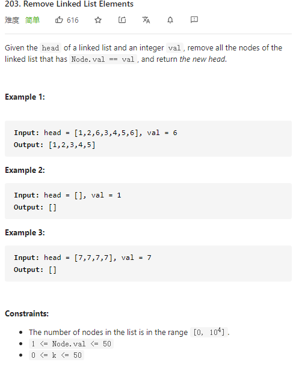

只需要注意当删除的结点是头结点的情况即可。可以通过创建一个伪头部来实现。

```cpp
class Solution {
public:
    ListNode* removeElements(ListNode* head, int val) {
        //1.remove the head
        //2.remove others

        ListNode preHead(0, head);

        ListNode* p = &preHead;

        while(p->next)
        {
            if(p->next->val == val)
            {
                p->next = p->next->next;
            }
            else
            {
                p = p->next;
            }
        }

        return preHead.next;
    }
};
```


# 位运算

# 排序

排序算法是使用性非常广泛的一种算法，通常对排序算法的评估有两个方面

1、**时间复杂度**：算法在处理大量数据时，总的时间效率

2、**稳定性**：在经过排序操作后，原序列中相同元素的顺序是否改变

通常待排序序列中的元素由关键字和其他数据两个部分组成，而排序算法就是根据一定的关键字顺序对序列进行排序。

> 在本文中以int数组作为典型的排序元素

在排序算法中常使用的子函数

```c
//交换两个元素的位置
int mySwap(int *pa, int *pb)
{
    int tmp = *pa;
    *pa = *pb;
    *pb = tmp;
}


```


## 冒泡排序

冒泡排序是最简单的暴力求解法，

1. 从序列尾部开始，两两比较相邻的元素，若不符合顺序则交换位置
2. 直到头部使最小的元素冒泡到头部，开始下一次循环直到第二小的元素冒泡到第二个位置
3. 重复过程直到全部排序完成

```c
void BubbleSort(int array[], int size)
{
    for(int i=0;i<size;i++)
    {
        //通过标记位来优化最优时间复杂度为O(N)
        bool skip = true;
        for(int j=size-1;j>i;j--)
        {
            if(array[j]<array[j-1])
            {
                mySwap(&array[j], &array[j-1]);
                skip = false;
            }
        }
        
        if(skip){
            return;
        }
    }
}
//时间复杂度：O(N^2)
//稳定性：稳定
```


## 选择排序

选择排序(Selection-sort)是一种简单直观的排序算法。它的工作原理：首先在未排序序列中找到最小（大）元素，存放到排序序列的起始位置，然后，再从剩余未排序元素中继续寻找最小（大）元素，然后放到已排序序列的末尾。以此类推，直到所有元素均排序完毕。 

**算法描述**

n个记录的直接选择排序可经过n-1趟直接选择排序得到有序结果。具体算法描述如下：

1. 初始状态：无序区为R[1..n]，有序区为空；
2. 第i趟排序(i=1,2,3…n-1)开始时，当前有序区和无序区分别为R[1..i-1]和R(i..n）。该趟排序从当前无序区中-选出关键字最小的记录 R[k]，将它与无序区的第1个记录R交换，使R[1..i]和R[i+1..n)分别变为记录个数增加1个的新有序区和记录个数减少1个的新无序区；
3. n-1趟结束，数组有序化了。

```c
void SelectSort(int array[], int size)
{
    for(int i=0;i<size;i++)
    {
        int minIndex = i;
        for(int j=i+1;j<size;j++)
        {
            if(array[j] < minIndex)	//寻找最小的数
            {
                minIndex = j;	//保存最小的数的索引
            }
        }
        mySwap(&array[i], &array[minIndex]);
    }
}
//时间复杂度：O(N^2)
//稳定性：不稳定
```


## 插入排序

插入排序的基本思想是将一个记录插入到已经排序好的有序表中，从而得到一个新的记录数加1的有序表。

最优时间复杂度`O(N)`，数组已排好序

**算法描述**

一般来说，插入排序都采用in-place在数组上实现。具体算法描述如下：

1. 从第一个元素开始，该元素可以认为已经被排序；
2. 取出下一个元素，在已经排序的元素序列中从后向前扫描；
3. 如果该元素（已排序）大于新元素，将该元素移到下一位置；
4. 重复步骤3，直到找到已排序的元素小于或者等于新元素的位置；
5. 将新元素插入到该位置后；
6. 重复步骤2~5。

```c
void InsertionSort(int array[],int size)
{
    for(int i=1;i<size;i++)//默认首元素为一个序列
    {
        for(int j=0;j<i;j++)
        {
            for(j=i-1;j>=0;j--)	//找到i可以插入的位置j,将其插入到j+1的位置
            {
                if(array[j]<=array[i])
                    break;
            }
            if(j!=i-1)	//无需插入
            {
                int temp = array[i];	//记录当前值
                for(int k=i;k>j+1;k--)	//将j+1~i-1的元素依次往后移到j+1~i
                {
                    array[k] = array[k-1];
                }
                array[j+1] = temp;
            }
        }
    }
}
```


## 归并排序

**分治法、递归**

归并排序是建立在归并操作上的一种有效的排序算法。该算法是采用分治法（Divide and Conquer）的一个非常典型的应用。将已有序的子序列合并，得到完全有序的序列；即先使每个子序列有序，再使子序列段间有序。若将两个有序表合并成一个有序表，称为2-路归并。 

**算法描述**

1. 把长度为n的输入序列分成两个长度为n/2的子序列；
2. 对这两个子序列分别采用归并排序；
3. 将两个排序好的子序列合并成一个最终的排序序列。


```c
#define ArrLen 20

void merge(int arr[], int start, int mid, int end) 
{
	int result[ArrLen];
	int k = 0;
	int i = start;
	int j = mid + 1;
	while (i <= mid && j <= end) {
		if (arr[i] < arr[j]){
			result[k++] = arr[i++];
        }
		else{
			result[k++] = arr[j++];
        }
	}
	if (i == mid + 1) {
		while(j <= end)
			result[k++] = arr[j++];
	}
	if (j == end + 1) {
		while (i <= mid)
			result[k++] = arr[i++];
	}
	for (j = 0, i = start ; j < k; i++, j++) {
		arr[i] = result[j];
	}
}
 
void mergeSort(int arr[], int start, int end) {
    //功能，对从start->end区间内数组进行排序
	if (start >= end)
		return;
	int mid = ( start + end ) / 2;
    
	mergeSort(arr, start, mid);	//对左半边排序
    
	mergeSort(arr, mid + 1, end);	//对右半边排序
    
    
    //左右全部各自排序好
    
	merge(arr, start, mid, end);
}

```


## 快速排序

本质是分治算法，时间复杂度


### 1. 算法步骤

1. 从数列中挑出一个元素，称为 "基准"（pivot）;
2. 重新排序数列，所有元素比基准值小的摆放在基准前面，所有元素比基准值大的摆在基准的后面（相同的数可以到任一边）。在这个分区退出之后，该基准就处于数列的中间位置。这个称为分区（partition）操作；
3. 递归地（recursive）把小于基准值元素的子数列和大于基准值元素的子数列排序；

```cpp
void QuickSort(vector<int> arr, int left, int right){
    if(left < right){
        int pivot = Paritition(arr, left, right);
        QuickSort(arr, left, pivot - 1);
        QuickSort(arr, pivot + 1, right);
    }
}

int Paritition(vector<int> arr, int left, right){
    int pivot = arr[left];
    while(left < right){
        while(left < right && arr[right] >= pivot){
            right--;
        }
        arr[left] = arr[right];
        while(left < right && arr[left] <= pivot){
            left++;
        }
        arr[right] = arr[left];
    }
    arr[left] = pivot;
    return left;
}
```


## 堆排序

```c++
#include <iostream>
#include <vector>
#include <algorithm>

using namespace std;

template <typename Type>
class Heap
{
public:
    Heap(const vector<Type> &array_)
    {
        m_array.assign(array_.begin(), array_.end());
    }

    template <typename Compare>
    void Sort(Compare cmp);

    void PrintArray(const vector<Type> &array_);

private:
    vector<Type> m_array;

    template <typename Compare>
    void HeapAdjust(int i, Compare cmp);

    template <typename Compare>
    void CreateHeap(Compare cmp);
};

template <typename Type>
void Heap<Type>::PrintArray(const vector<Type> &array_)
{
    for(size_t i = 0; i < array_.size(); i++)
    {
        cout << array_[i] << " ";
    }
    cout << endl;
}

template <typename Type>
template <typename Compare>
void Heap<Type>::Sort(Compare cmp)
{
    cout << "before sort : " << endl;
    PrintArray(m_array);

    CreateHeap(cmp);
    vector<Type> arrayTmp;
    for(int i = m_array.size() - 1; i >= 0; i--)
    {
        arrayTmp.push_back(m_array[0]);
        swap(m_array[0], m_array[i]);
        m_array.pop_back();

        HeapAdjust(0, cmp);
    }

    m_array = std::move(arrayTmp);
    cout << "after sort : " << endl;
    PrintArray(m_array);
}

template <typename Type>
template <typename Compare>
void Heap<Type>::CreateHeap(Compare cmp)
{
    for(int i = m_array.size()/2 - 1; i >= 0; i--)
    {
        HeapAdjust(i, cmp);
    }
}

template <typename Type>
template <typename Compare>
void Heap<Type>::HeapAdjust(int i, Compare cmp)
{
    Type temp = m_array[i];
    for(size_t k = 2*i+1; k < m_array.size(); k = 2*k+1)
    {
        if(k+1 < m_array.size() && cmp(m_array[k+1], m_array[k]))
        {
            k++;
        }

        if(cmp(m_array[k], temp))
        {
            m_array[i] = m_array[k];
            i = k;
        }
        else
        {
            break;
        }
    }

    m_array[i] = temp;
}

int main()
{
    vector<int> array;
    for (int i=10; i<20; i++)
    {
        array.push_back(i);
    }
    random_shuffle(array.begin(), array.end());//打乱顺序
    Heap<int> heap(array);
    heap.Sort(less<int>());
    heap.Sort(greater<int>());
    return 0;
}
```

## 外部排序

以上内容都是内部排序，何为内部排序，计算机内部一般有两种存储器：内存储器（主存）和外存储器（辅存）。内存信息可随机读取，存取速度快，但价格贵，容量小。外存通常有**磁带和磁盘**两种，磁带只可顺序读取，磁盘可随机读取（伪，通过磁头的移动来选择磁道，选择好磁道后仍然要等待磁盘旋转到指定位置）通常等待旋转的时间不会超过25ms。

外部排序的基本方法：

1. 按可用内存大小，将外存上含m个记录的文件分成若干长度为l的段，依次读入内存，并进行内部排序后重新写入外存。
2. 通过归并段进行多路归并排序，得到整个有序文件。


k路归并方法，**败者树**

设目前有k个已经排序好的归并段，设`b[i]`，为第i个归并段的首个元素。

设败者树ls，败者树是完全二叉树结构，不含叶子节点，可以采用顺序存储结构。


以下解释：

1. 下方有5个归并段等待参加5路归并排序，每个归并段的首个元素作为败者树的**叶子节点（方形节点）**参加比赛
2. 败者树的**节点值**代表该节点的孩子节点中的**败者所在的归并段**，如ls[4]的值4表示其孩子节点中的败者为b4。
3. 胜者作为新的参赛者进入败者树的上一层参加比赛，直至最后得到ls[0]即为此次归并的冠军（最小\大值）
4. 将ls[0]添加到已排序队列的末尾，从ls[0]所在的归并段选择新的元素进入叶子节点，并重新比赛。

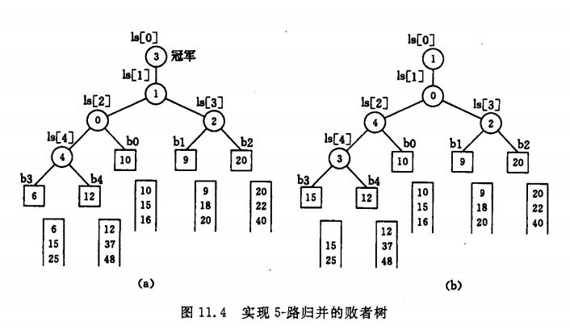

```c++

```

> 疑问：这不就是堆排序么？用每个归并段的首个元素建堆，将堆顶元素弹出，并用堆顶元素所在归并段的下一个元素替换，重新调整。

# 数组

#### **大数乘法**

开数组，A[i]和B[j]的结果放在result[i+j]的位置，最后处理进位

```c++
#include <iostream>
#include <vector>
using namespace std;

string multi(string &n1, string &n2)
{
    if(n1.length() == 0) return n2;
    if(n2.length() == 0) return n1;
    
    int len1 = n1.length();
    int len2 = n2.length();
    
    int resLen = len1 + len2;
    vector<int> result_tmp(resLen, 0);
    
    for(int i = 0; i < len1; i++)
    {
        if(n1[i] - '0' < 0 || n1[i] - '0' > 9)
        {
            return "";
        }
        for(int j = 0; j < len2; j++)
        {
            if(n2[j] - '0' < 0 || n2[j] - '0' > 9)
            {
                return "";
            }
            
            result_tmp[i+j+1] += (n1[i] - '0') * (n2[j] - '0');
        }
    }
    
    int c = 0;
    for(int i = resLen-1; i>=0; i--)
    {
        result_tmp[i] += c;
        c = result_tmp[i] / 10;
        result_tmp[i] %= 10;
    }
    
    string res;
    int firstNonZero = 0;
    while(firstNonZero < resLen && result_tmp[firstNonZero] == 0) 
        firstNonZero++;
    for(int i = firstNonZero; i < resLen; i++)
    {
        res += (result_tmp[i] + '0');
    }
    if(firstNonZero == resLen)
    {
        res = "0";
    }
    return res;
    
}

int main()
{
    string n1,n2;
    cin >> n1 >> n2;
    cout << multi(n1, n2) << endl;
    
}

```


# 字符串

## 5、最长回文子串

Given a string s, find the longest palindromic substring in s. You may assume that the maximum length of s is 1000.

给定一个字符串s，找到s中最长的回文子串。 你可以假设s的最大长度为1000。


思路分析：

回文字符串有以下两种类型：`aba` 、`abba`，其区别在于回文中心为某个字符或两个字符中间。

这种典型的奇偶区分情况可以用Manacher's Algorithm（马拉车算法）整合成一种情况。


典型的Manacher's Algorithm即通过将字符串进行扩展，在字符串的开头、结尾和每个字符间穿插虚拟符号#，将奇偶字符串统一转化成奇数长度字符串。

**举个例子**
字符串s1="babad"，长度为`n=5`，下标c1范围为[0,n-1]。扩充之后为#b#a#b#a#d#，长度为m=11，下标c1范围为[0,2n]。

字符串s2="cbbd"，长度为n=4，下标c2范围为[0,n-1]，扩充之后为#c#b#b#d#。

# 状态机

## 65 有效数字

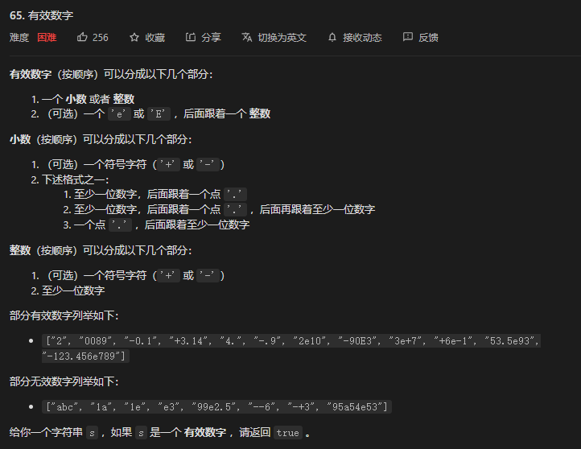

一个有效的数字包含以下状态：

1. 符号位
2. 整数部分
3. 左侧有整数的小数点
4. 左侧无整数的小数点（小数点左右至少有一侧是数字）
5. 小数部分
6. 字符e
7. 指数部分符号位
8. 指数部分的整数部分

状态机


```cpp
class Solution {
public:
    enum State {
        STATE_INITIAL,
        STATE_INT_SIGN,
        STATE_INTEGER,
        STATE_POINT,
        STATE_POINT_WITHOUT_INT,
        STATE_FRACTION,
        STATE_EXP,
        STATE_EXP_SIGN,
        STATE_EXP_NUMBER,
        STATE_END
    };

    enum CharType {
        CHAR_NUMBER,
        CHAR_EXP,
        CHAR_POINT,
        CHAR_SIGN,
        CHAR_ILLEGAL
    };

    CharType toCharType(char ch) {
        if (ch >= '0' && ch <= '9') {
            return CHAR_NUMBER;
        } else if (ch == 'e' || ch == 'E') {
            return CHAR_EXP;
        } else if (ch == '.') {
            return CHAR_POINT;
        } else if (ch == '+' || ch == '-') {
            return CHAR_SIGN;
        } else {
            return CHAR_ILLEGAL;
        }
    }

    bool isNumber(string s) {
        unordered_map<State, unordered_map<CharType, State>> transfer{
            {
                STATE_INITIAL, {
                    {CHAR_NUMBER, STATE_INTEGER},
                    {CHAR_POINT, STATE_POINT_WITHOUT_INT},
                    {CHAR_SIGN, STATE_INT_SIGN}
                }
            }, {
                STATE_INT_SIGN, {
                    {CHAR_NUMBER, STATE_INTEGER},
                    {CHAR_POINT, STATE_POINT_WITHOUT_INT}
                }
            }, {
                STATE_INTEGER, {
                    {CHAR_NUMBER, STATE_INTEGER},
                    {CHAR_EXP, STATE_EXP},
                    {CHAR_POINT, STATE_POINT}
                }
            }, {
                STATE_POINT, {
                    {CHAR_NUMBER, STATE_FRACTION},
                    {CHAR_EXP, STATE_EXP}
                }
            }, {
                STATE_POINT_WITHOUT_INT, {
                    {CHAR_NUMBER, STATE_FRACTION}
                }
            }, {
                STATE_FRACTION,
                {
                    {CHAR_NUMBER, STATE_FRACTION},
                    {CHAR_EXP, STATE_EXP}
                }
            }, {
                STATE_EXP,
                {
                    {CHAR_NUMBER, STATE_EXP_NUMBER},
                    {CHAR_SIGN, STATE_EXP_SIGN}
                }
            }, {
                STATE_EXP_SIGN, {
                    {CHAR_NUMBER, STATE_EXP_NUMBER}
                }
            }, {
                STATE_EXP_NUMBER, {
                    {CHAR_NUMBER, STATE_EXP_NUMBER}
                }
            }
        };

        int len = s.length();
        State st = STATE_INITIAL;

        for (int i = 0; i < len; i++) {
            CharType typ = toCharType(s[i]);
            if (transfer[st].find(typ) == transfer[st].end()) {
                return false;
            } else {
                st = transfer[st][typ];
            }
        }
        return st == STATE_INTEGER || st == STATE_POINT || st == STATE_FRACTION || st == STATE_EXP_NUMBER || st == STATE_END;
    }
};
```


# 图

## 连通分量


## 并查集

**unio_find algorithm、Disjoint Sets**

一种**树型数据结构**，用于处理一些**不相交集合的合并及查询**问题。

其底层实现一般为**数组**或**哈希表**

设计方法：**用父节点的键作为值**

通过**查询两个节点的根节点是否相同**可以判断两个结点是否联通。


针对查找的时间复杂度可以通过**路径压缩**的方法来优化。

路径压缩有**隔代压缩**和**完全压缩**两种，多次的隔代压缩可以实现完全压缩的效果。


针对合并的时间复杂度优化可以通过**按秩合并**来优化

按秩合并：在合并的过程中，使得**高度更低**的树的根结点**指向高度更高**的根节点，以避免合并以后的树高度增加。


当路径压缩和按秩合并同时使用时，秩的定义不再准确，但仍有参考价值。并且优化后的**合并和查询**的时间复杂度接近O(1)。

并查集有两种基本操作：

- 合并(Union)：把两个不相交的集合合并为一个集合
- 查询(Find)：查询两个元素是否在同一个集合中

### 并查集模板

```c++
class UnionFind {
private:
    //vector作为并查集的底层实现
    vector<int> parent;

public:
    UnionFind(int n) 
    {
        parent.resize(n);
        iota(parent.begin(), parent.end(), 0);	//iota,对迭代器的范围赋值,从0递增 实现每个元素的初始根节点为本身
    }

    int find(int index) {
        //递归写法的查询，在查找的同时实现了完全压缩
        if (index == parent[index]) {
            return index;
        }
        parent[index] = find(parent[index]);
        return parent[index];
    }

    void unite(int index1, int index2) {
        parent[find(index1)] = find(index2);
    }
};
```


**典型的应用**

用于岛屿集群的地图制作上，通过并查集来判断岛屿群中的两个岛屿是否能够陆地通行。

### 990、等式方程的可满足性

https://leetcode-cn.com/problems/satisfiability-of-equality-equations/

```c++
class UnionFind {
private:
    //vector作为并查集的底层实现
    vector<int> parent;

public:
    UnionFind() {
        parent.resize(26);
        iota(parent.begin(), parent.end(), 0);	//iota,对迭代器的范围赋值
    }

    int find(int index) {
        //递归写法的查询，在查找的同时实现了完全压缩
        if (index == parent[index]) {
            return index;
        }
        parent[index] = find(parent[index]);
        return parent[index];
    }

    void unite(int index1, int index2) {
        parent[find(index1)] = find(index2);
    }
};

class Solution {
public:
    bool equationsPossible(vector<string>& equations) {
        UnionFind uf;
        for (const string& str: equations) {
            if (str[1] == '=') {
                int index1 = str[0] - 'a';
                int index2 = str[3] - 'a';
                uf.unite(index1, index2);
            }
        }
        for (const string& str: equations) {
            if (str[1] == '!') {
                int index1 = str[0] - 'a';
                int index2 = str[3] - 'a';
                if (uf.find(index1) == uf.find(index2)) {
                    return false;
                }
            }
        }
        return true;
    }
};
```


### 1202. 交换字符串中的元素

```c++
class DisjointSetUnion {
private:
    vector<int> f, rank;
    int n;

public:
    DisjointSetUnion(int _n) {
        n = _n;
        rank.resize(n, 1);
        f.resize(n);
        for (int i = 0; i < n; i++) {
            f[i] = i;
        }
    }

    int find(int x) {
        return f[x] == x ? x : f[x] = find(f[x]);
    }

    void unionSet(int x, int y) {
        int fx = find(x), fy = find(y);
        if (fx == fy) {
            return;
        }
        if (rank[fx] < rank[fy]) {
            swap(fx, fy);
        }
        rank[fx] += rank[fy];
        f[fy] = fx;
    }
};

class Solution {
public:
    string smallestStringWithSwaps(string s, vector<vector<int>>& pairs) {
        DisjointSetUnion dsu(s.length());
        for (auto& it : pairs) {
            dsu.unionSet(it[0], it[1]);
        }
        unordered_map<int, vector<int>> mp;
        for (int i = 0; i < s.length(); i++) {
            mp[dsu.find(i)].emplace_back(s[i]);
        }
        for (auto& [x, vec] : mp) {
            sort(vec.begin(), vec.end(), greater<int>());
        }
        for (int i = 0; i < s.length(); i++) {
            int x = dsu.find(i);
            s[i] = mp[x].back();
            mp[x].pop_back();
        }
        return s;
    }
};
```


最短路径 dijkstra算法

