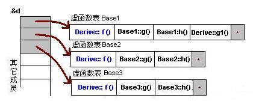
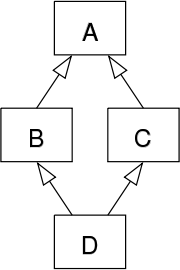
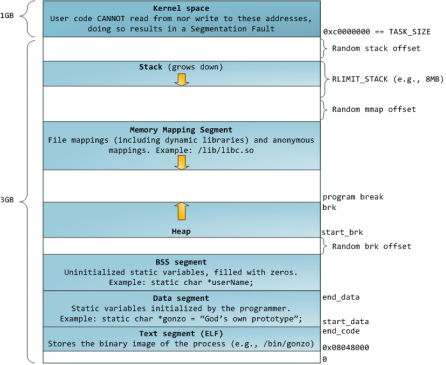

[TOC]

# main函数

main函数执行之前，主要就是初始化系统相关资源：

     1. 设置栈指针
    
     2. 初始化static静态和global全局变量，即data段的内容
    
     3. 将未初始化部分的全局变量赋初值：数值型short，int，long等为0，bool为FALSE，指针为NULL，等等，即.bss段的内容
    
     4. 全局对象初始化，在main之前调用构造函数
    
     5. 将main函数的参数，argc，argv等传递给main函数，然后才真正运行main函数


main函数执行之后：

     1. 全局对象的析构函数会在main函数之后执行； 
    
     2. 可以用atexit 注册一个函数，它会在main 之后执行; 

 


`__attribute__((constructor)) `  用这个修饰函数，会让函数在main调用之前被执行

`__attribute__((destructor)) ` 用这个修饰函数，会让函数在main调用之后被执行

# 宏

缺点：

- 无法对宏定义中的变量进行类型检查
- 未加括号可能带来边界效应

# const 

**作用**

1. 修饰变量，说明该变量不可被改变
2. 修饰指针，有两种，一种是指向常量的指针(pointer to const)，另一种是自身是常量的指针(const pointer)
3. 修饰引用，指向常量的引用（reference to const），用于形参类型，及避免拷贝，又避免函数对值进行修改。
4. 修饰成员函数，说明该成员函数不能修改成员变量。

**const的指针和引用**

- 指针
  - 指向常量的指针（pointer to const）
  - 自身是常量的指针（常量指针，const pointer）
- 引用
  - 指向常量的引用（reference to const）
  - 没有 const reference，因为引用本身就是 const pointer

**使用**

```c++
class A
{
  private:
    const int a;	//常成员变量，只能在初始化列表中赋值
    mutable int b;	//可变成员变量，即使在const成员函数中也可以修改
  public:
    A() : a(0){};
    A(int x) : a(x) {};	//初始化列表
    
    //const 用于对重载函数的区分
    int getValue();
    int getValue() const;	//常成员函数，不能对成员变量进行修改
};

void function()
{
    //对象
    A b;	//普通对象
    const A a;	//常对象，只能调用常成员函数
    const A *p = &a;	//指针变量，指向常对象
    const A &q = a;		//指向常对象的引用
    
    char greeting[] = "Hello";
    char *p1 = greeting;
    const char* p2 = greeting; //指针变量，指向字符数组常量（const 后面是 char，说明指向的字符（char）不可改变）
    char* const p3 = greeting; //自身是常量的指针，指向字符数组变量（const后面是p3，说明p3指针自身不可变）
    const char* const p4 = greeting; //自身是常量的指针，指向字符数组常量
}

//函数
void function1(const int Var);
void function2(const char* Var);
void function3(char* const Var);
void function4(const int& Var);	//引用参数在函数内为常量

//函数返回值
const int function5();
const int* function6();	// 返回一个指向常量的指针变量，使用：const int *p = function6();
int* const function7();	// 返回一个指向变量的常指针，使用：int* const p = function7();
```

# constexpr

constexpr可以用来修饰变量、函数、构造函数，其目的是用于告知编译器，该变量、函数、构造函数可以在编译时就能得出常量值

```c++
const int func()
{
    return 10;
}

int main()
{
    int arr[func()];	//error:函数调用在常量表示中必须具有常量值
}

constexpr func()
{
    return 10;
}

int main()
{
    int arr[func()];	//通过
}
```


# 指针

[]的优先级比*高

```c
char *p[];	//指针数组，数组元素是指针
char (*p)[];	//数组指针，指向数组的指针
char *p();	//函数声明， 返回char指针类型
char (*p)();	//函数指针
```


# malloc

在c当中，malloc/free函数的底层是通过`mmap` , `munmap`以及`sbrk`函数来进行内存的分配和释放的。

当malloc小于128k的内存时，会使用sbrk来分配内存，这个128k是可以由用户设置的。其中sbrk函数通过将内核的brk指针增加来扩展和收缩堆。

并且如果brk指针内已经有足够大小的已释放空间，则可以直接使用这片内存空间而不用重新分配。

当malloc大于128k的内存时，会使用mmap在堆和栈之间寻找一块空闲的内存来进行分配，并且通常会分配一个比用户申请内存空间更大，目的是为了减少后续申请中向操作系统申请内存的次数。并且用mmap分配的内存都会直接与物理地址建立映射，**会发生大量的缺页中断**。

malloc是由c函数库实现的，跟os无关。sbrk和mmap是系统调用


**由此会带来内存碎片的问题**

# malloc和new

区别：

- new申请内存时无需指定内存块大小，编译器会根据类型信息计算，而malloc需要显示指定大小
- new操作成功时返回对象类型指针，而malloc返回void*，需要类型转换
- new分配失败时抛出bac_alloc异常，而malloc失败返回Null
- new会先调用operator new函数申请内存，然后调用构造函数，初始化，最后返回类型指针；malloc只能动态申请，需要自己做构造和初始化操作。
- new/delete操作符可以重载，placement new可以指定地址作为内存分配起始区域。而malloc只允许在堆上分配内存
- new从自由存储区分配内存，malloc从堆分配内存，自由存储区不等于堆

**一.new** 
new operator就是new操作符，不能被重载，假如A是一个类，那么A * a=new A;实际上执行如下3个过程。 
（1）调用operator new分配内存，operator new (sizeof(A)) 
（2）调用构造函数生成类对象，A::A() 
（3）返回相应指针 
事实上，分配内存这一操作就是由operator new(size_t)来完成的，如果类A重载了operator new，那么将调用A::operator new(size_t )，否则调用全局::operator new(size_t )，后者由C++默认提供。 

**二.operator new** 
operator new是函数，分为三种形式（前2种不调用构造函数，这点区别于new operator）： 
void* operator new (std::size_t size) throw (std::bad_alloc); 
void* operator new (std::size_t size, const std::nothrow_t& nothrow_constant) throw(); 
void* operator new (std::size_t size, void* ptr) throw(); 
第一种分配size个字节的存储空间，并将对象类型进行内存对齐。如果成功，返回一个非空的指针指向首地址。失败抛出bad_alloc异常。 
第二种在分配失败时不抛出异常，它返回一个NULL指针。 
第三种是placement new版本，它本质上是对operator new的重载，定义于#include <new>中。它不分配内存，调用合适的构造函数在ptr所指的地方构造一个对象，之后返回实参指针ptr。 

```C++
void* mem = (void*) malloc(100);
A* p=new (mem)A;
```

placement new，从指定的内存空间创建对象。内存池的使用。


# static

1. 修饰普通变量，修改变量的存储区域和生命周期，变量存储在静态区，在main函数运行时就已经分配了空间，如果有初始值就用初始值初始化，如果没有则用默认值初始化。

2. 修饰普通函数，表明函数的作用范围，仅在定义该函数的文件内才能使用。在多人开发项目时为了防止与他人命名空间里的函数重名，可以将函数定义成static。
3. 修饰成员变量，该类的所有对象实例只保存一个该变量，而且不需要生成对象就可以访问该成员。
4. 修饰成员函数，使得不需要生成对象就可以访问该函数，在静态成员函数中只能访问静态成员变量。

## static的初始化顺序

在类外的static变量的初始化顺序是根据其在编译单元（.cpp）中声明的顺序初始化的，但是不同编译单元之间的静态变量的初始化顺序是不确定的。

可以通过延迟初始化的方式来控制静态变量的初始化顺序。


类内部的static成员变量的初始化顺序根据其**初始化语句的先后顺序**确定，而不是根据声明的顺序确定。


# this指针

1. `this` 指针是一个隐含于每一个非静态成员函数中的特殊指针。它指向调用该成员函数的那个对象。

2. 当对一个对象调用成员函数时，编译程序先将对象的地址赋给 `this` 指针，然后调用成员函数，每次成员函数存取数据成员时，都隐式使用 `this` 指针。

3. 当一个成员函数被调用时，自动向它传递一个隐含的参数，该参数是一个指向这个成员函数所在的对象的指针。

4. `this` 指针被隐含地声明为: `ClassName *const this`，这意味着不能给 `this` 指针赋值；在 `ClassName` 类的 `const` 成员函数中，`this` 指针的类型为：`const ClassName* const`，这说明不能对 `this` 指针所指向的这种对象是不可修改的（即不能对这种对象的数据成员进行赋值操作）；

5. `this` 并不是一个常规变量，而是个右值，所以不能取得 `this` 的地址（不能 `&this`）。

6. 在以下场景中，经常需要显式引用`this`指针：

  1. 为实现对象的链式引用；
2. 为避免对同一对象进行赋值操作；
   3. 在实现一些数据结构时，如 `list`。

# inline内联函数

## 特征

- 相当于把内联函数里的内容写在调用内联函数处
- 相当于不用执行进入函数的步骤，直接执行函数体
- 相当于宏，但是比宏多了类型检查，具有函数特性
- 编译器会根据情况不内联某些内联函数，如包含循环，递归、switch等复杂操作的内联函数
- 在类声明中定义的函数，除了虚函数的其他函数都会自动隐式的当成内联函数


## 编译器对inline函数的处理步骤

1. 将inline函数体复制到inline函数的调用处
2. 为所用inline函数中的局部变量分配空间
3. 将 inline 函数的的输入参数和返回值映射到调用方法的局部变量空间中；
4. 如果 inline 函数有多个返回点，将其转变为 inline 函数代码块末尾的分支（使用 GOTO）。

## 优缺点

优点

1. 内联函数同宏函数一样将在被调用处进行代码展开，省去了参数压栈、栈帧开辟与回收，结果返回等，从而提高程序运行速度。
2. 内联函数相比宏函数来说，在代码展开时，会做安全检查或自动类型转换（同普通函数），而宏定义则不会。
3. 在类中声明同时定义的成员函数，自动转化为内联函数，因此内联函数可以访问类的成员变量，宏定义则不能。
4. 内联函数在运行时可调试，而宏定义不可以。

缺点

1. 代码膨胀。内联是以代码膨胀（复制）为代价，消除函数调用带来的开销。如果执行函数体内代码的时间，相比于函数调用的开销较大，那么效率的收获会很少。另一方面，每一处内联函数的调用都要复制代码，将使程序的总代码量增大，消耗更多的内存空间。
2. inline 函数无法随着函数库升级而升级。inline函数的改变需要重新编译，不像 non-inline 可以直接链接。
3. 是否内联，程序员不可控。内联函数只是对编译器的建议，是否对函数内联，决定权在于编译器。

**虚函数（virtual）可以是内联函数（inline）吗？**

> [Are "inline virtual" member functions ever actually "inlined"?](http://www.cs.technion.ac.il/users/yechiel/c++-faq/inline-virtuals.html)

- 虚函数可以是内联函数，内联是可以修饰虚函数的，但是当虚函数表现多态性的时候不能内联。
- 内联是在编译器建议编译器内联，而虚函数的多态性在运行期，编译器无法知道运行期调用哪个代码，因此虚函数表现为多态性时（运行期）不可以内联。
- `inline virtual` 唯一可以内联的时候是：编译器知道所调用的对象是哪个类（如 `Base::who()`），这只有在编译器具有实际对象而不是对象的指针或引用时才会发生。

## 虚函数内联使用

```cpp
#include <iostream>  
using namespace std;
class Base
{
public:
    inline virtual void who()
    {
        cout << "I am Base\n";
    }
    virtual ~Base() {}
};
class Derived : public Base
{
public:
    inline void who()  // 不写inline时隐式内联
    {
        cout << "I am Derived\n";
    }
};

int main()
{
    // 此处的虚函数 who()，是通过类（Base）的具体对象（b）来调用的，编译期间就能确定了，所以它可以是内联的，但最终是否内联取决于编译器。 
    Base b;
    b.who();

    // 此处的虚函数是通过指针调用的，呈现多态性，需要在运行时期间才能确定，所以不能为内联。  
    Base *ptr = new Derived();
    ptr->who();

    // 因为Base有虚析构函数（virtual ~Base() {}），所以 delete 时，会先调用派生类（Derived）析构函数，再调用基类（Base）析构函数，防止内存泄漏。
    delete ptr;
    ptr = nullptr;

    system("pause");
    return 0;
} 
```


# volatile

```c++
volatile int i = 10;
```

- volatile 关键字是一种类型修饰符，用它声明的类型变量表示可以被某些编译器未知的因素（操作系统、硬件、其它线程等）更改。所以使用 volatile 告诉编译器不应对这样的对象进行优化。
- volatile 关键字声明的变量，每次访问时都**必须从内存中取出值**（没有被 volatile 修饰的变量，可能由于编译器的优化，从 CPU 寄存器中取值）
- const 可以是 volatile （如只读的状态寄存器）
- 指针可以是 volatile


# assert()

断言，是宏，而非函数。assert 宏的原型定义在 `<assert.h>`（C）、`<cassert>`（C++）中，其作用是如果它的条件返回错误，则终止程序执行。可以通过定义 `NDEBUG` 来关闭 assert，但是需要在源代码的开头，`include <assert.h>` 之前。

assert() 使用

```c++
#define NDEBUG          // 加上这行，则 assert 不可用
#include <assert.h>

assert( p != NULL );    // assert 不可用
```


# #pragma pack(n)

用于设定结构体、联合以及类内成员变量的n字节方式对齐

在网络数据传输的序列化和反序列化中，结构体的内存往往需要紧凑分配，使用pragma pack可以保证多台不通种类的机器上

```c++
#pragma pack(push)  // 保存对齐状态
#pragma pack(1)     // 设定为 1 字节对齐

struct test
{
    char m1;
    double m4;
    int m3;
};

#pragma pack(pop)   // 恢复对齐状态
```


# struct 与 typedef struct

## C

```c
typedef struct Student{
    int age;
} S;

//等价
struct Student { 
    int age; 
};

typedef struct Student S;
```

可以定义与struct Student不冲突的void Student(){}

## C++

1、当定义了struct Student， 使用 Student me 时，编译器首先搜索全局标识符表，若未找到，则在类标识符中搜索。

2、若定义了与Student同名函数之后，则Student只表示函数，不代表结构体


# C++中struct和class的区别

最本质的区别只有一个，struct的默认访问控制和继承权限都是public，而class的默认访问控制和继承权限都是private。

# struct

**内存对齐**

字节对齐主要是为了提高内存的访问效率，比如intel 32位cpu，每个总线周期都是从偶地址开始读取32位的内存数据，如果数据存放地址不是从偶数开始，则可能出现需要两个总线周期才能读取到想要的数据，因此需要在内存中存放数据时进行对齐。

**三个原则：** 

1、结构体变量的起始地址能被"最宽的成员大小"整除 

2、每个成员变量的对于起始地址的偏移能被“自身大小整除”，如果不能在前一个成员后对齐

 3、结构体总大小能被”最宽的成员大小“整除，如果不能在结构体末尾补齐 以上加引号的内容都可以被手动设置的对齐参数替代。 

比如

```c++
 struct A{
     char a;
     long long b;
     float c; 
 }; 
```

假设地址从0x00开始，char a占1个字节，结束的地址为0x01，

然后看long long b，占8个字节，开始的地址0x01不能被8整除，所以对齐到0x08，再加上b自身的8个字节，结束地址0x10，

再看c，占4个字节，结束地址0x14，不能被8整除，对齐到8整数倍，结束地址0x18，即总占空间24字节


# union联合

联合(union)是一种可以节省空间的特殊的类，一个union可以有多个数据成员，但是任意时刻只有一个成员有值，当某个成员被赋值之后其他成员都会变为未定义状态。

- 默认访问控制public
- 可以有构造函数、析构函数
- 不能有虚函数
- 不能作为基类、不能继承自其他类
- 不能含有引用类型成员
- 匿名union在定义作用域内可以直接访问成员
- 匿名union不能包含protected、private成员
- 全局匿名union必须时static

```c++
#include<iostream>

union UnionTest {
    UnionTest() : i(10) {};
    int i;
    double d;
};

static union {
    int i;
    double d;
};

int main() {
    UnionTest u;

    union {
        int i;
        double d;
    };

    std::cout << u.i << std::endl;  // 输出 UnionTest 联合的 10

    ::i = 20;
    std::cout << ::i << std::endl;  // 输出全局静态匿名联合的 20

    i = 30;
    std::cout << i << std::endl;    // 输出局部匿名联合的 30
    d = 0.1;
    std::cout << i << std::endl;    // 输出局部匿名联合未定义的i  
    std::cout << d << std::endl;    // 输出局部匿名联合的 0.1
    return 0;
}
```

 

# explicit

首先, C++中的explicit关键字只能用于修饰只有一个参数的类构造函数, 它的作用是**表明该构造函数是显式的**, 而非隐式的, 跟它相对应的另一个关键字是implicit, 意思是隐藏的,类构造函数默认情况下即声明为implicit(隐式).

explicit在类构造函数大于或者等于两个时无效。

https://www.cnblogs.com/rednodel/p/9299251.html

# INF、NAN

INF: infinity，数值超出浮点数表示范围。

NAN：not a number，对浮点数进行未定义操作

会导致出现NAN的情况：负数开方`sqrt(-1)`，负数求对数`log(-1)`，`0.0/0.0`，`0.0*inf`、`inf/inf`，`inf - inf`

nan == nan 始终会返回0，可用于nan判断

```c++
bool isNumber(double d)
{
    return d == d;
}
```

`1.0/0.0 = inf`,`-1.0 / 0.0 = -inf`, `0.0 + inf = inf`

inf一般出现在溢出或者除0，nan一般出现非法操作

# decltype(C++11)

有时我们希望从表达式的类型推断出要定义的变量类型，但是不想用该表达式的值初始化变量（初始化可以用`auto`）。为了满足这一需求，C++11新标准引入了`decltype`类型说明符，它的作用是选择并返回操作数的数据类型，在此过程中，编译器分析表达式并得到它的类型，却不实际计算表达式的值。

通常用于检查实体的声明类型或表达式的类型及值分类。

```c++
int a;
decltype(a);

//在模板编程中，尾置返回允许我们在参数列表之后声明返回类型
template <typename It>
auto fcn(It beg, It end) -> decltype(*beg)
{
    //处理
    return *beg;	//返回序列中元素的一个引用
}

template <typename It>
auto fcn2(It beg, It end) -> typename remove_reference<decltype(*beg)>::type
{
    //处理
    return *beg;	//返回序列中元素的一个拷贝
}
```


# 赋值运算符函数

为如下的类型声明添加赋值运算符函数

```c++
class CMyString
{
public:
	CMyString(char* pData=nullptr);
    CMyString(const CMyString& str);
    ~CMyString(void);
private:
    char* m_pData;
}
```

添加赋值运算符函数时需要考虑的几个问题：

- 返回值的类型应当被设置为**该类型的引用**，并且在函数结束时**返回实例自身的引用**（*this）。只有返回被设置成为引用才可以允许连续赋值。
- **传入的参数应该被设置常量引用**。若传入的不是引用而是实例，从形参到实参的转换会调用一次复制构造函数，出现无畏的消耗。同时，赋值运算符函数中不会改变传入实例的状态，应当添加const关键字。
- **释放实例自身已有的内存**。若在分配新内存前没有释放自身已有的内存，则程序会出现**内存泄漏问题**。
- **判断传入的参数和当前的实例是否是同一个实例。**若是同一个则不能进行赋值操作，否则在进行内存释放时会将传入的参数的内存也同时释放。

基本的实现方法如下

```c++
CMyString& CMyString::operator=(const CMyString& str)
{
	if(this != &str)
    {
        CMyString tmp(str);
        
        char *pTemp = str.m_pData;
        tmp.m_pData = this->m_pData;
        this->m_pData = pTemp;
    }
    
    return *this;    
}
```

深入思考上述代码中可能出现的问题，因为我们先调用了delete释放了内存，之后在调用new分配内存时可能出现内存不足的情况，则此时的m_pData将是一个空指针，CMyString实例的有效性被破坏了。其中一个解决方法是先调用new分配内存，再进行delete操作。如此一下即使内存分配失败也不会破坏实例的有效性。

# 指针和引用的区别


# 智能指针（smart_pointer）

C++使用四种不同的方案来存储数据

- **自动存储持续性：**在函数定义中声明的变量，也包括函数的参数，他们的存储持续性为自动的，在程序开始执行其函数或代码块时被创建，在执行完函数或代码块之后，其内存就被释放，这是自动进行的。
- **静态存储持续性：**在函数定义外定义的变量和使用static定义的变量的存储持续性都为静态。他们在程序的整个运行过程中都存在。
- **线程存储持续性：**使用thread_local声明的变量其生命周期和所属的线程一样长，这样程序可以将计算放在可并行处理的不同线成中。
- **动态存储持续性：**使用new运算符分配的内存将会一直存在，直到使用delete运算符将其释放或者程序结束。

## 动态内存和智能指针

除了静态内存和栈内存之外，每个程序还有一个内存池被称为自由空间或者**堆**。动态内存的管理通过**new**和**delete**一对运算符来完成。程序用堆来存储通过new来动态分配的对象，当动态对象不再使用时，必须调用delete对其进行显示销毁。

在动态内存的管理中常常会出现两种问题

1. 没有即使释放内存导致内存泄漏。
2. 尚有指针引用内存时就进行释放，产生引用非法内存的指针。


**智能指针的基本思想**：用一个**计数器**去记录指向某块内存的指针个数，当指针个数为0时，就自动释放该内存，或执行用户自定义操作，如资源的回收等。

每当指向该内存的指针被复制，计数器就+1，当局部变量的指针被释放，如函数结束等，计数器就-1。

C++中存在的**四种智能指针**：**auto_ptr**, **shared_ptr**, **unique_ptr**, **weak_ptr**

## 1、auto_ptr

auto_ptr是c++98的方案，在c++11中已经被弃用了，其采取**所有权模式**设计。

```c++
auto_ptr<string> p1 (new string("I am a auto_ptr"));
auto_ptr<string> p2;
p2 = p1; //auto_ptr允许这么做
```

编译能够通过，p2剥夺了p1的所有权，但是当程序试图访问p1时会报错。auto_ptr存在**潜在的内存崩溃问题**。

## 2、shared_ptr

shared_ptr实现**共享式拥有**，允许多个指针指向同一个对象。智能指针如同vector一样也是模板。因此当创建一个智能指针时必须提供额外的信息：指针可以指向的类型。

```c++
shared_ptr<string> p1;
shared_ptr<list<int>> p2;
```

在默认初始化的智能指针中保存着一个空指针。

### shared_ptr和unique_ptr都能使用的操作

| 操作             | 解释                                                         |
| ---------------- | ------------------------------------------------------------ |
| shared_ptr<T> sp | 空智能指针，指向类型为T的对象                                |
| unique_ptr<T> up |                                                              |
| p                | 将p用作一个条件判断，若p指向一个对象则返回true               |
| *p               | 解引用p，获得它指向的对象                                    |
| p->mem           | 等价于(*p).mem                                               |
| p.get()          | 返回p中保存的指针。注意：当智能指针释放了对象时，返回的指针的所指向的对象也消失了。 |
| swap(p, q)       | 交换p和q中的指针                                             |
| p.swap(q)        |                                                              |

### shared_ptr独有的操作

| 操作                  | 介绍                                                         |
| --------------------- | ------------------------------------------------------------ |
| make_shared<T> (args) | 返回一个shared_ptr，指向一个动态分别的类型为T的对象。使用args初始化此对象。 |
| shared_ptr<T> p(q)    | p是shared_ptr q的拷贝；此操作为递增q中的计数器。q中的指针必须能转换为T |
| p = q                 | p和q都是shared_ptr，所保存的指针必须能湘湖转换。此工作会递减p的引用计数，递增q的引用计数；若p的引用计数变为0，则将其管理的原内存释放。 |
| p.unqiue()            | 若p.use_count()为1，则返回true，否则返回false                |
| p.use_count()         | 返回与p共享对象的指针数量。**耗时长，用于调试。**            |

## 详解

在c++11的shared_ptr中，一个智能指针对象的大小为16字节，其中包含了一个`_Ptr`指针和一个`_Rep`指针。其中`_Rep`指向一个`_Ref_count_base`类，用于计数。`_Ptr`用于存储智能指针内部对象。

## 3、unique_ptr

unique_ptr实现**独占式拥有**概念，在某个时刻有且只能有个一个unique_ptr对象指向一个给定对象。当unique_ptr对象被销毁时，它所指向的对象也被销毁。

```c++
#include <iostream>
#include <memory>

struct Task {
    int mId;
    Task(int id ) :mId(id) {
        std::cout << "Task::Constructor" << std::endl;
    }
    ~Task() {
        std::cout << "Task::Destructor" << std::endl;
    }
};

int main()
{
    // 通过原始指针创建 unique_ptr 实例
    std::unique_ptr<Task> taskPtr(new Task(23));
	std::unique_ptr<Task> taskPtr2 = std::make_unique<Task>(34);
    //通过 unique_ptr 访问其成员
    int id = taskPtr->mId;
    std::cout << id << std::endl;

    return 0;
}

```

unique_ptr对象始终是关联的原始指针的唯一所有者。我们**无法复制**unique_ptr对象，它**只能移动**。
由于每个unique_ptr对象都是原始指针的唯一所有者，因此**在其析构函数中它直接删除关联的指针**，不需要任何参考计数。


```c++
//unique_ptr可能出现编译错误的情况

// 编译错误 : unique_ptr 不能复制
std::unique_ptr<Task> taskPtr3 = taskPtr2; // Compile error

// 编译错误 : unique_ptr 不能复制
taskPtr = taskPtr2; //compile error
```

### 转移unique_ptr所有权

必须通过std::move转移所有权

```c++
// 通过原始指针创建 taskPtr2
std::unique_ptr<Task> taskPtr2(new Task(55));
// 把taskPtr2中关联指针的所有权转移给taskPtr4
std::unique_ptr<Task> taskPtr4 = std::move(taskPtr2);
// 现在taskPtr2关联的指针为空
if(taskPtr2 == nullptr)
	std::cout<<"taskPtr2 is  empty"<<std::endl;

// taskPtr2关联指针的所有权现在转移到了taskPtr4中
if(taskPtr4 != nullptr)
	std::cout<<"taskPtr4 is not empty"<<std::endl;

// 会输出55
std::cout<< taskPtr4->mId << std::endl;

```


```c++
#include <iostream>
#include <memory>

class A
{
public:
    void f()
    {
        std::cout << "1" << std::endl;
    }
};

void func(A *a)
{
    std::unique_ptr<A> pb(a);
}

int main()
{
    std::unique_ptr<A> pa(new A());
    func(pa.get());
    pa->f();
}
```


# 面向对象


## 类

### 类的大小

类对象的大小=各非静态数据成员（包括父类的非静态数据成员但都不包括所有的成员函数）的总和+ vfptr指针(多继承下可能不止一个)+vbptr指针(多继承下可能不止一个)+编译器额外增加的字节。


## 封装

把客观的事物封装成客观的类，并且类可以把自己的数据和方法给可信的类或者对象操作，对不可信的进行信息隐藏。

- `public` 成员：可以被任意实体访问
- `protected` 成员：只允许被子类及本类的成员函数访问
- `private` 成员：只允许被本类的成员函数、友元类或友元函数访问

## 继承

## **多态（polymorphism）**

多态以封装和继承为基础，多态可以定义为消息以多种形式显示的能力。

C++多态的分类和实现

- 重载多态：编译器，函数重载、运算符重载
- 子类型多态：运行期，虚函数
- 参数多态：编译器，类模板、函数模板
- 强制多态：编译器/运行期，基本类型转换、自定义类型转换、动态类型转换

**静态多态**

```c++
//函数重载
class A
{
    public:
     void do(int a);
    void do(int a, int b);
};
```

**动态多态**

# 虚函数

- 普通函数不能是虚函数
- 静态成员函数不能是虚函数
- 构造函数不能是虚函数（在调用构造函数之前，虚表指针没有在对象的内存空间内，必须要构造函数调用完成之后才会行成虚表支撑）
- 内联函数不能是表现多态性的虚函数


## 说一说虚函数的实现机制

在虚函数类中维护一个虚函数表指针，指向一个虚函数表。在子类继承有虚函数的父类，并且进行了虚函数的覆盖之后，虚函数表中的对应的函数指针就会指向子类中的虚函数的地址，从而实现多态。

虚函数表的指针位于对象实例中最前面的位置，用以保证正确获取虚函数的偏移量。




# 虚析构函数

为什么要有虚析构函数：

在派生类继承基类时，使用基类的指针去指向派生类对象，在使用基类的指针删除派生类对象时，将需要将基类的析构函数定义为虚函数，才能正确释放。

在delete时，先调用子类析构函数，再调用基类虚析构函数。其顺序与调用构造函数的顺序相反。

# 纯虚函数

一种特殊的虚函数，纯虚函数不能在基类中实现，有纯虚函数的类是抽象类，不能有具体对象，其实现在派生类中完成，且只有完成对纯虚函数的实现之后才能实例对象。

```c++
class A
{
public:
	virtual int func() = 0;    
}
```

# 两者的区别

- 通过虚函数的方式，在基类中提供函数接口，如果不是纯虚函数，则基类也可以对虚函数进行实现，哪怕是空实现。派生类可以对基类的虚函数进行覆盖(override)，编译器通过这种方式使用后期绑定来实现多态。而纯虚函数只是一个接口，要在派生类中去实现。
- 虚函数在派生类中可以不重写，但纯虚函数必须在派生类中实现才可以实例化。
- 虚函数在继承接口的同时也继承父类的实现，纯虚函数关注的是接口的统一性，实现由派生类完成。

# 虚函数指针、虚函数表

虚函数指针：在含有虚函数类的对象中，指向虚函数表，在运行时确定具体调用哪个实现。

虚函数表：在程序只读数据段`.rodata section`，存放虚函数指针，如果派生类实现了基类的某个虚函数，则在虚函数表中覆盖原本基类的哪个虚函数指针，在编译时根据类的声明创建。

> 一个空的类，其占用空间大小为1个字节，一个有一个虚函数的类的，其占用空间大小为1+一个虚函数指针大小（4字节）

# 虚继承，菱形继承



如果直接继承，会有**访问二义性**和**数据冗余**，可以通过作用域符指定访问对象`Angle.Brid::LifeMeaning`来消除，可以通过虚继承`class  LifePropagate1: virtual public Life `的方法来消除数据冗余。

```c++
#include <Windows.h>
#include <iostream>
using namespace std;
 
class Life
{
public:
    Life() :LifeMeaning(0x5)
    {  }
public:
    int LifeMeaning;
};
 
class LifePropagate1 :virtual public Life
{
public:
    LifePropagate1() :LifePropagate1Meaning(0x50)
    {  }
public:
    int LifePropagate1Meaning;
};
 
class LifePropagate2 :virtual public Life
{
public:
    LifePropagate2() :m_B(0x60)
    {  }
public:
    int m_B;
};
class NewLife :public LifePropagate1, public LifePropagate2
{
public:
    NewLife() :NewLifeMeaning(0x100)
    {  }
public:
    int NewLifeMeaning;
};
 
 
 
int main()
{
    NewLife NewLifeObject;
    return 0;
}
```

虚继承通过在中间的基类中保存一份虚基类指针（一个指针存储空间，4字节），和一个虚基类表（不占用空间）将最原始的父类数据保存在一个公共位置处，即解决了数据冗余，也消除了二义性。

# 虚继承和虚函数的区别

- 相同：都利用虚指针（占用类的存储空间）和虚表（不占用类存储空间）
- 不同：
  - 虚继承
    - 虚基类依旧保存在继承类中，只占用存储空间
    - 虚基类表存储的是虚基类相对直接继承类的编译
  - 虚函数
    - 虚函数不占用存储空间
    - 虚函数表存储的是虚函数的地址

# 模板函数

模板函数不是一个实在的函数、**编译器不会为其生成可执行代码**。函数的参数的数据类型也作为一个参数。在函数定义时不指明具体的数据类型，在发生函数调用时，编译器根绝传入的实参自动推断数据类型。

**模板只有在被调用的时候才会实例化**

```c++
#include <iostream>

using namespace std;

template<typename T>
int compare(const T a, const T b)
{
    cout << "T:";
    return a < b;
}

//特化
template<>
int compare<string>(const string a, const string b)
{
    cout << "string:";
    return a.length() < b.length();
}

int main()
{
    int a = 1;
    int b = 2;
    cout << compare(a,b) << endl;
    cout << compare(1.1, 1.2) << endl;

    string s1 = "ab";
    string s2 = "bcd";
    cout << compare(s1, s2) << endl;
}


```

# 模板编程的特化

对某种特别的类型，需要自定义不同的函数体，通过特化的方法来实现


# C++ 中的四种cast转换（显式类型转换）

C++中有四种转换类型，分别是

- const_cast
- static_cast
- dynamic_cast
- reinterpret_cast

## const_cast

用于将const变量转为非const，有且**仅有**该操作符有此功能。

## static_cast

任何具有明确定义的类型转换，只要不包含底层const，都可以使用static_cast。

一般编译器发现算术类型转换丢失精度时会给出警告，若使用显式类型转换则警告信息会关闭。

用于各种隐式转换，如非const转const，viod*转指针，static_cast用于多态转换时是不安全的，我们必须保证转换后所得的类型就是指针所指的类型，否则会产生未定义的后果。

## dynamic_cast

**dynamic_cast运算符用于将基类的指针或引用安全的转换成派生类的指针或引用。**

使用形式如下：

```c++
dynamic_cast<type *>(e)	// e是一个有效指针
dynamic_cast<type &>(e)	// e是一个左值
dynamic_cast<type &&>(e)	//e不是一个左值
```

其中**type**必须是一个类类型，并且通常情况下其应该含有虚函数。

转换是安全的，若进行非法转换则会返回NULL。

## reinterpret_cast

**reinterpret_cast通常为运算对象的位模式提供较低层次上的重新解释。**

假设的如下一种转换方式，在编译过程中是合法的，但是编译器无从得知pc指针实际是一个指向int类型的指针，在实际使用过程中会出现未定义的问题，谨慎使用。

```c++
int *ip;
char *pc = reinterpret_cast<char*>(ip);
```

> 到底有何使用意义？在[MSDN的Visual C++ Developer Center](http://msdn.microsoft.com/en-us/library/e0w9f63b(VS.80).aspx)中它被用来辅助hash函数，通过将地址强制转换为整型数据来进行处理

```c++
#include <iostream>
using namespace std;
 
unsigned short Hash(void *p)
{
    unsigned int val = reinterpret_cast<unsigned long>(p);
    return (unsigned short)(val ^ (val>>16));
}
 
int main()
{
    int a[20];
    for(int i=0;i<20;i++)
    {
        cout<<Hash(a+i)<<endl;
    }
    return 0;
}
```

# C++ 顺序容器

- vector：可变大小数组。支持快速随机访问。在尾部之外的位置插入或删除元素可能会很慢。
- deque：双端队列。支持快速随机访问。在头尾位置插入/删除速度很快。
- list：双向链表。只支持双向顺序访问。在list中任何位置进行插入/删除操作速度都很快。
- forward_list：单向链表。只支持单向顺序访问。在链表任何位置进行插入/删除操作速度都很快。
- array：固定大小数组。支持快速随机访问。**不能添加/删除元素。**
- string：于vector相似容器，但专用于保存字符。随机访问快，在尾部插入/删除快。

> Q : 如何选择顺序容器
>
> A : 除非有特殊的理由选择其他容器，否则应当使用vector。

容器选择的基本原则：


## C++ std::vector

vector的数据安排以及操作方式，与array非常类似，两者唯一的区别是空间运用的灵活性，array是**静态空间**，一旦配置了就不能改变，如果你想要大一点的空间，就必须首先配置一块新空间，然后将原来的元素一一复制进来，再把原来的空间释放给系统。但是vector是动态空间，随着元素的增加，它的内部机制会自行扩充空间以容纳新元素，因此vector的运用对于内存的合理利用与运用的灵活性有很大的帮助，我们再也不必因为害怕空间不足而一开始要求一个大块头的array了，我们可以安心使用vector，随便使用多大空间都可以。

  vector的实现技术，关键在于其对大小的控制以及重新配置时的数据移动效率，一旦vector的旧有空间满载，如果客户端每新增一个元素，vector的内部只是扩充一个元素的空间，实为不智，因为所谓扩充空间，都是配置新空间，复制原来内容，释放旧空间所需要的时间很多。

vector有两个函数，一个是**capacity()**，返回对象缓冲区（vector维护的内存空间）实际申请的空间大小，另一个**size()**，返回当前对象缓冲区存储数据的个数。对于vector来说，capacity是永远大于等于size的，当capacity和size相等时，vector就会扩容，capacity变大。

vector维护的是一个**连续线性空间，所以支持vector随机存取**

注意：

  vector动态增加大小时，并不是在原空间之后持续新空间（因为根本无法保证原空间之后尚有可供配置的空间），而是**以原大小的两倍另外配置一块较大的空间，然后将内容拷贝过来**，然后才开始在原内容之后构造新元素，并释放原空间，因此，一旦引起空间重新配置，指向原vector的所有迭代器都失效了，这是程序员易犯的一个错误，务必小心

# C++ 关联容器

对于**顺序容器**，其中的元素是通过其在容器中的**位置**来顺序保存和访问的，对于**关联容器**，其中的元素是通过**关键字**来保存和访问的。

关联容器支持搞笑的关键字查找和访问，常用的关联容器有map和set，其典型实现有哈希表。

| 关联容器类型       | 特点                                         |
| ------------------ | -------------------------------------------- |
| map                | 关联数组：保存<关键字, 值>对，有序集合，下同 |
| set                | 关键字即值，只保存关键字                     |
| multimap           | 关键字可以重复出现的map                      |
| multiset           | 关键字可以重复出现的set                      |
| unordered_map      | 用hash函数组织的map，无序集合，下同          |
| unordered_set      | 。。                                         |
| unordered_multimap | 。。                                         |
| unordered_multiset | 。。                                         |

# 迭代器

| 迭代器                                                       | 描述                                                         |
| ------------------------------------------------------------ | ------------------------------------------------------------ |
| [input](https://www.169it.com/tag/input)_[iterator](https://www.169it.com/article/17348299582169730452.html) | 提供读功能的向前[移动](https://www.169it.com/tag/移动)迭代器，它们可被进行增加(++)，比较与解[引用](https://www.169it.com/tag/引用)（*）。 |
| [output](https://www.169it.com/tag/output)_iterator          | 提供写功能的向前移动迭代器，它们可被进行增加(++)，比较与解引用（*）。 |
| [forward](https://www.169it.com/tag/forward)_iterator        | 可向前移动的，同时具有[读写](https://www.169it.com/tag/读写)功能的迭代器。同时具有input和output迭代器的功能，并可对迭代器的值进行[储存](https://www.169it.com/tag/储存)。 |
| [bidirectional](https://www.169it.com/tag/bidirectional)_iterator | 双向迭代器，同时提供读写功能，同forward迭代器，但可用来进行增加(++)或减少(--)操作。 |
| [random](https://www.169it.com/tag/random)_iterator          | 随机迭代器，提供随机读写功能.是功能最强大的迭代器， 具有双向迭代器的全部功能，同时实现指针般的[算术](https://www.169it.com/tag/算术)与比较运算。 |
| [reverse](https://www.169it.com/tag/reverse)_iterator        | 如同随机迭代器或双向迭代器，但其移动是反向的。（[Either](https://www.169it.com/tag/either) a random iterator or a bidirectional iterator that moves [in](https://www.169it.com/tag/in) reverse [direction](https://www.169it.com/tag/direction).）（我不太理解它的行为） |

## C++ std::map 

### map的定义

map是保存关联数组的关联容器，在定义时必须指定其关键字类型和值类型，同时对于有序容器，其关键字必须有元素比较方法。

即key类型必须能够进行<运算，必须**严格弱序**（strict weak ordering）。

> 严格弱序：
>
> - 两个关键字不能同时**小于等于**对方
> - 如果k1**小于等于**k2，k2**小于等于**k3，则k1必须**小于等于**k3
> - 如果存在两个关键字，**任何一个都不小于等于另一个**，则这两个关键字**等价**

```C++
//map的模板定义
template <class _Key, class _Tp,           
	 class _Compare __STL_DEPENDENT_DEFAULT_TMPL(less<_Key>),
	 class _Alloc = __STL_DEFAULT_ALLOCATOR(_Tp) >class map;
```

通常情况下我们直接使用前两个参数来定义map，实际上map要求其key元素必须可比较，而在模板中默认的比较函数参数为less<Key>

```c++
template <class T> struct less : binary_function <T,T,bool> {
  bool operator() (const T& x, const T& y) const
    {return x<y;}
};
```

其实质是对操作符()的重载，相应的还有greater<key>

```c++
template <class T> struct greater : binary_function <T,T,bool> {
  bool operator() (const T& x, const T& y) const
    {return x>y;}
};
```

那么就可以通过手动重载()，对自定义关键字进行比较函数定义。

```c++
#include <map>

struct myCompare
{
    bool operator()(const string &s1, const string &s2)
	{
    	return s1.size() < s2.size();
	}
}

map<int, int> myMap1;
map<string, &isShorter, int> myMap2;
```

### map的内部实现

带着几个问题

1. 为何map和set的插入删除效率比用其他序列容器高？
2. 为何每次insert之后，以前保存的iterator不会失效？
3.  为何map和set不能像vector一样有个reserve函数来预分配数据？
4. 当数据元素增多时（10000到20000个比较），map和set的插入和搜索速度变化如何？

map内部自建一颗**红黑树**，一种非严格意义上的平衡二叉树，这颗树具有对数据自动排序的功能。

1. 它的特点是增加和删除节点对迭代器的影响很小，除了那个操作节点，对其他的节点都没有什么影响。因为map和set其底层的二叉树实现使得每个元素都是以节点的方式来存储的，因此在插入和删除的时候，只是对指针的移动。
2. 同样因此，**每次insert之后，以前保存的iterator也不会失效。相对于vector来说，每一次删除和插入，指针都有可能失效，调用push_back在尾部插入也是如此。牢记这个原则：不要使用过期的iterator**
3. 究其原理来说时，引起它的原因在于在map和set内部存储的已经不是元素本身了，而是包含元素的节点。也就是说map内部使用的Alloc并不是map声明的时候从参数中传入的Alloc。例如： map, Alloc > intmap; 这时候在intmap中使用的allocator并不是Alloc, 而是通过了转换的Alloc，具体转换的方法时在内部通过Alloc::rebind重新定义了新的节点分配器，详细的实现参看彻底学习STL中的Allocator。其实你就记住一点，在map和set内面的分配器已经发生了变化，reserve方法你就不要奢望了。 
4. **在map和set中查找是使用二分查找，也就是说，如果有16个元素，最多需要比较4次就能找到结 果**，有32个元素，最多比较5次。那么有10000个呢？最多比较的次数为log10000，最多为14次，如果是20000个元素呢？最多不过15次。 看见了吧，当数据量增大一倍的时候，搜索次数只不过多了1次，多了1/14的搜索时间而已。

# C++ std::move

在C++11中，标准库在<utility>中提供了一个有用的函数std::move，std::move并不能移动任何东西，它唯一的功能是将一个左值强制转化为右值引用，继而可以通过右值引用使用该值，以用于移动语义。从实现上讲，std::move基本等同于一个类型转换：static_cast<T&&>(lvalue);

std::move的定义

```c++
template <typename T>
typename remove_reference<T>::type&& move(T&& t)
{
    return static_cast<typename remove_reference<T>::type&&>(t);
}
```

std::move函数可以以非常简单的方式将左值引用转换为右值引用。(左值 右值 引用 左值引用)概念 https://blog.csdn.net/p942005405/article/details/84644101

1. C++ 标准库使用比如vector::push_back 等这类函数时,会对参数的对象进行复制,连数据也会复制.这就会造成对象内存的额外创建, 本来原意是想把参数push_back进去就行了,通过std::move，可以避免不必要的拷贝操作。
2. std::move是将对象的状态或者所有权从一个对象转移到另一个对象，只是转移，没有内存的搬迁或者内存拷贝所以可以提高利用效率,改善性能.。
3. 对指针类型的标准库对象并不需要这么做.

用法:
原value值被moved from之后值被转移,所以为空字符串. 

```c++
//摘自https://zh.cppreference.com/w/cpp/utility/move
#include <iostream>
#include <utility>
#include <vector>
#include <string>
int main()
{
    std::string str = "Hello";
    std::vector<std::string> v;
    //调用常规的拷贝构造函数，新建字符数组，拷贝数据
    v.push_back(str);
    std::cout << "After copy, str is \"" << str << "\"\n";
    //调用移动构造函数，掏空str，掏空后，最好不要使用str
    v.push_back(std::move(str));
    std::cout << "After move, str is \"" << str << "\"\n";
    std::cout << "The contents of the vector are \"" << v[0]
                                         << "\", \"" << v[1] << "\"\n";
}
```

输出

```bash
After copy, str is "Hello"
After move, str is ""
The contents of the vector are "Hello", "Hello"
```

# C++ 优先队列Priority_queue 大顶堆的实现

对于一般的队列queue，数据的优先级为先入先出，而优先队列中的数据可以定义优先级，**优先级高的数**据排在队列前面，优先出队。优先队列只会在`push`的时候


```c++
#include<queue>
priority_queue<Type, Container, Functional>;

auto cmp = [](const Type& e1, const Type& e2)
{
    return e1.first < e2.first;
};

priority_queue<Type, vector<Type>, delctype(cmp)> queue{cmp};
```

如leetcode 767题重构字符串

```c++
class Solution {
public:
    string reorganizeString(string S) {
        if (S.length() < 2) {
            return S;
        }
        vector<int> counts(26, 0);
        int maxCount = 0;
        int length = S.length();
        for (int i = 0; i < length; i++) {
            char c = S[i];
            counts[c - 'a']++;
            maxCount = max(maxCount, counts[c - 'a']);
        }
        if (maxCount > (length + 1) / 2) {
            return "";
        }
        auto cmp = [&](const char& letter1, const char& letter2) {
            return counts[letter1 - 'a']  < counts[letter2 - 'a'];
        };
        priority_queue<char, vector<char>,  decltype(cmp)> queue{cmp};
        for (char c = 'a'; c <= 'z'; c++) {
            if (counts[c - 'a'] > 0) {
                queue.push(c);
            }
        }
        string sb = "";
        while (queue.size() > 1) {
            char letter1 = queue.top(); queue.pop();
            char letter2 = queue.top(); queue.pop();
            sb += letter1;
            sb += letter2;
            int index1 = letter1 - 'a', index2 = letter2 - 'a';
            counts[index1]--;
            counts[index2]--;
            if (counts[index1] > 0) {
                queue.push(letter1);
            }
            if (counts[index2] > 0) {
                queue.push(letter2);
            }
        }
        if (queue.size() > 0) {
            sb += queue.top();
        }
        return sb;
    }
};
```

# 关键词作用


## mutable

**mutable**的中文意思是“可变的，易变的”，跟constant（既C++中的const）是反义词。

在C++中，**mutable**也是为了突破const的限制而设置的。被**mutable**修饰的变量，将永远处于可变的状态，即使在一个const函数中。

我们知道，被const关键字修饰的函数的一个重要作用就是为了能够保护类中的成员变量。即：该函数可以使用类中的所有成员变量，但是不能修改他们的值。然而，在某些特殊情况下，我们还是需要在const函数中修改类的某些成员变量，因为要修改的成员变量与类本身并无多少关系，即使修改了也不会对类造成多少影响。当然，你可以说，你可以去掉该函数的const关键字呀！但问题是，我只想修改某个成员变量，其余成员变量仍然希望被const保护。

# 设计模式

## 单例模式

单例模式的设计方法一般有懒汉式和饿汉式两种，其中懒汉式设计方法，只有在第一次用到类实例的时候才会去实例化一个对象。在访问量较小的情况下，以时间换空间。

```c++
//通过互斥锁来实现线程安全
#include <iostream>
#include <mutex>

std::mutex mt;
 
class Singleton
{
public:
    static Singleton* getInstance();
private:
    Singleton(){}                                    //构造函数私有
    Singleton(const Singleton&) = delete;            //明确拒绝
    Singleton& operator=(const Singleton&) = delete; //明确拒绝
 
    static Singleton* m_pSingleton;
 
};
Singleton* Singleton::m_pSingleton = NULL;
 
Singleton* Singleton::getInstance()
{
    if(m_pSingleton == NULL)
    {
        mt.lock();
        if(m_pSingleton == NULL)
        {
            m_pSingleton = new Singleton();
        }
        mt.unlock();
    }
    return m_pSingleton;
}
```

饿汉式是在单例类定义的时候就进行实例化。在访问量较大或访问线程多时，以空间换时间。

# C++内存管理/布局

在C++中，虚拟内存分为代码段、数据段、BSS段、堆区、文件映射区以及栈区六部分。

- **代码段**:包括只读存储区和文本区，其中只读存储区存储字符串常量，文本区存储程序的机器代码。

- **数据段**：存储程序中已初始化的全局变量和静态变量

- **bss 段**：存储未初始化的全局变量和静态变量（局部+全局），以及所有被初始化为0的全局变量和静态变量。

- **堆区**：调用new/malloc函数时在堆区动态分配内存，同时需要调用delete/free来手动释放申请的内存。

- **映射区**:存储动态链接库以及调用mmap函数进行的文件映射

- **栈**：使用栈空间存储函数的返回地址、参数、局部变量、返回值




- malloc：`void *malloc(size_t size)`申请指定字节数的内存，申请内存中的初始值不确定，无初始化。
- calloc：`void *calloc(size_t n, size_t size) `，申请n个长度为size的内存空间，初始化为0
- realloc：`void *realloc(void *mem_address, size_t newsize)`，为原有的内存指针分配新的内存空间，若新分配空间比原分配空间小，则可能会有数据丢失。首先检查原内存地址处后续连续空间是否充足，充足则直接分配，不足则申请新空间，并进行内存拷贝。
- alloca：`void *alloc(size_t size)`，与malloc的区别为alloca在栈上申请空间，在栈释放时一起释放。
- free：`free(void *mem_address)`，释放内存


- new/ new[]：1、底层调用malloc分配内存；2、调用构造函数（创建对象）。
- delete/delete[]：1、调用析构函数；2、底层调用free释放内存
- 区别：new会调用构造函数，而malloc不会，new在申请内存时会自动计算所需字节数，而malloc需要指定


# delete this合法吗

合法，但需要满足以下要求：

1. 必须保证this对象是通过new分配的，不是new[]，不是placement new，不是栈上， 不是全局，不是其他对象成员
2. 必须保证调用`delete this`的成员函数是最后一个调用this的成员函数。
3. 必须保证成员函数的`delete this`后面没有再调用this了
4. 必须保证之后没有人继续使用了


# 定义一个只在堆上/栈上生成对象的类

链接：https://www.nowcoder.com/questionTerminal/0a584aa13f804f3ea72b442a065a7618
来源：牛客网

在C++中，类的对象建立分为两种，一种是静态建立，如A  a；另一种是动态建立，如A* ptr=new A；这两种方式是有区别的。

静态建立一个类对象，是由编译器为对象在栈空间中分配内存，是通过直接移动栈顶指针，挪出适当的空间，然后在这片内存空间上调用构造函数形成一个栈对象。使用这种方法，直接调用类的构造函数。 

动态建立类对象，是使用new运算符将对象建立在堆空间中。这个过程分为两步，第一步是执行operator  new()函数，在堆空间中搜索合适的内存并进行分配；第二步是调用构造函数构造对象，初始化这片内存空间。这种方法，间接调用类的构造函数。 

那么如何限制类对象只能在堆或者栈上建立呢？下面分别进行讨论。

## 只在堆上

当对象建立在栈上面时，是由编译器分配内存空间的，调用构造函数来构造栈对象。当对象使用完后，编译器会调用析构函数来释放栈对象所占的空间。编译器管理了对象的整个生命周期。**将析构函数设为私有**，编译器在为类对象分配空间时，会检查类的析构函数的访问性，若虚构函数不可访问，则不能在栈上创建对象。

```c++
#include <iostream>

using namespace std;

class A
{
public:
    A(int i) : m_i(i){cout << "construct" << m_i << endl;}
    void destroy(){delete this;}
private:
    ~A(){cout << "deconstruct" << m_i << endl;}

    int m_i;
};

int main()
{
    A* pa = new A(2);
    pa->destroy();
}
```

将析构函数定义为私有会导致类不可继承，且不可在外部调用delete删除对象，需要定义公有`destroy`函数调用`delete this`函数进行释放。

可以通过增加外包装类来统一接口，类似单例模式。

```c++
#include <iostream>

using namespace std;

class A
{
public:
    static A *create(int i)
    {
        return new A(i);
    }
    void destroy()
    {
        delete this;
    }

protected:
    A(int i) : m_i(i) { cout << "construct" << m_i << endl; }

    ~A() { cout << "deconstruct" << m_i << endl; }

    int m_i;
};

int main()
{
    A *pa = A::create(1);
    pa->destroy();
}
```


## 只在栈上

将new和delete重载为私有

```c++
#include <iostream>

using namespace std;

class A
{
public:

    A(int i) : m_i(i) { cout << "construct" << m_i << endl; }

    ~A() { cout << "deconstruct" << m_i << endl; }

    
private:
    void* operator new(size_t t){}
    void operator delete(void *ptr){}
    int m_i;
};

int main()
{
    A a(1);
}
```


# lambda

```c++
[capture list](parameter list) -> return type {function body}
```

表达一个可调用的代码单元，理解成一个未命名的内联函数，lambda也具有一个返回类型，一个参数列表，以及一个函数体。lambda可以定义在函数内。在lambda中可以忽略括号包含的参数列表。

方括号内表示的是捕获列表，表示lambda函数体内可以使用的当前函数的局部变量


# C++ STL

标准模板库

# C++11新特性

列表初始化：在构造函数中使用列表初始化，其初始化顺序根据声明的顺序

auto类型指示符：

decltype类型指示符

范围for语句

尾置返回类型

=defalut

=delete

emplace_back：用参数来初始化，减少一次拷贝过程


智能指针

无序容器 哈希 unordered_map

move函数

类模板

lambda

虚函数override final

锁

## lock_guard

使用RAII包装来实现一种作用域加锁，

创建即加锁，作用域结束自动析构解锁，无需手工解锁

不能中途解锁，必须等作用域结束才解锁

不能复制

```c++
#include <thread>
#include <mutex>
#include <iostream>
 
int g_i = 0;
std::mutex g_i_mutex;  // protects g_i
 
void safe_increment()
{
    const std::lock_guard<std::mutex> lock(g_i_mutex);
    ++g_i;
 
    std::cout << std::this_thread::get_id() << ": " << g_i << '\n';
 
    // g_i_mutex is automatically released when lock
    // goes out of scope
}
 
int main()
{
    std::cout << "main: " << g_i << '\n';
 
    std::thread t1(safe_increment);
    std::thread t2(safe_increment);
 
    t1.join();
    t2.join();
 
    std::cout << "main: " << g_i << '\n';
}
```


## unique_lock

是lock_guard的升级版，在具有lock_guard的基础功能的同时，还包含了其他如：延迟锁定，限时深度锁定，锁定所有权转移等其他方法，但资源消耗也更多。

