[TOC]


# 计算机网络概述

计算机网络由若干结点node和连接这些节点的链路link组成

## 计算机之间通信方式

网络边缘的端系统之间的通信方式通常可划分为两大类：Client-Server(C/S), Peer-to-Peer(P2P)


## 分组交换

**交换(switching)**就是按照某种方式动态地分配传输线路的资源。

**电路交换**:建立连接-通话-释放连接。

**分组交换**采用**存储转发**技术，通常将一个报文message划分为几个分组packet后再进行传送，每个分组的前面加上包含控制信息的首部header组成。

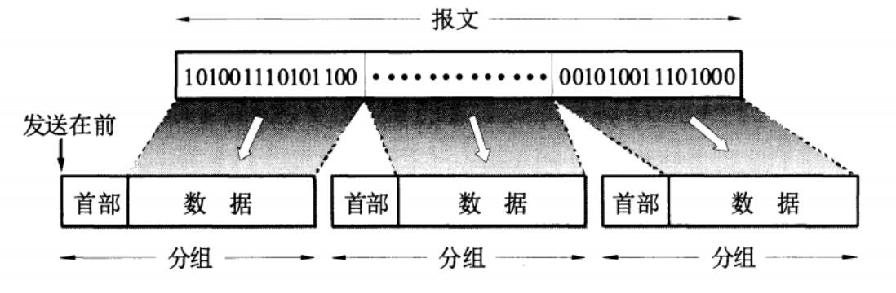

​	**主机**：为用户进行信息处理，可以和其他主机通过网络交换信息。

​	**路由器**：用来转发分组，进行分组交换。

### 分组交换的优点

|  优点  | 所采用的手段                             |
| :--: | :--------------------------------- |
|  高效  | 在分组传输的过程中动态分配传输带宽，对通信链路是逐段占用       |
|  灵活  | 为每个分组独立选择最合适的转发路由                  |
|  迅速  | 以分组作为传送单位，可以不先建立连接就能向其他主机发送分组      |
|  可靠  | 保证可靠性的网络协议：分布式多路由的分组交换网，使网路有很好的生产性 |


#### 计算机网络的性能指标

##### 1、速率

基本单位bit/s，通常在前面上字母，如K,G...，kbit/s

##### 2、带宽

在计算机网络中带宽用来表示网络中某通道传送数据的能力，某信道所能通过的“最高数据率”

##### 3、吞吐量

单位时间内通过某个网络的实际数据量。吞吐量≤额定速率

##### 4、时延

总时延=发送时延+传播时延+处理时延+排队时延
	**发送时延：主机或路由器发送数据帧所需要的时间**

​	**传播时延：电磁波在信道中传播一定的距离需要花费的时间**

​	**处理时延：主机或路由器处理分组的时间**

​	**排队时延：分组在进入路由器后在输入队列排队等待处理的时间**

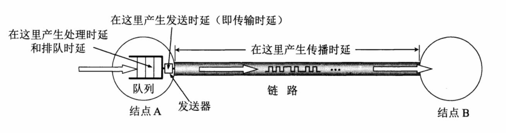

##### 5、时延带宽积

​	发送端连续发送数据，则在发送的第一个比特即将到达终点时，发送端已经发送的比特数。

##### 6、往返时间RRT

​	A向B发送数据，数据长度为100MB，发送速率为100Mbit/s
$$
发送时间=\frac{数据长度}{发送速率}=\frac{100\times2^{20}\times8}{100\times10^6}=8.39s
$$


​	若RRT=2s
$$
有效数据率=\frac{数据长度}{发送时间+RRT}=\frac{100\times2^{20}\times8}{8.39+2}=80.7Mbit/s
$$


## 计算机网络体系结构

OIS七层体系结构、TCP\IP四层、原理学习用五层

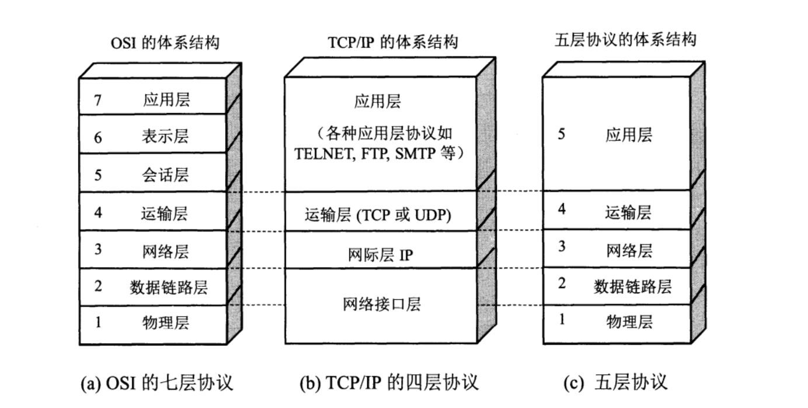

##### 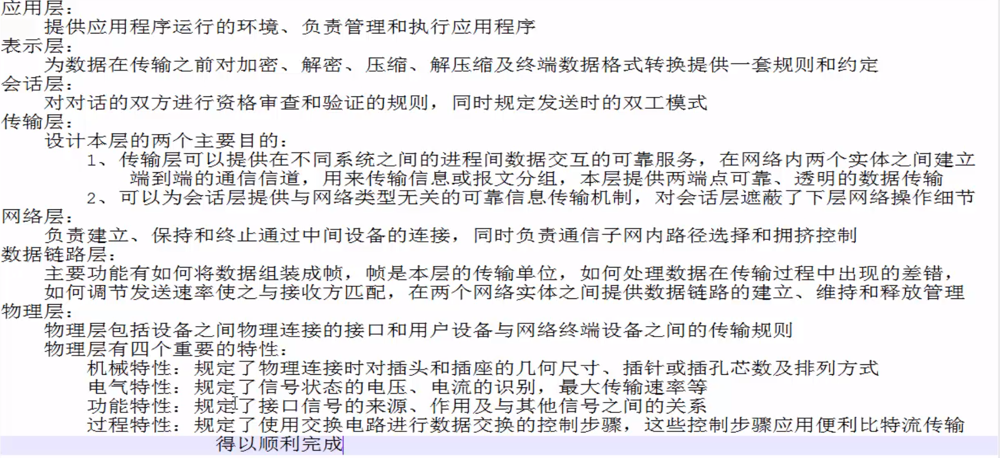

##### 1、应用层(application layer)

​	任务：通过应用进程间的交互来完成特定网络应用。

​	协议定义：应用进程间通信和交互的规则

​	应用层协议:DNS, HTTP, SMTP

​	数据单元：message报文

##### 2、传输层(transport layer)

​	任务：负责向两台主机进程之间的通信提供通用的数据传输服务

​	运输层主要使用以下两种协议：

- **传输控制协议TCP(Transmission Control Protocol)**--提供面向连接的、可靠的数据传输服务，其数据传输单位是**报文段(segment)**。
- **用户数据协议UDP(User Datagram Protocol)**--不可靠的，提供无连接的、尽最大努力(best-effort)的数据传输服务，其数据传输单位是**用户数据报**

##### 3、网络层(network layer)

​	任务1：为分组交换网上的不同主机提供通信服务。在发送数据时，网络层把运输层产生的**报文段**或**用户数据报**封装成**分组**或**包**进行传送。

​	在TCP/IP体系中，网络层使用IP协议，因此分组也叫做**IP数据包**。

​	任务2：选择合适的路由，使源主机传输层所传下来的分组能够通过网络中的路由找到目的主机

​	路由器位于网络层

##### 4、数据链路层(data link layer)

​	任务：将网络层交下来的**IP数据报组装成帧**(farming)，在相邻结点间的链路上传送**帧**(frame)。

​		差错帧的校验，丢弃或纠错

​	传输单位：帧

​	交换机位于数据链路层，有多个冲突域和广播域，有多个端口可以用于连接各个主机，基于MAC地址工作，转发数据快，

##### 5、物理层(physical layer)

​	关注在一条通信信道上传输原始比特。设计问题涉及机械、电子和时序接口等。

​	传输单位：**比特**

​	集线器位于物理层，用于信号放大和连接多个终端


> ###### 有关HUB、交换机， 冲突域、广播域的补充知识
>
> 

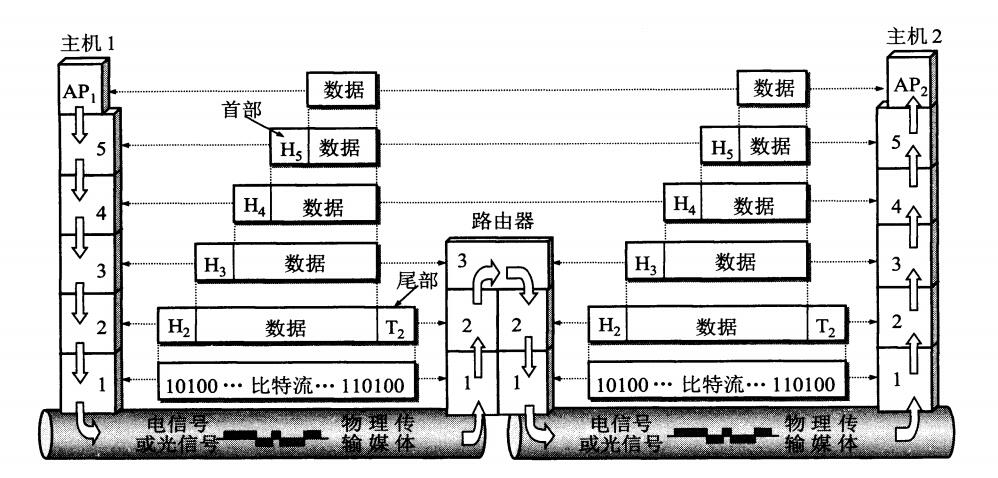


#### TCP/IP体系结构协议簇

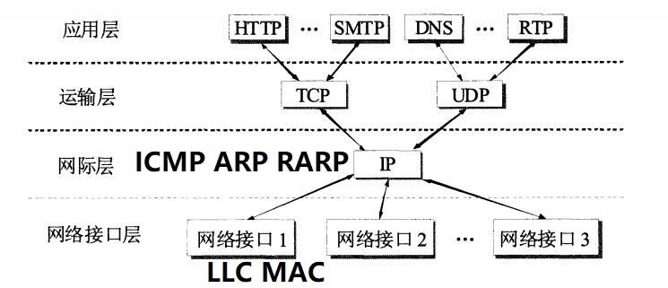

### 例：C/S工作方式说明

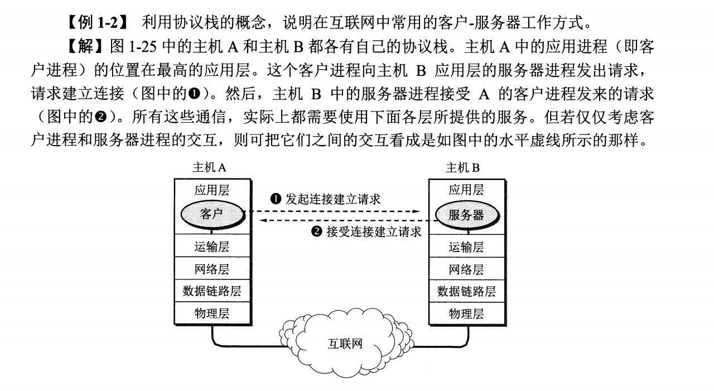

# 物理层

## 传输方式

### 双绞线

**双绞线**：把两根**相互绝缘**的铜导线并排放在一起，然后用规则的方法**绞合(twist)**在一起

**单工**：数据只能单向流通，从一端传输到另一端

**半双工**：数据可以双向流通，但是同时只能使用一个方向的链路

**全双工**：数据可以同时双向流通

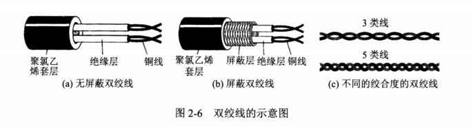

### 同轴电缆

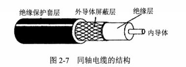

### 光缆

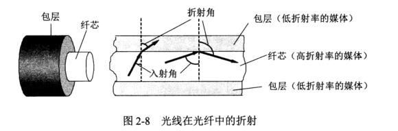

### 无线微波传输

## 信道复用技术

在一条信道上传送几种信号的**多路复用技术(multiplexing)**，可分为**时分复用**，**频分复用**和**码分复用**。

### 频分复用、时分复用

FDM(Frequency Division Multiplexing)、TDM(Time Division Multiplexing)

FDM:用户被分配到固定的频段，不同用户可以在相同的时间占用不同的带宽频段进行数据传输。

TDM:将时间划分为一段等长的时分复用帧。每个一时分复用的用户在每一个TDM帧中占用固定序号的时隙。

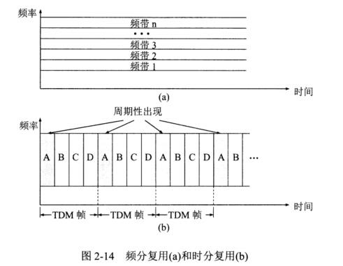

缺点：由于计算机数据的突发性，用户对自己占用通道的利用率不高。

改进：统计时分复用，通过一个集中器将分散的用户数据集中到一起，加上头部信息，提高利用率。

### 码分复用

CDM(Code Division Mulitiplexing)

每一个用户在同样的时间使用同样的频带进行通信，选择经过特殊挑选的不同码型，各用户之间不会造成干扰。

很复杂

# 数据链路层

数据链路层要完成的功能

1. 向网络层提供一个定义良好的**服务接口**
2. **处理传输错误**
3. **调节数据流**。确保慢速的接收方不会被快速的发送方淹没

## 成帧

首位填充和转义字符

## 交换机

**基本概念**

扩展以太网的常用方法是在**数据链路层**进行，最初使用**网桥**。

网桥对收到的帧根据其**MAC****帧的目的地址**，通过查找网桥中的**地址表**，进行**转发**和**过滤**。

交换机是一种市场名词，switching hub，交换式集线器、以太网交换机

交换机的本质就是一个**多接口的网桥**。

每个接口与一个单台主机或另一个交换机连接，工作在**全双工方式**、拥有**并行性**。

对于连接主机来说，其**独占传输媒体，无碰撞的传输数据。**

即：若十个10Mbit/s的用户，连接到交换机上，其各自的速度依然是10Mbit/s，交换机的总容量可以达到100Mbit/s

交换机的接口还有存储器，用于端口繁忙时缓存数据帧。

交换机可以即插即用，其内部帧的**交换表（地址表）**通过**自学习**算法自动建立，其使用专门的交换结构芯片，硬件转发速度比使用软件转发的网桥快很多。


**自学习算法**

基本原理：

连接到交换机的主机在**发送帧**时，交换机**记录其MAC地址和接口号**到交换表中

若目的地址不在交换表中，则**广播**

交换表中的每个项目都有一定的有效时间，过期项目被自动删除。（维持即插即用）

 

**生成树协议STP（Spanning Tree Protocol)**，用于解决冗余链路导致的循环传输

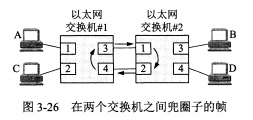

 

**虚拟局域网VLAN virtual Lan**

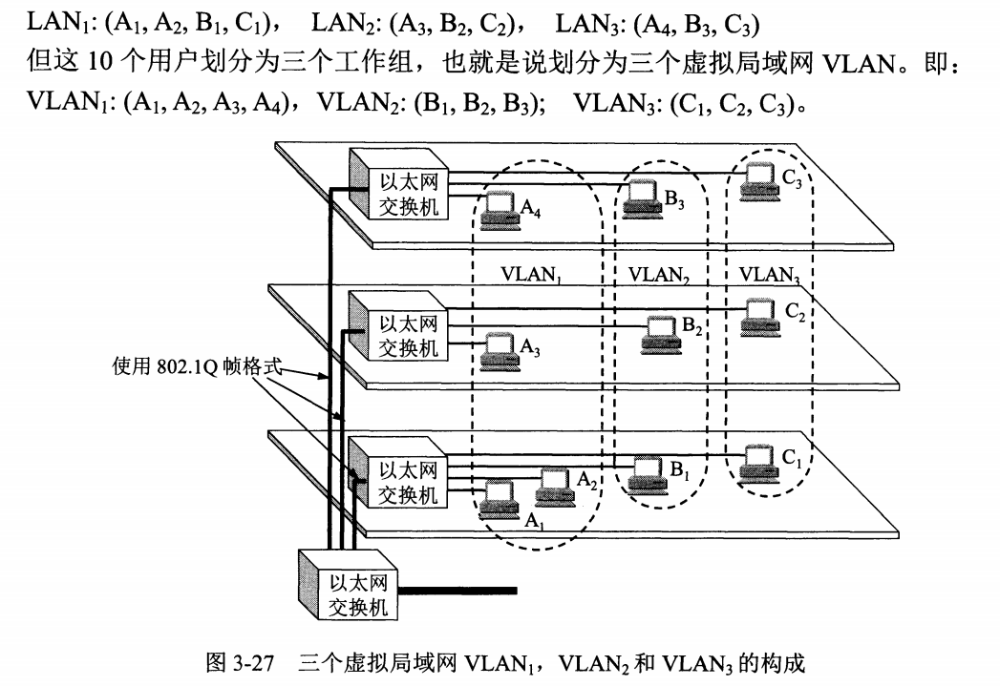

 

# 网络层

网络层的目的是实现两个端系统之间的数据透明传送，具体功能包括寻址和路由选择、连接的建立、保持和终止等。它提供的服务使传输层不需要了解网络中的数据传输和交换技术。如果您想用尽量少的词来记住网络层，那就是“**路径选择、路由及逻辑寻址**”。

　　网络层中涉及众多的协议，其中包括最重要的协议，也是TCP/IP的核心协议——**IP协议**。IP协议非常简单，仅仅提供不可靠、无连接的传送服务。IP协议的主要功能有：无连接数据报传输、数据报路由选择和差错控制。与IP协议配套使用实现其功能的还有**地址解析协议ARP**、**逆地址解析协议RARP**、**因特网报文协议ICMP**、**因特网组管理协议IGMP**。具体的协议我们会在接下来的部分进行总结，有关网络层的重点为：

　　**1> 网络层负责对子网间的数据包进行路由选择。此外，网络层还可以实现拥塞控制、网际互连等功能；**

　　**2> 基本数据单位为IP数据报；**

　　**3> 包含的主要协议：**

　　**IP协议（Internet Protocol，因特网互联协议）;**

　　**ICMP协议（Internet Control Message Protocol，因特网控制报文协议）;**

　　**ARP协议（Address Resolution Protocol，地址解析协议）;**

　　**RARP协议（Reverse Address Resolution Protocol，逆地址解析协议）。**

## IP协议

IP协议是一种无连接不可靠的分组传送服务的协议

IP协议是dian-点线路的网络层通信协议

### IP头

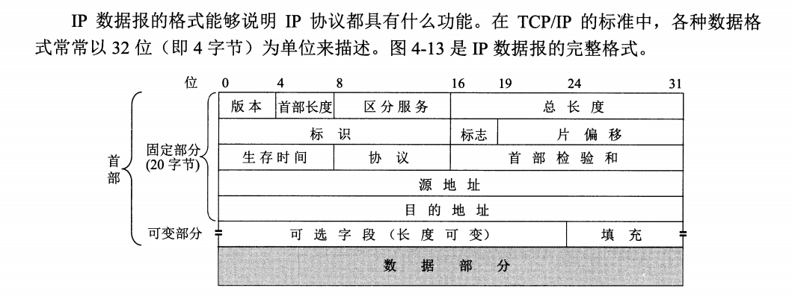

### IP地址的分类


### 子网掩码的计算方法


子网掩码：代表了”网络+子网号“与主机号之间的分割方案。

如子网掩码255.255.255.0的表示方式如下

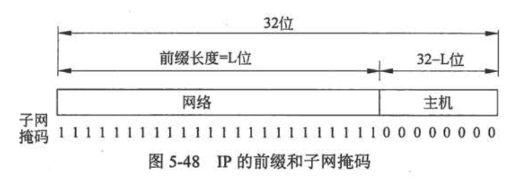

子网掩码的使用方法：当数据包到达时，路由器查看该数据包的目标地址，将其与每个子网的掩码进行按位AND操作，看结果是否对应于某个前缀。

## ARP协议

从IP地址解析到MAC地址，解决同一个局域网上的主机或路由器的IP地址和硬件地址的映射问题。


## IPV6头

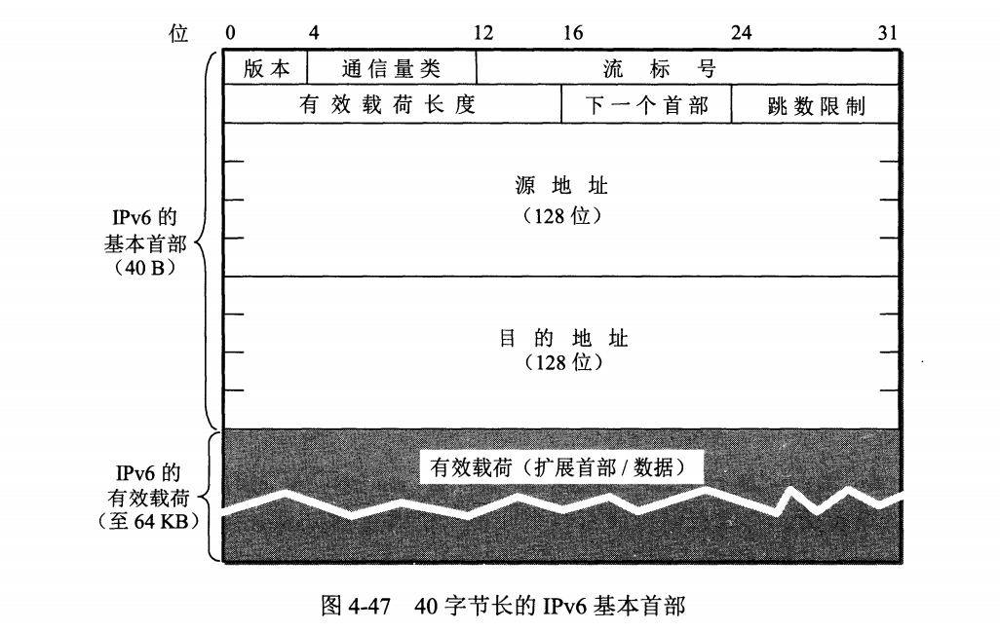


## 路由器

**路由器的结构**

 

**交换结构**

交换结构负责把分组从一个输入端口转移到某个合适的输出端口。

有三种常用的交换结构：

**存储器**

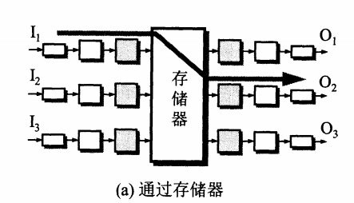

最早期就是使用普通计算机作为路由器，通过计算机的CPU作为路由器的路由选择处理机。其交换速度受限于存储器的读写速度。

 

**总线**

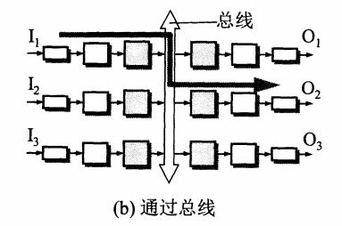

同一时间只能有一个分组在总线上传送。转发带宽受总线速度的限制。

**互连网络**

 

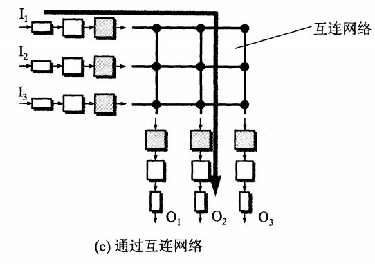

有2N条总线，N个输入端口和N个输出端口连接，根据垂直总线是否空闲来判断是等待还是传输数据。速度很快

## 路由选择

分层次的路由选择协议

动态的、分布式路由选择协议。

互联网规模很大，同时很多单位想要隐藏局域网络细节，同时保持外部互联。

根据上述原因，整个互联网被划分为许多较小的**自治系统（****autonomous system****）**，一般记为AS。

一个AS对其他AS表现出的是**一个单一和一致的路由选择策略**。

### 内部网关协议 IGP Interior Gateway Protocol

在一个自治系统内使用的路由选择协议，与外部其他自治系统无关。如RIP、OSPF协议

#### RIP Routing Information Protocol

**工作原理**

一种分布式的**基于距离向量的路由选择协议**，其最大优点是简单。

RIP协议要求网络中的每一个路由器都要维护从它自己到其他每一个目的网络的距离。（一组距离，即一个“距离向量”）

距离的定义如下：从一路由器直接连接的网络的距离定义为1，到非直接连接的网络的距离定义为经过的路由器数加1。

距离也称为**跳数（hop count）**，RIP允许一条路径**最多只能包含15个路由器，**因此其**只适用于小型互联网。**

 

因为只依赖跳数，在**各个路径带宽不同**时，其不一定是最短路径

 

对于分布式路由选择协议来说，它们都需要不断和其他路由器交换信息，其中的**关键点**在于：

- 和哪些路由器交换信息？

  ​	仅和相邻路由器交换信息。

- 交换什么信息？

  ​	交换当前已知的所有信息，即自己现在的路由表

- 在什么时候交换信息？

  ​	按固定的时间间隔（30s）交换信息。（维持网络动态更新）

 

路由表中的信息：到某个网络的距离，以及应该经过的下一跳地址。

### 外部网关协议

问：在不同的AS之间为什么不可以使用内部网关协议？

答：

1、互联网规模大，如果使用RIP，每个路由器要维护一个非常庞大的链路状态数据库对每个AS来说，记录的路径代价并不一定通用

2、AS之间的路由选择必须考虑有关策略。如政治、经济、安全等各个方面都会影响AS之间的数据流通

#### 边际网关协议 BGP

综上，BGP的目的是寻找一条能到达目标网络的**比较好**的路由，而**并非找到一条最佳路由**

BGP使用路径向量路由选择协议。

专属名词：BGP speaker，每个AS都需要由管理员指定**至少**一个BGP发言人，表明该路由器代表整个AS与其他AS交换路由信息。

BGP speaker**往往就是BGP边界路由器**，但也可以不是

两个AS之间通过BGP speaker交换路由信息时，需要先建立TCP连接（port 127），在此连接上交换BGP报文以建立**BGP会话**

这两个建立连接的BGP speaker 彼此成为对方的**邻站（neighbor）**或**对等站（peer）**

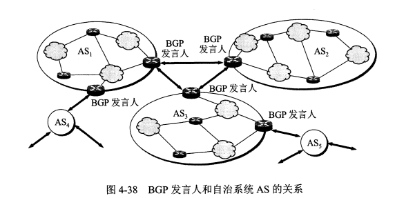

 

BGP支持无分类域间路由先择CIDR，其路由表包括目的网络前缀，下一条路由器，以及到达该目的网络所要经过的自治系统序列。

当一个BGP发言人收到其他BGP发言人的路径通知时，会检查自己是否已经在路径中，防止兜圈子。

BGP-4的四种报文：

1、**OPEN报文**，用来与相邻的另一个BGP发言人建立关系，使通信初始化

2、**UPDATE报文**，用来通告某一路由的信息，以及列出要撤销的多条路由

3、**KEEPALIVE报文**，用来周期性的证实邻站的连通性

4、**NOTIFICATION报文**，用来发送检测到的差错

## VPN 虚拟专用网络

- 本地地址：仅在机构内有效的IP地址
- 全球地址：全球唯一的IP地址
- 专用地址：这些地址只能用于一个机构的内部通信，不能用于互联网上的主机通信。**在互联网中的所有路由器，对目的地址使专用地址的数据报一律不进行转发。**

 

三个专用地址块

1、10.0.0.0 到 10.255.255.255（10.0.0.0/8，24位块）

2、172.16.0.0到172.32.255.255 （172.16.0.0/12， 20位块）

3、192.168.0.0 到 192.168.255.255 （192.168.0.0/16 ，16位块）

 

当同属于一个机构的专用地址间需要互相通信时，就需要用到公用的互联网作为本机构专用网之间的通信载体，称为**虚拟专用网VPN（Virtual Private Network）**

**如何使用IP隧道技术实现虚拟专用网**

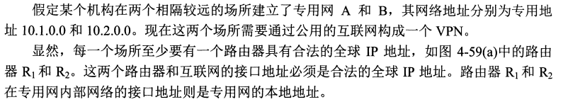

 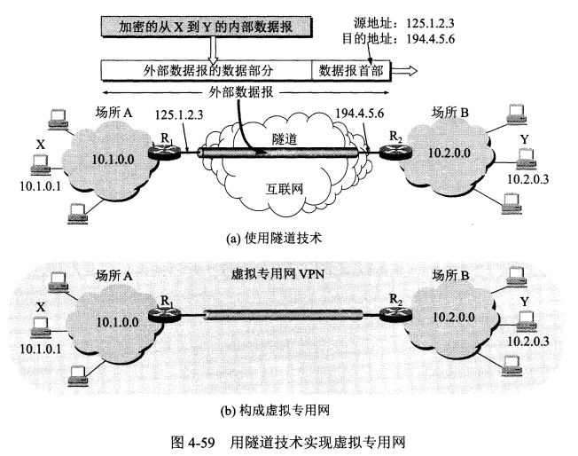

当场所A的主机X要和场所B的主机Y通信时，需要经过路由器R1和R2。主机X向主机Y发送的IP数据包的源地址是10.1.0.1，目的地址是10.2.0.3。路由器R1收到数据报后，发现其目的网络必须通过互联网，则对其进行**加密，**将其封装成为在护粮网上发送的外部数据报。同理，路由器R2收到后，对数据进行解密，恢复出原始数据报，并发送到其目的地址（10.2.0.3）

# 传输层

传输层架构在网络层提供的服务之上，把数据传递服务从两台计算机之间扩展到两台计算机上的进程之间。以下内容主要涉及可靠性、连接、释放和拥塞控制，协议（UDP和TCP）和性能等问题的解决。

## 传输协议的要素

### 寻址

当一台计算机上的一个应用进程需要与另一台计算机上的一个应用进程通信时，它必须指定连接到哪个确定的应用进程上。在网络层上，每个计算机都有自己唯一的IP地址作为其**网络服务访问点**（NSAP，Network Service Access Point）。相对应的，在每台计算机中，每个应用进程需要有其所对应的**传输服务访问点**（TSAP，Transport Service Access Point），在Intenet中，这些访问点被称为**端口**（port）。

通过IP地址和端口号的组合，应用进程之间可以完成准确的寻址。

### 连接建立

著名的三次握手。

首先考虑发送方和接收方之间建立连接的方法与可能出现的情况。

1. 正常的情况

   发送方向接收方发送一个CONNECTION REQUEST段，接收方收到之后返回一个ACCEPTED，连接建立完成。

2. 丢失

   若发送方发送的请求包中途丢失，则接收方根本无从得知发送方是否发起过连接请求，这时需要发送方有超时重发的功能。

3. 延迟重复

   考虑发送方先发送的一个请求包1在网络中遇到拥塞，但并没有丢失，发送方迟迟没有接收到回应包，判断超时后重新发送请求包2，该请求包被接收方迅速接收后，并发回回应包。之后，请求包1在请求包2之后到达接收方，此时如何处理。

   典型的银行转账问题

4. 损坏

   接收方接收到一个不完整的请求包，这是需要差错控制。

### 连接释放

### 差错控制和流量控制

## UDP(User Datagram Protocol)

UDP是无连接协议，它除了给应用程序提供发送数据包功能并允许他们在所需层次上架构自己的协议之外，几乎没有做任何事情。

而TCP是面向连接的协议，它几乎做了所有事情，包括建立连接， 通过重传机制增加可靠性，同行还进行流量控制和拥塞控制。

UDP传输段包括一个8字节的头，其大小为[8, 65515]

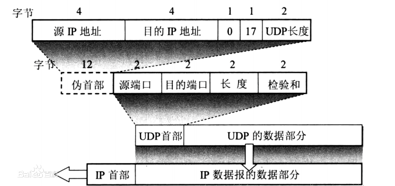


**UDP校验和的计算：**

在计算校验和时，要在UDP用户数据包之前增加12个字节的**伪首部**，其不是UDP真正的首部，只在计算时使用，不会上传和下发。

UDP的校验和将**首部和数据部分**一起都校验。校验和为**所有16位数的二进制反码**的和。

域名系统(DNS, Domain Name System)是使用UDP的典型应用

## TCP

与UDP的无连接传输相对的，传输控制协议（TCP, Transimission Control Protocol）是为了在不可靠的互联网上提供**可靠的端到端字节流**而专门设计的传输协议。

在UDP协议中，在媒体应用中对数据包的丢失不敏感，但大多数的Internet需要可靠的、按序递交的传输特性，TCP提供了这种服务。

TCP有许多种重要的责任：

1. 负责足够快的发送数据，以便使用网络容量，但是又不能引起网络拥塞
2. TCP超时后重传没有递交的数据报。
3. 把接收到的数据报按照正确的顺序排列。

### TCP服务模型

TCP服务由发送端和接收端创建一种称为套接字（socket）的端点来获得。每个socket有一个Address，由主机的ip和port组成。每个链接可以用两端的socket标识符来标识，即（socket1, socket2）。

**一段字节流通过TCP协议从发送端到接收端的过程：**

首先根据TCP的报文结构对字节流进行打包，形成一个完整的TCP报文段，之后将TCP报文段传送到IP层，加上IP首部后，再传送到数据链路层，加上数据链路层的首部和尾部，才离开主机发送到物理链路。接收端在链路层接受到数据包。

### TCP段的头

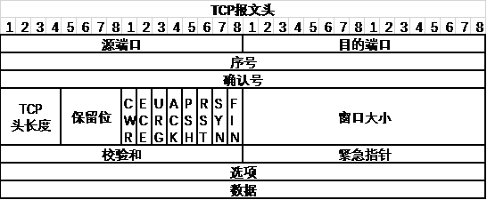

每个TCP段的起始部分是一个固定格式的20字节头。因为TCP段之后还要进行加IP头，那么在TCP段中的数据最多可达65535-20-20=**65495**字节，其中第一个20是ip头的长度，第二个20是TCP头的长度。**没有任何数据的TCP段也是合法的。**

源端口（Source port）和目的端口(Destination port)记录了发送方和接收方的对应应用程序的端口号。TCP端口加上所在主机的IP地址就组成了48位的唯一端点。源端点和目的端点一起标识一条连接。

序号（**seq**, Sequence number）和确认号(**ack**, Acknowledgement number)。确认号指定的是**下一个期待的字节**，而非正确接收的最后一个字节。

TCP头长度（TCP Header Length）表示了整个TCP头包含多少个32位的字。因为选项的长度是可变的，因此该位是必须的。从一定角度上讲，该字段实际上也表示了数据部分在TCP段内的起始位置（以32位为单位）。

4位未被声明的保留位，在设计之初有6位的保留位，在RFC3168中增加了ECN（显式拥塞通知），增加了CWR和ECE作为拥塞控制的信号。

**CWR和ECE**：当接收端收到了网络拥塞的指示后，设置ECE标识位告诉发送端减慢发送速率。发送端接受到ECE-Echo信号后，设置CWR，通知接收端已经放慢发送速率。

**URG**是紧急指针的标识位，当使用了紧急指针时，就将URG设置为1。

**ACK**字段被设置为1用来表示确认号字段有效，否则可以忽略确认号。

**PSH**字段用于指示该数据被推送（PUSH），需要接收端立即递交应用程序，而非送入缓冲区。

**RST**字段用于重置连接。或者用于拒收一个无效的段，拒绝一个连接请求。

**SYN**用于建立连接过程，当客户发送一个请求连接的段时，设置SYN=1, ACK=0，服务器接收到请求段并回复的应答段中包含确认，设置SYN=1, ACK=1。

**FIN**用于释放连接。

TCP中的流量控制是通过一个**可变大小**的滑动窗口来处理 的。**窗口大小**字段指定了从被确认的字节算起可以发送多少个字节。

**校验和**提供对TCP头和数据的校验。

**选项**提供添加额外设施的途径，其长度必须是32为的倍数。常见的选项包括：接受的最大段长设定（MSS, Maximum Segment Size），窗口尺度（Window scale），时间戳（Timestamp）等

### TCP的三次握手和四次挥手

 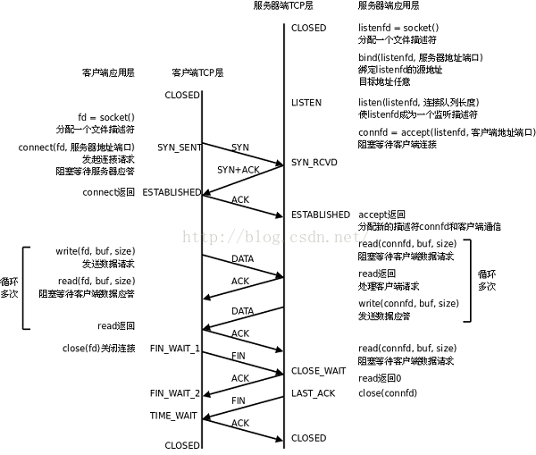 

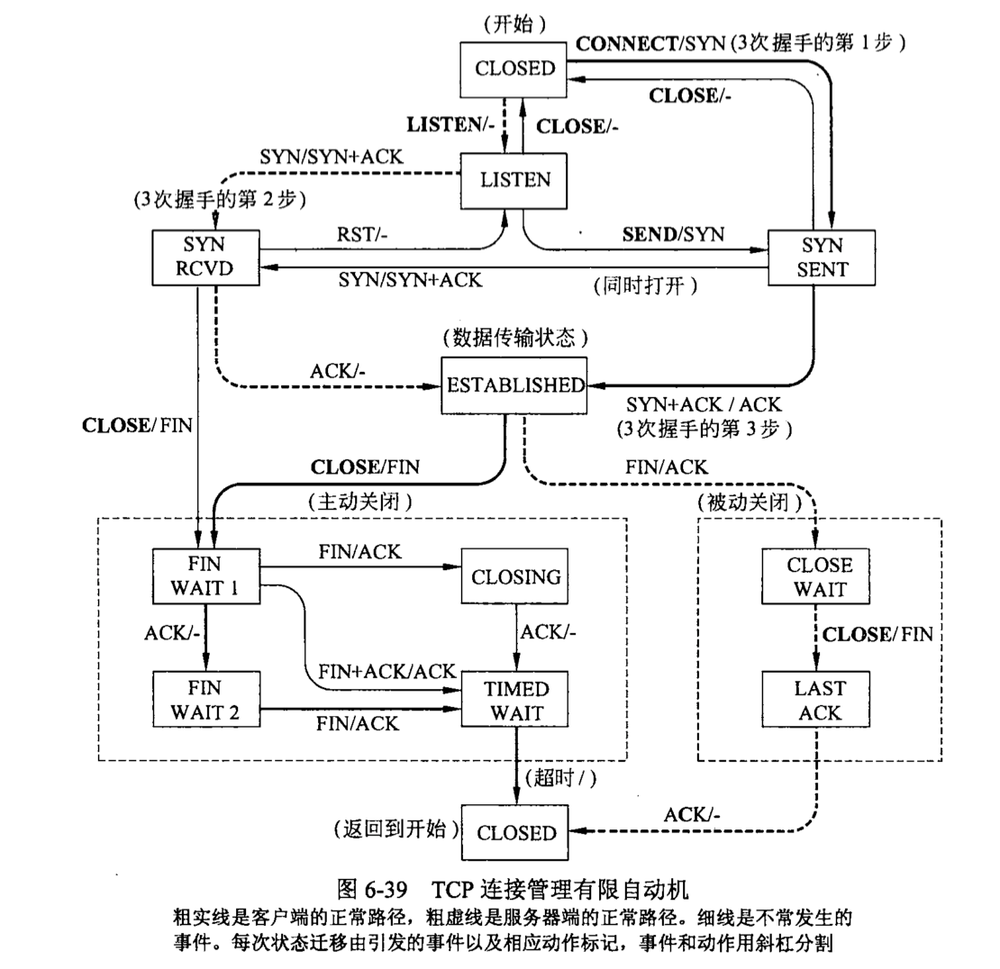


TCP（Transmission Control Protocol，传输控制协议）是一种**面向连接的**、**可靠的**、**基于字节流**的通信协议，数据在传输前要建立连接，传输完毕后还要断开连接。
客户端在收发数据前要使用 connect() 函数和服务器建立连接。建立连接的目的是保证IP地址、端口、物理链路等正确无误，为数据的传输开辟通道。
TCP建立连接时要传输三个数据包，俗称三次握手（Three-way Handshaking）。可以形象的比喻为下面的对话：

- [Shake 1] 套接字A：“你好，套接字B，我这里有数据要传送给你，建立连接吧。”
- [Shake 2] 套接字B：“好的，我这边已准备就绪。”
- [Shake 3] 套接字A：“谢谢你受理我的请求。”

#### TCP数据报结构

我们先来看一下TCP数据报的结构：


带阴影的几个字段需要重点说明一下：1) 序号：Seq（Sequence Number）序号占32位，用来标识从计算机A发送到计算机B的数据包的序号，计算机发送数据时对此进行标记。

3) 标志位：每个标志位占用1Bit，共有6个，分别为 URG、ACK、PSH、RST、SYN、FIN，具体含义如下：

> 对英文字母缩写的总结：Seq 是 Sequence 的缩写，表示序列；Ack(ACK) 是 Acknowledge 的缩写，表示确认；SYN 是 Synchronous 的缩写，愿意是“同步的”，这里表示建立同步连接；FIN 是 Finish 的缩写，表示完成。

#### TCP连接的建立（三次握手）

使用 connect() 建立连接时，客户端和服务器端会相互发送三个数据包，请看下图：


客户端调用socket () 函数创建套接字后，因为没有建立连接，所以套接字处于**CLOSED**状态；服务器端调用 listen() 函数后，套接字进入**LISTEN**状态，开始监听客户端请求。这个时候，客户端开始发起请求：

1) 	当客户端调用 connect() 函数后，TCP协议会组建一个数据包，并设置 SYN 标志位，表示该数据包是用来建立同步连接的。同时生成一个**随机数字** 1000，填充“序号（Seq）”字段，表示该数据包的序号。完成这些工作，开始向服务器端发送数据包，客户端就进入了**SYN-SEND**状态。

> 注意，客户端和服务器各自维护自己的序列号，两者互相无关，只是将对方发来的上一条消息的序列号+1作为确认号返回。

2) 	服务器端收到数据包，检测到已经设置了 SYN 标志位，就知道这是客户端发来的建立连接的“请求包”。服务器端也会组建一个数据包，并设置 SYN 和 ACK 标志位，SYN 表示该数据包用来建立连接，ACK 用来确认收到了刚才客户端发送的数据包。

服务器生成一个随机数 2000，填充“序号（Seq）”字段。2000 和客户端数据包没有关系。

服务器将客户端数据包序号（1000）加1，得到1001，并用这个数字填充“确认号（Ack）”字段。

服务器将数据包发出，进入**SYN-RECV**状态。

3) 	客户端收到数据包，检测到已经设置了 SYN 和 ACK 标志位，就知道这是服务器发来的“确认包”。客户端会检测“确认号（Ack）”字段，看它的值是否为 1000+1，如果是就说明连接建立成功。

客户端将数据包发出，进入**ESTABLISED**状态，表示连接已经成功建立。
4) 	服务器端收到数据包，检测到已经设置了 ACK 标志位，就知道这是客户端发来的“确认包”。服务器会检测“确认号（Ack）”字段，看它的值是否为 2000+1，如果是就说明连接建立成功，服务器进入**ESTABLISED**状态。
至此，客户端和服务器都进入了**ESTABLISED**状态，连接建立成功，接下来就可以收发数据了。

三次握手的关键是要确认对方收到了自己的数据包，这个目标就是通过“确认号（Ack）”字段实现的。计算机会记录下自己发送的数据包序号 Seq，待收到对方的数据包后，检测“确认号（Ack）”字段，看**Ack=Seq + 1**是否成立，如果成立说明对方正确收到了自己的数据包。

##### TCP连接的建立为什么是三次而不是两次或者四次？

**一、资源浪费观点：引自《计算机网络》释疑与习题解答 谢希仁**

如果只有两次握手，当客户端的SYN请求连接在网络管道中阻塞，客户端没有接收到ACK报文，就会重新发送SYN，由于没有第三次握手，服务器不清楚客户端是否收到了自己发送的建立连接的ACK确认信号，所以每收到一个SYN就只能主动建立一个连接，这会造成什么情况呢？如果客户端的SYN阻塞了，重复发送多次SYN报文，那么服务器在收到请求后就会建立多个冗余的无效链接，造成不必要的资源浪费。
即两次握手会造成消息滞留情况下，**服务器重复接受无用的连接请求SYN报文**，而造成重复分配资源。

**二、可靠性论断：**

另外一种是 如果想确定双通道通畅，必须使用三个包的发送接收，也就是三次握手：“这个问题的本质是, 信道不可靠, 但是通信双发需要就某个问题达成一致. 而要解决这个问题, 无论你在消息中包含什么信息, 三次通信是理论上的最小值. 所以三次握手不是TCP本身的要求, 而是为了满足"在不可靠信道上可靠地传输信息"这一需求所导致的. 请注意这里的本质需求,信道不可靠, 数据传输要可靠. 三次达到了, 那后面你想接着握手也好, 发数据也好, 跟进行可靠信息传输的需求就没关系了. 因此,如果信道是可靠的, 即无论什么时候发出消息, 对方一定能收到, 或者你不关心是否要保证对方收到你的消息, 那就能像UDP那样直接发送消息就可以了.”
三次是保证双方互相明确对方能收能发的最低值。理论上讲不论握手多少次都不能确认一条信道是“可靠”的，但通过3次握手可以至少确认它是“可用”的，再往上加握手次数不过是提高“它是可用的”这个结论的可信程度。另外Tcp的可靠传输更多的是靠重传机制来保证的

**三、初始序列号**

三次握手的本质是为了同步双方的初始序列号：
为了实现可靠数据传输， TCP 协议的通信双方， 都必须维护一个序列号， 以标识发送出去的数据包中， 哪些是已经被对方收到的。 三次握手的过程即是通信双方相互告知序列号起始值， 并确认对方已经收到了序列号起始值的必经步骤。如果只是两次握手， 至多只有连接发起方的起始序列号能被确认， 另一方选择的序列号则得不到确认。TCP建立连接的握手，实质上就是建立一个双向的可靠通信连接，一边一个来回，每一边都自带超时重传来确保可靠性(而不是靠握手的次数)。TCP的3次握手是优化的结果，其实它应该是4次握手，由于是从零开始的建立连接，因此将SYN的ACK以及被动打开的SYN合并成了一个SYN-ACK。
握手的作用，旨在确定两个双向的初始序列号，TCP用序列号来编址传输的字节，由于是两个方向的连接，所以需要两个序列号，握手过程不传输任何字节，仅仅确定初始序列号。


### 对于不正常的三次握手情况TCP是如何处理的

1、客户端发送的SYN包在网络中阻塞或者丢失

client会持续发送syn包，总尝试时间为75s

2、server收到了client的syn，并发送了syn+ack包，该包丢失

client因为没有接受到回应，会触发1的情况，持续重传syn

server方面，超时时间内没有接收到client的ack包，会持续发送syn+ack包

#### TCP连接的释放（四次挥手）

 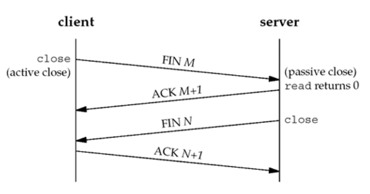 

1）当客户端发送完左右数据之后，应用结束，由客户端向服务器发送一个FIN段，并等待对应的ACK段返回，此时客户端为主动关闭，状态为**FIN WAIT 1**，表示应用没有数据要发送了。

当服务器收到客户端发送来的FIN段，被动关闭，返回对应的ACK段确定客户端关闭，并进入**CLOSE WAIT**状态

2）当客户端收到ACK确认关闭的ACK之后，进入到**FIN WAIT2**阶段，表示服务器已经同意释放连接，并等待服务器发送关闭FIN段。

3）当服务器也关闭时，给客户端发送FIN段，直接进入**LAST ACK**状态，等待连接上所有数据包超时。这个时间一般为最大数据包生存周期的两倍。

> 上述2、3两个步骤可以合成一步，及服务器收到客户端发送的FIN关闭请求时，回应ACK并同时也发送FIN段表示关闭自己。

4）客户端收到服务器发来的FIN段之后，返回ACK确认，进入**TIMED WAIT**状态，等待数据包超时后关闭。同时，当服务器收到最后的ACK时关闭。

### TIME_WIAT的作用

**为实现TCP全双工连接的可靠释放**

TCP四次挥手中主动关闭连接方发送完最后一次挥手之后，会进入TIME_WAIT状态，持续2MSL（Maximum Segment Lifetime），这是为了**保证客户端发送的最后一个ACK确认报文段能够到达服务器**。因为如果这个确认包丢失，服务器会**超时重传**第三次挥手的FIN信息报，客户端会据此重传第四次挥手的ACK报文，如果没有这个等待时间，客户端在第四次挥手后直接关闭连接，那么如果发生丢失的情况的话，客户端接收到的服务器重传的第三次挥手会被认为是非法报文段，返回RST数据报拒绝请求，从而无法正常关闭连接。

**为使旧的数据包在网络因过期而消失**

还有一个原因是为了等待滞留在网络中的当前连接的所有报文段消失，不对下次连接造成影响。


**高并发、短链接下TIME_WAIT带来的危害和解决方法**

短连接表示“**业务处理+传输数据的时间 远远小于 TIMEWAIT超时的时间**”的连接。

服务器可以设置SO_REUSEADDR套接字选项来通知内核，如果端口忙，但TCP连接位于TIME_WAIT状态时可以重用端口。

### TCP保证可靠性的方法

有两个可靠的点，一个是保证**数据不会损坏和丢失**，这个是通过**重传机制**来保证的，另一个是数据能够**按照指定的顺序**交付，这个是通过**序列号和确认号**实现的。

#### 序列号、确认应答、超时重传

客户端和服务器在建立连接后都会维护一个自己的**序列号**，在发送数据段时填入当前序列号，接收方接收到序列号后将序列号+1作为确认号返回，表示**已经接收到该数据段**，并设置该确认号为下一条期望接收到的数据段。如果发送方迟迟未收到确认应答，那么可能是发送的数据丢失，也可能是确认应答丢失，这时发送方在等待一定时间后会进行重传，这个重传时间一般被设置为$t = 2 * RTT + offset$. RTT为报文段往返时间。


#### 超时重传的时间


#### 窗口控制与高速重发控制/快速重传（重复确认应答）

TCP的**滑动窗口本质是描述接收方的TCP数据包缓冲区大小的数据**。接收端在接收到数据段后，在确认中通过TCP段头中的WIN字段告知发送端目前的窗口大小，WIN为0是合法的，说明到现在为止已经接收了多达确认号-1个字节，但是接收端因为缓冲空间不足，没有更多的空间来接收数据，希望暂时别发送数据。在接收端有更多的空间之后，可以通过发送一个具有同样确认号但是非零的WIN字段的段来通知发送端继续发送段。

在发送端接收到了一个WIN字段为0的段后，发送端就不能如通常那样发送段了，但是有两种意外情况：

1. 紧急数据仍可以发送，比如允许用户杀掉远程机器上的某一个进程
2. 发送端可以发送一个1字节的段，强制接收端重新宣告下一个期望的字节和窗口大小，这种数据包被称为**窗口探测(window probe)**。

如果设定报文发送为固定为1的窗口大小，发送端每次发送一段数据，都需要等待接收端确认后再继续发送下一段数据，再某些应用场景，比如ssh中，用户每次发送小数据包，则会造成大量的带宽浪费。针对这种情况许多TCP实现采用一种**延迟确认(delayed acknowledgement)**方法。

> 延迟确认 delayed acknowledgement
>
> 将确认和窗口更新延迟50ms

**Nagle算法**能够解决一个段中只包含小数据的问题

> Nagle算法：当数据每次以很少量的方式进入发送端时，发送端只是发送第一次到达的数据字节，然后将其余后面到达的字节缓冲起来，直到发送出去的数据包被确认；然后将所有缓冲的字节放在一个TCP段中发送出去，并且继续还是缓冲字节，直到下一个段被确认。
>
> 消极影响：在Internet网络游戏等需要快速短数据包相应的场景，Nagle算法会带来游戏相应不稳定的影响。
>
> 有时Nagle算法还会因为延迟确认的相互作用而造成短暂的死锁：发送端在发送第一个短数据包之后在等待回应，而接收端在等待收到后续数据的到来以便捎带确认，

另一个可能降低TCP性能的问题是**低能窗口综合征(silly window syndrome)**

> 低能窗口综合征(silly window syndrome)
>
> 发生情况：当数据以大块形式被传递给发送端TCP实体，但是接收端的交互式应用每次只读取一个字节数据。
>
> Clark通过禁止接收端发送只有1个字节的窗口更新段来解决这个问题，它强制接收端必须等待一段时间，直到有了一定数量的可用空间之后才能通告对方。

通过同时使用Nagle算法和Clark的方法可以同时解决发送方发送小数据段和接收端接收小数据段的问题。


### TCP拥塞控制 慢启动 拥塞避免 快重传 快恢复

当提供给任何网络的负载超过处理能力时就会产生拥塞。

拥塞发生在路由器，因此在网络层检测拥塞，但是拥塞的根本是由于传输层注入网络中的流量引起，因此拥塞控制依赖于传输层的特殊算法。

加法递增乘法递减，(AIMD, Additive Increase Multiplicative Decrease)， 用户以加法的方式增加发送速率，接收到拥塞信号后以乘法的方式递减发送速率。

加法线斜率45°向上，而乘法线过原点，最终收敛至平衡点。

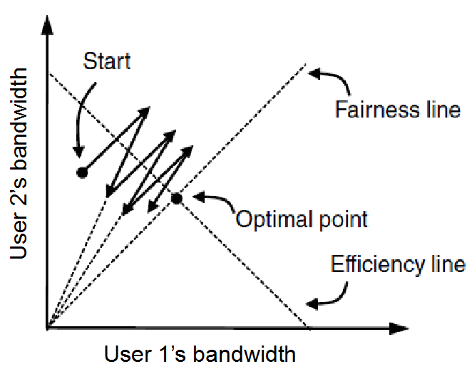

TCP的拥塞控制是基于AIMD法则实现的，其维持一个**拥塞窗口(congestion window)**，窗口大小表示任何时候发送端可以往网络发送的字节数。

**确认时钟(ack clock)**：确认返回到发送端的速率恰好是数据包通过路径上最慢链路时的速率，而这正是发送端应该使用的精确发送速率。即发送端按照一个恰好能在最慢链路上传输而不引起拥塞的速度发送数据包。

慢速启动(slow start)：发送端采用一个很小的值（1~4）初始化拥塞窗口，然后发送端发送该初始窗口大小的数据，数据包经过一个往返时间（RTT）后被确认，每一个发送后被确认的段都增加一个允许发送的段，则每经过一个往返时间拥塞窗口增加一倍。

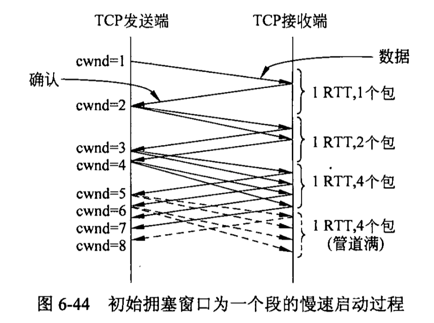

慢速启动很快就会使拥塞窗口达到一个可能引起网络拥塞的大小，这时，发送端为每个连接维持一个**慢启动阈值(slow start threshold)**，最初这个值被设置的任意高，可以达到流量控制窗口的大小，因此其不会限制连接速度。每当检测到丢包，如超时，慢启动阈值就被设置为当前拥塞窗口的一半。

一旦慢速启动超过阈值之后，TCP就从慢速启动切换到线性增加，即在每个往返时间拥塞窗口只增加一段。相比较满速启动，线性增加要慢得多，但是最终能够维持一个接近最佳值的拥塞窗口。

在上述方法中，有一个缺陷是等待超时，超时时间相对RTT来说要较长，因为它们是保守的。当一个包丢失之后，接收端不能越过它确认，因此确认号将保持不变，发送端因为拥塞窗口为满，无法发送任何新的数据包，这种情况会持续一段比较长的时间，直到计时器触发和重传丢失的包。

针对上述缺陷，当丢失数据包的后续数据包来到接收端时，他们触发给发送端发送确认，这些确认段带着相同的确认号，称为**重复确认(duplicate acknowledgement)**，发送端在接受到**三次**重复确认后，即认定已经丢失了一个包，这个包的序号可以从确认号推断，是整个数据序列中紧接着的下一个包。因此这个包可以立即重传，而无需等待计时器超时。这种启发式机制被称为**快速重传(fast retransmission)**。

发生了快速重传后，慢启动阈值就被设置为当前拥塞窗口的一半。并重新开始慢启动过程。1988 TCP Tahoe拥塞算法示意图如下。

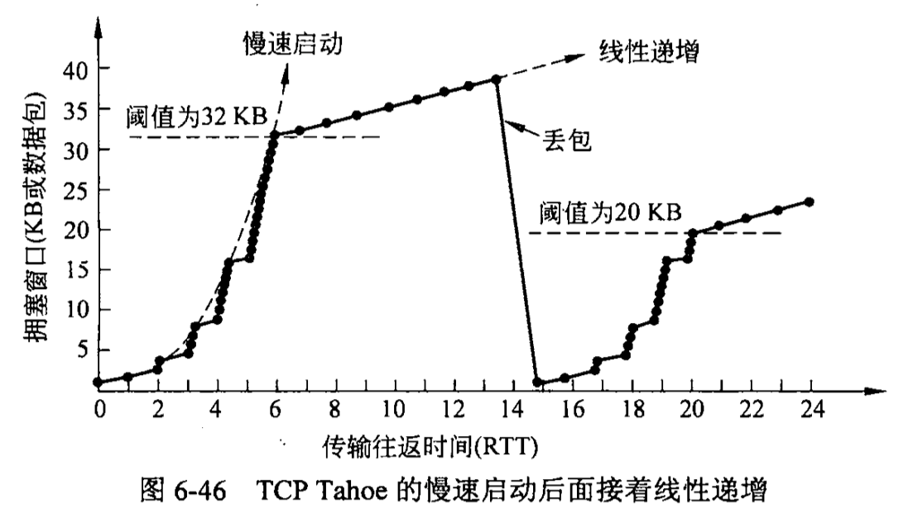

TCP Reno版本中新增了**快速恢复(Fast recovery)**，其目的是保持拥塞窗口上运行确认始终，在快速重传发生时，把拥塞窗口值减半。并对重复确认计数，在快速重传后的一个往返时间后，丢失的包被确认，重复确认流停止，快速恢复模式退出，拥塞窗口被设置到新的慢启动阈值并开始按线性增长。快速恢复的机制避免了多次的慢速启动。

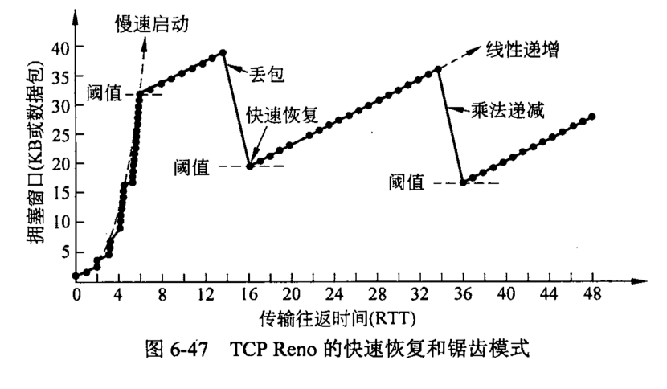

## SYN FLOOD攻击

### 原理

通过伪造源地址的方式远远不断的发送缺少第三次连接的TCP连接请求，占用服务器的半开连接队列。

### 防御方法

- #### cookie源认证


在ddos防护系统加入cookie认证，筛选真实的客户端加入白名单。

- #### reset认证


利用TCP协议的可靠性，收到SYN后响应一个特定的（cookie）ack，若客户端为真实的，则收到该错误确认号会发送reset报文，并且seq为cookie，而伪造的源不会有任何响应。

- #### TCP首包丢弃


将第一个包丢弃来触发客户端的重发机制，但是会影响用户体验。

- #### 控制连接队列上限

设定缓冲大小，满之后进行优化，放弃某些连接

# 应用层

## DNS协议

　DNS是**域名系统(Domain Name System)**的缩写，该系统用于命名组织到域层次结构中的计算机和网络服务。

一种分层次的，基于**域**的命名方案，并使用分布式数据库实现，其主要用途就是将URL映射为IP地址。

顶级域：包括通用域和国家域等

通常用域名树来表示互联网的域名系统。

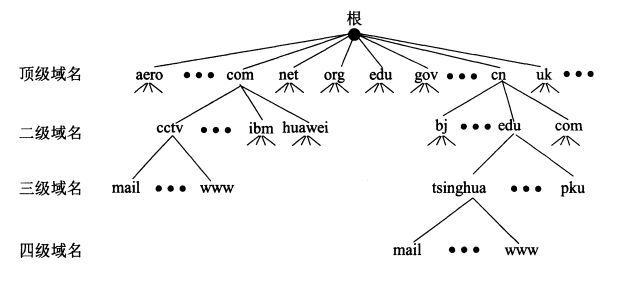

域名是由圆点分开一串单词或缩写组成的，每一个域名都对应一个惟一的IP地址，在Internet上域名与IP地址之间是一一对应的，DNS就是进行域名解析的服务器。DNS命名用于Internet等TCP/IP网络中，通过用户友好的名称查找计算机和服务。

DNS服务器的管辖范围以“区”为单位，`区∈域`

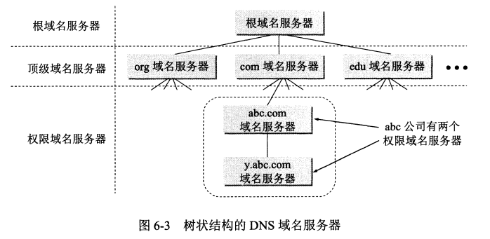

**DNS查找过程**

1. 浏览器缓存：浏览器会缓存DNS记录是短时间。
2. 系统缓存：windows `gethostbyname`
3. 路由器缓存
4. 本地域名服务器缓存
5. **递归查询**：主机所询问的本地域名服务器无法解析，则由本地域名服务器作为DNS客户的身份向根域名服务器发出查询请求报文，而不是由主机自己进行下一步查询。
6. **迭代查询**：本地域名服务器向根域名服务器查询通常是采用迭代查询。根域名服务器收到本地域名服务器发送的迭代查询请求报文时，返回所查询的IP地址，或者告诉本地服务器“下一步应当查询的域名服务器”，由本地域名服务器进行后续的查询。根域名服务器通常是将自己直到的顶级域名服务器IP告诉本地域名服务器，顶级域名服务器处理方式同理。

## HTTP协议

超文本传输协议(HTTP, Hyper Text Transfer Protocol)

HTTP中每个URL地址都由两部分组成，主机名（域名）+路径。HTTP使用TCP作为运输协议。

**HTTP报文有请求报文和响应报文两种。**

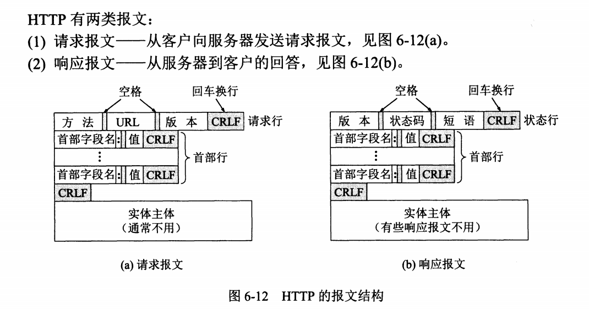

### HTTP状态码

| 分类 | 分类描述                                       |
| :--- | :--------------------------------------------- |
| 1**  | 信息，服务器收到请求，需要请求者继续执行操作   |
| 2**  | 成功，操作被成功接收并处理                     |
| 3**  | 重定向，需要进一步的操作以完成请求             |
| 4**  | 客户端错误，请求包含语法错误或无法完成请求     |
| 5**  | 服务器错误，服务器在处理请求的过程中发生了错误 |

| 状态码 | 英文名                        | 描述                                                         |
| :----- | :---------------------------- | :----------------------------------------------------------- |
| 100    | continue                      | 客户端应继续其请求                                           |
| 101    | Switching Protocols           | 切换协议，例如切换到更高版本的HTTP                           |
| 102    | Processing                    | 服务器已经收到并正在处理请求，时间较长，无响应，防止客户端超时 |
| 103    | Early Hints                   | 在最终的HTTP消息之前返回一些响应头                           |
| 200    | ok                            | 一切正常                                                     |
| 201    | created                       | 服务器响应客户端请求创建了资源                               |
| 202    | accepted                      | 服务器接收一个异步请求                                       |
| 203    | Non-Authoritative Information | 服务器是转换代理服务器，以200为起源回应响应的修改版本        |
| 204    | no context                    | 服务器成功处理了请求，没有返回任何内容。在[强制门户](https://zh.wikipedia.org/wiki/强制门户)功能中，Wifi设备连接到需要进行Web认证的Wifi接入点时，通过访问一个能生成HTTP 204响应的的网站，如果能正常收到204响应，则代表无需Web认证，否则会弹出网页浏览器界面，显示出Web网页认证界面用于让用户认证登录。 |
| 205    | Reset Consent                 | 服务器成功处理了请求，但没有返回任何内容。与204响应不同，此响应要求请求者重置文档视图。 |
| 206    | Partial Content               | 部分内容。服务器处理了部分GET请求。用此响应实现**断点续传**  |
| 300    | Multiple Choices              | **多种选择**。请求的资源可包括多个位置，相应可返回一个资源特征与地址的列表用于用户终端（例如：浏览器）选择 |
|302 | Found | 临时移动。所请求的资源未修改，服务器返回此状态码时，不会返回任何资源。客户端通常会缓存访问过的资源，通过提供一个头信息指出客户端希望只返回在指定日期之后修改的资源。虽然RFC 1945和RFC 2068规范**不允许客户端在重定向时改变请求的方法**，但是很多现存的浏览器将302响应视作为303响应，并且使用GET方式访问在Location中规定的URI，而无视原先请求的方法。[20]因此状态码303和307被添加了进来，用以明确服务器期待客户端进行何种反应 |
|303 | See Other | 查看其他地址 |
|304 | Not Modified | 未修改|
|305 | Use Proxy | 使用代理。所请求的资源必须通过代理访问 |
| 306 | Unused | 已废弃的状态码 |
| 307 | Temporary Redirect | 在这种情况下，请求应该与另一个URI重复，但后续的请求应仍使用原始的URI。与302相反，当重新发出原始请求时，不允许更改请求方法。 |
| 308 | Permanent Redirect | 请求和所有将来的请求应该使用另一个URI重复。 307和308重复302和301的行为，但不允许HTTP方法更改。 例如，将表单提交给永久重定向的资源可能会顺利进行。 |
| 400 | bad request | 通用错误 |
| 401 | unauthorized | 客户端尝试操作无权限的受保护资源 |
| 402 | Payment Required | 保留，将来使用 |
| 403 | Forbidden | 服务器已经理解请求，但是拒绝执行它。服务器希望能够讲清楚为何请求不能被执行，那么就应该在实体内描述拒绝的原因 |
| 404 | Not Found | 请求失败，请求所希望得到的资源未被在服务器上发现，但允许用户的后续请求。 |
| 405 | Method Not Allowed | 求行中指定的请求方法不能被用于请求相应的资源。 |
| 406    | Not Acceptable                | 请求的资源的内容特性无法满足请求头中的条件，因而无法生成响应实体，该请求不可接受。 |
| 407    | Proxy Authentication Required | 与401响应类似，只不过客户端必须在代理服务器上进行身份验证    |
| 408    | Request Time-out              | 服务器等待客户端发送的请求时间过长，超时                     |
|409	|Conflict	|服务器完成客户端的 PUT 请求时可能返回此代码，服务器处理请求时发生了冲突|
|410	|Gone	|客户端请求的资源已经不存在。410不同于404，如果资源以前有现在被永久删除了可使用410代码，网站设计人员可通过301代码指定资源的新位置|
|411	|Length Required|	服务器无法处理客户端发送的不带Content-Length的请求信息|
|412	|Precondition Failed	|客户端请求信息的先决条件错误|
|413|	Request Entity Too Large	|由于请求的实体过大，服务器无法处理，因此拒绝请求。为防止客户端的连续请求，服务器可能会关闭连接。如果只是服务器暂时无法处理，则会包含一个Retry-After的响应信息|
|414	|Request-URI Too Large	|请求的URI过长（URI通常为网址），服务器无法处理|
|415|	Unsupported Media Type|	服务器无法处理请求附带的媒体格式|
|416|	Requested range not satisfiable	|客户端请求的范围无效|
|417|	Expectation Failed|	服务器无法满足Expect的请求头信息|
| 500    | internal server error         | 通用服务器错误响应                                           |
| 501    | not implemented               | 不支持的http特性                                             |
| 502    | bad gateway                   | http代理响应：代理错误问题                                   |
| 503    | service unavailable           | http正常，web服务异常，如资源不足                            |
| 504    | gateway timeout               | 代理无法连接上行服务器                                       |
| 505    | http version not support      | 服务器不支持的http版本                                       |

### HTTP1.0和HTTP1.1的区别

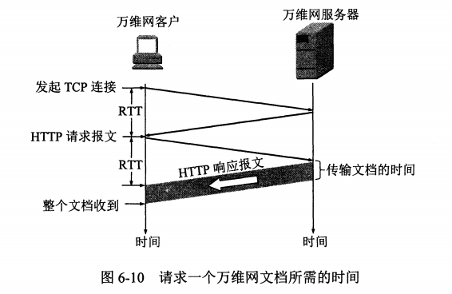

在HTTP1.0中，使用非持续连接的方法，每请求一个文档有两倍RTT的开销，在HTTP1.1版本中，使用了持续连接的方法，服务器在发送响应后在一段时间内继续保持这条连接。

两种持续连接方法：

- **非流水线方式**：客户在收到HTTP响应报文之后才能发送新的请求报文（阻塞等待）
- **流水线方式**：客户在收到HTTP的响应报文之前就能接着发送新的请求报文（非阻塞异步）


### cookie

HTTP响应报文中包含了cookie首部行；HTTP请求报文中包含cookie首部行；客户端有一个cookie文件，由浏览器管理；WEB站点的后端数据库保存了基于cookie识别码的用户浏览信息。

**客户端发送一个请求到服务器** --》 

**服务器发送一个HttpResponse响应到客户端，其中包含Set-Cookie的头部** --》 

**客户端保存cookie，之后向服务器发送请求时，HttpRequest请求中会包含一个Cookie的头部** --》

**服务器返回响应数据**


## 网络抓包原理

代理服务器，在客户端和服务器之间设置一道关卡，客户端先将请求数据发送出去后，代理服务器会将数据包进行拦截，代理服务器再冒充客户端发送数据到服务器；同理，服务器将响应数据返回，代理服务器也会将数据拦截，再返回给客户端。

## NAT协议

network address translation网络地址转换

子网中需要接入网的设备多过可以分配的IP地址时，路由器提供了NAT功能，不同的局域网中的地址可以相同，规定192，172，10网段作为子网。当他们连接到广域网时不能使用原来的局域网地址，通过具有NAT功能的路由器对数据帧中的地址进行转换。所有局域网内设备相当于共用该路由器的公网地址。

广域网中传入局域网的数据如何分配给对应的主机？通过NAT转换表，为局域网内的不同连接分配不同的端口号，端口号指定了对应的主机，16位的端口号决定了NAT并行连接超过60000


# 在地址栏中输入url后发生了什么


1、**浏览器请求DNS查询服务器url的IP地址。DNS服务器返回IP地址**

首先，浏览器向本地 DNS 服务器发起请求，由于本地 DNS 服务器没有缓存不能直接将域名转换为 IP 地址，需要采用递归或者迭代查询的方式（图 3）依次向根域名服务器、顶级域名服务器、权威域名服务器发起查询请求，直至找到一个或一组 IP 地址，返回给浏览器。一般本地 DNS 地址由 ISP（Internet Service Provider，互联网服务提供商）通过 DHCP 协议动态分配，我们仍可以手动把它修改为公共 DNS，比如 Google 提供的 8.8.8.8，国内的 114.114.114.114，它们分布在不同的地理位置上，借助 Anycast 技术，将请求路由到离用户最近的 DNS 服务器上。为了让 DNS 解析更加精确，客户端还需在请求包里带上自己的源 IP 地址，否则类似 GSLB 的 DNS 服务器不能够精准地匹配判断离用户最近的目标 IP 地址。

2、浏览器与IP地址机器的80端口建立一个TCP连接，80端口是HTTP协议的知名端口

这其中包括TCP建立连接的三次握手，如果是是HTTPS协议的话，其工作在TCP协议443端口，除了三次同步握手之外，还另外包含客户端验证服务器数字证书，DH算法协商**对称加密**算法的密钥、hash算法的密钥，SSL安全加密隧道协商完成、网页加密传输过程。

3、浏览器发送HTTP报文，请求页面


请求报文

5、服务器返回页面作为HTTP响应

6、浏览器显示页面

# 数据从网卡接受到应用程序处理，中间经历了什么

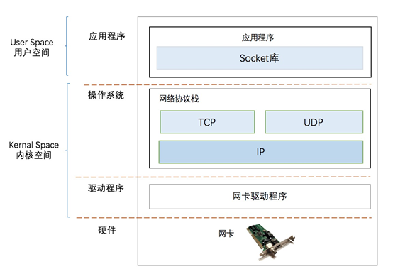

1、首先网卡接受到数据后进行一些简单的校验，如FCS校验，判断是否再传输过程中由于噪声影响而造成了信号失真，有的话就丢弃无用数据包。然后检查MAC地址的接收方是否是自己，是则奖数据保存在网卡缓冲区中，这个过程中CPU不知道有数据到达

2、数据到达缓冲区之后，通过硬件中断通知CPU处理，CPU调用网卡驱动程序从网卡缓冲区读取数据到内核缓冲区，再根据MAC头部的以太类型字段确认使用的协议，调用对应的协议栈来处理。

如果是TCP/IP协议，则先检查IP头部判断是否是发送给自己的数据包，再根据标识号、标志和片偏移字段来判断数据是否已经分片，最后一组数据是否已经到达，重新组装。再根据协议号交给TCP/UDP模块处理

对于TCP/UDP协议来说，先进行差错校验，如果出错则丢弃或者交给应用程序处理，如果正常，则检查绑定的套接字，将数据读到对应的缓冲区，等到应用程序读取(read函数)。


# socket TCP传输中的数据传输流程

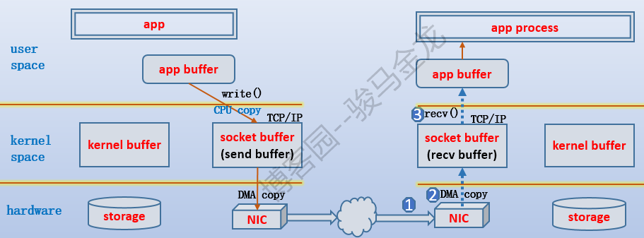

TCP协议栈维护了两个缓冲区：send_buffer 和 recv_buffer，合称为socket_buffer，它位于内核态内存空间中， 在发送端通过TCP发送的数据，需要先从用户内存空间写入到内核内存空间的send_buffer中，再由网卡通过硬件dma的方式从send_buffer拷贝数据并且发送到接收端的网卡，接收端网卡同样通过DMA的方式将数据拷贝到recv_buffer，之后接收端的应用程序通过recv的方式从内核态的recv_buffer拷贝数据到app_buffer

# SDN software Defined Network 软件定义网络

 

关键点：

**网络开放可编程（****SDN****发展和落地的关键）**

数控分离：逻辑上的分离，用一个通用的接口（南向接口）

集中控制：分布式网络系统的总控（主控制器、备份控制器、控制器集群）

 

数控分离和集中控制都是为网络开放可编程提供更多可能性。

 

如果把网络中的所有网络设备视为被管理的资源，那么参考操作系统的原理，可以抽象出一个**网路操作系统**的概念，这个网路操作系统一方面抽象了底层设备的具体细节，同时为上层应用提供了统一的管理视图和编程接口。基础网络操作系统这个平台，用户可以开口各种应用程序，通过软件来定义逻辑上的网络拓扑，以满足对网络资源的不同需求，而无需关心底层网络的物理拓扑结构。

# socket编程

## 创建socket

在linux系统中，c++使用<sys/socket.h>头文件中的socket()函数来创建socket，其原型为

```c++
int socket(int af, int type, int protocol);
```

1、af为地址族（Address Family），也就是ip地址类型。

| 名称              | 目的       |
| ----------------- | ---------- |
| AF_UNIX, AF_LOCAL | 本地通信   |
| AF_INET           | IPv4       |
| AF_INET6          | IPv6       |
| AF_PACKET         | 链路层通信 |

2、type为数据传输方式/套接字类型，其中对AF_INET协议族来说有SOCK_STREAM、SOCK_DGRAM。

| 名称            |                         |
| --------------- | ----------------------- |
| **SOCK_STREAM** | 流格式套接字/面向连接的 |
| **SOCK_DGRAM**  | 数据报套接字/无连接的   |
| SOCK_RAW        |                         |
| SOCK_RDM        |                         |
| SOCK_SEQPACKET  |                         |
| SOCK_DCPP       |                         |
| SOCK_PACKET     |                         |

3、protocol表示传输协议，常用的有IPPROTO_TCP和IPPTOTO_UDP。

在常用情况下，通过设定前两个参数，系统就能自动推算出第三个参数，选择合适的传输协议，在这种情况下可以将protocol的值设置为0。如下所示。

```c++
int tcp_socket = socket(AF_INET, SOCK_STREAM, 0);  //创建TCP套接字
int udp_socket = socket(AF_INET, SOCK_DGRAM, 0);  //创建UDP套接字
```

## 绑定socket并建立连接

使用socket()函数创建套接字，确定套接字的各种属性之后，服务器要用bind()函数将套接字与特定的**IP地址和端口**绑定起来。类似的，客户端使用connect()函数建立连接。

### bind()

```c
int bind(int sock, struct sockaddr *addr, socklen_t addrlen);  
```

1、sock是socket文件描述符。

2、addr为sockaddr结构体变量的指针，包含了family、port、ip和一个多余的空白8字节


其中family与socket建立时使用相同的值，port为监听端口号，ip为监听地址，特别的，当其设置为127.0.0.1时，表示监听本机，设置为0.0.0.0（null）时，表示监听所有ip。而最后的sin_zero，是为了保证sockaddr_in结构体和sockaddr保持一样的16位长度。

> 思考：为什么要用16位长度，而不直接用8位长度呢？是为了留下余量做后续兼容性开发吗？

```c
struct sockaddr {
unsigned short sa_family; // address family, AF_xxx
char sa_data[14]; // 14 bytes of protocol address
};

struct sockaddr_in {
short int sin_family; // Address family
unsigned short int sin_port; // Port number
struct in_addr sin_addr; // Internet address
unsigned char sin_zero[8]; // Same size as struct sockaddr
};

struct in_addr {
unsigned long s_addr; // that’s a 32-bit long, or 4 bytes
};
```

### connect()

```c
int connect(int sock, struct sockaddr *serv_addr, socklen_t addrlen);  
```

客户端用于建立连接，参数类似，但是ip地址需要设置。

## 监听和响应

对于服务器，使用bind()绑定套接字之后，使用listen()函数让套接字进入被动监听状态，再调用accept()函数就可以随时响应客户端请求。

### listen()

```c
int listen(int sock, int backlog); 
```

sock 为需要进入监听状态的套接字，backlog 为**请求队列**的最大长度。

> #### 请求队列
>
> 当套接字正在处理客户端请求时，如果有新的请求进来，套接字是没法处理的，只能把它放进缓冲区，待当前请求处理完毕后，再从缓冲区中读取出来处理。如果不断有新的请求进来，它们就按照先后顺序在缓冲区中排队，直到缓冲区满。这个缓冲区，就称为请求队列（Request Queue）
>
> 缓冲区的长度（能存放多少个客户端请求）可以通过 listen() 函数的 backlog 参数指定，但究竟为多少并没有什么标准，可以根据你的需求来定，并发量小的话可以是10或者20。
>
> 如果将 backlog 的值设置为 SOMAXCONN，就由系统来决定请求队列长度，这个值一般比较大，可能是几百，或者更多。  

### accept()

```c
int accept(int sock, struct sockaddr *addr, socklen_t *addrlen); 
```

它的参数与 listen() 和 connect() 是相同的：sock 为服务器端套接字，addr 为 sockaddr_in 结构体变量，addrlen 为参数 addr 的长度，可由 sizeof() 求得。

accept() 返回一个新的套接字来和客户端通信，**addr 保存了客户端的IP地址和端口号**，而 **sock 是服务器端的套接字**，大家注意区分。后面和客户端通信时，要使用这个新生成的套接字，而不是原来服务器端的套接字。

最后需要说明的是：listen() 只是让套接字进入监听状态，并没有真正接收客户端请求，listen() 后面的代码会继续执行，直到遇到 accept()。**accept() 会阻塞程序执行**，直到有新的请求到来。  

## 发送和接收数据

### send()

```c
int send(SOCKET sock, const char *buf, int len, int flags);
```

sock 为要发送数据的套接字，buf 为要发送的数据的缓冲区地址，len 为要发送的数据的字节数，flags 为发送数据时的选项，一般设置为0或NULL。

### recv()

```c
int recv(SOCKET sock, char *buf, int len, int flags);
```

参数同send()。

## socket缓冲区

socket的缓冲区涉及到数据在网络上的传输途径。每个socket被创建之后，都会分配两个缓冲区：输入缓冲区和输出缓冲区。

程序在调用write()/send()后**并不立即将数据向网络中传输**，而是先将数据写入到缓冲区中，将发送的时机**交给TCP协议自己处理**。数据可能在刚被写入时就发送到网络，也可能在缓冲区中积累后，多次写入的数据被一次性发送。

相应的，read()/recv()函数也是如此，他们从接收缓冲区中读取数据。


## TCP的阻塞模式

当TCP socket被设置为阻塞模式时，使用write()/send()发送数据时，会出现以下情况：

1、**空间不足：**检查缓冲区，当**缓冲区中的可用空间长度小于要发送的数据**时，write()/send()函数会被阻塞，直到缓冲区中的数据被发送到目标机器，腾出足够空间之后，才会继续执行write()/send()函数。

2、**正在占用：**如果当前TCP协议正在向网络发送数据，输出缓冲区会被锁定，禁止写入，此时write()/send()函数也会被阻塞，直到TCP协议发送完数据，解开输出缓冲区锁定。

3、写入的数据长度超过缓冲区长度，数据将被分批写入。

4、直到所有的数据都被写入缓冲区之后，write()/send()才会返回。

使用read()/recv()读取数据时，会出现以下情况：

1、**无数据：**检查缓冲区，若缓冲区无数据，则函数被阻塞，直到网络上有数据到来。

2、若读取的数据长度小于缓冲区中的数据长度，则一次读取不能将缓冲区中的所有数据读取。剩余数据留着缓冲区中不断积压。

3、直到读取到足够的数据，read()/recv()才会正常返回，否则就会进入阻塞状态，等待缓冲区中接收到新的数据。

当然TCP协议也可以设置为非阻塞模式。

## TCP中的粘包问题

客户端发送的多个数据包被当作一个数据包接收，也称作数据的无边界性。

TCP协议采用流式传输，不关注数据的边界，以此来提高发送和接收的效率。

详细见《TCP粘包问题分析和解决》

> https://www.cnblogs.com/kex1n/p/6502002.html