[TOC]


# 时间复杂度

算法中基本操作重复执行的次数是问题规模n的某个函数f(n)，那么算法的时间复杂度可以记为
$$
T(n) = O(f(n))
$$
该公式表示了随着问题规模n的增大，算法执行时间的增长率和f(n)的增长率相同。

计算时间复杂度的方法通常是从运算次数得到f(n)，在这个过程中有几种规则：

1. 当 T(n) = c，c 为一个常数的时候，我们说这个算法的时间复杂度为 O(1)；如果 T(n) 不等于一个常数项时，直接将常数项省略。如下，c=2，T(n)=O(1)。

```c
int aFunc(void) {
    printf("Hello, World!\n");      //  需要执行 1 次
    printf("Hello, World!\n");      //  需要执行 1 次
    printf("Hello, World!\n");      //  需要执行 1 次
    printf("Hello, World!\n");      //  需要执行 1 次
    printf("Hello, World!\n");      //  需要执行 1 次
    
    return 0;       // 需要执行 1 次
}
```

2. 高次项对于函数的增长速度的影响远超低次项。因为要求的精度不高，所以我们忽略低次项。

```
T(n) = n^3 + n^2 + 29，此时时间复杂度为 O(n^3)。
```

3. 函数的阶数对函数的增长速度的影响是最显著的，所以忽略与最高阶相乘的常数。

```
T(n) = 3n^3，此时时间复杂度为 O(n^3)。
```

**对时间复杂度的计算分有几种简单的情况**

1. 对于一个循环，假设循环体的时间复杂度为 O(n)，循环次数为 m，则这个循环的时间复杂度为 O(n×m)。

```c
void aFunc(int n) {
    for(int i = 0; i < n; i++) {         // 循环次数为 n    
        printf("Hello, World!\n");		// 循环体时间复杂度为 O(1)     
    }
}
//整个函数的时间复杂度为O(n)
```

2. 对于多个循环，假设循环体的时间复杂度为 O(n)，各个循环的循环次数分别是a, b, c...，则这个循环的时间复杂度为 O(n×a×b×c...)。分析的时候应该由里向外分析这些循环。

```c
void aFunc(int n) {
    for(int i = 0; i < n; i++) {         // 循环次数为 n
        for(int j = 0; j < n; j++) {       // 循环次数为 n
            printf("Hello, World!\n");      // 循环体时间复杂度为 O(1)
            //人脸识别 10ms
        }
    }
    
    for(int i = 0; i < n; i++) {         // 循环次数为 n
            printf("Hello, World!\n");      // 循环体时间复杂度为 O(1)
            //人脸识别 10ms
        }
    }
}
//整个函数的时间复杂度为O(n^2)
```

3. 对于顺序执行的语句或者算法，总的时间复杂度等于其中最大的时间复杂度。

```c
void aFunc(int n) {
    // 第一部分时间复杂度为 O(n^2)
    for(int i = 0; i < n; i++) {
        for(int j = 0; j < n; j++) {
            printf("Hello, World!\n");
        }
    }
    // 第二部分时间复杂度为 O(n)
    for(int j = 0; j < n; j++) {
        printf("Hello, World!\n");
    }
}
//整个函数的时间复杂度为O(n^2)
```

4. 对于条件判断语句，总的时间复杂度等于其中 时间复杂度最大的路径 的时间复杂度。

```c
void aFunc(int n) {
    if (n >= 0) {
        // 第一条路径时间复杂度为 O(n^2)
        for(int i = 0; i < n; i++) {
            for(int j = 0; j < n; j++) {
                printf("输入数据大于等于零\n");
            }
        }
    } else {
        // 第二条路径时间复杂度为 O(n)
        for(int j = 0; j < n; j++) {
            printf("输入数据小于零\n");
        }
    }
}
//整个函数的时间复杂度为O(n^2)
```

**几种特殊情况**

1. 二分法的时间复杂度计算。如通过二分法在一个有序序列中寻找指定值，对于长度为n的序列，其执行次数t满足$2^t<n$，则$t =\ log_2(n)$。时间复杂度为$O(log_2(n))$。

```c
int find(int *a, int lenth, int left, int right, int num)
{
    int index = (left+index)/2;
    if (a[index]<num)
        return find(a, lenth, index, right, num);
    else if(a[index]>num)
        return find(a, lenth, left, index, num);
    else
        return index;
}
```

2. 斐波那契数列的时间复杂度


# 空间复杂度


# 线性表

## 单向链表

```c++

```


## 双向链表

```c++
struct DLinkedNode
{
	Node * last;
	Node * next;
	int key, value;
	
	DLinkedNode():key(0), value(0), last(nullptr), next(nullptr) {}
	DLinkedNode(int _key, int _value), key(_key), value(_value), last(nullptr), next(nullptr) {}
};
```


将双向链表中的一个节点移到链表头部

```c++
node->last->next = node->next;
node->next->last = node->last;
node->last = nullptr;
node->next = head;
head = node;
```

# 哈希表

通过哈希函数来在元素的关键字和存储位置之间建立一个映射关系。

## 冲突

当关键字集合很大的时候，关键字不同的元素可能会映射到哈希表的同一地址上，这种现象称为冲突。实际中**冲突是不可避免的**，但是可是通过改进哈希函数的性能来减少冲突。

> 鸽巢原理
>
> 内存空间是有限的，可能的关键字是无限的

## 减少冲突的方法

### 开放地址法/线性探测法

当p出现冲突时，根据p再进行一次哈希，直到不冲突

### 再哈希法/二次哈希法

构造多个哈希函数，一个发生冲突时使用另一个，直到不冲突

### 链地址

将冲突的元素构成一个同义词链的链表

# 栈

两个栈实现队列

两个队列实现栈

# 队列

## 优先队列

底层实现是vector + heap,

# 堆

堆（heap)是计算机科学中一类特殊的数据结构的统称。堆通常是一个可以被看做一棵树的**数组对象**。堆总是满足下列性质：

- 堆中某个节点的值总是不大于或不小于其父节点的值；
- 堆总是一棵**完全二叉树**。

将根节点最大的堆叫做最大堆或大根堆，根节点最小的堆叫做最小堆或小根堆。

第i个节点的父亲节点下标为`(i-1) / 2`， 其左右子节点下标分别为`2*i + 1`, `2*i+2`。

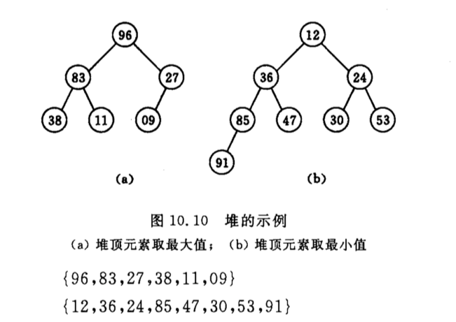

**堆的一个特性，最后一个有子树的点为`n/2`向下取整**

1. 如何由一个无序序列建成呢个一个堆？
2. 如何在输出堆顶元素后，调整剩余元素成为一个新的堆？

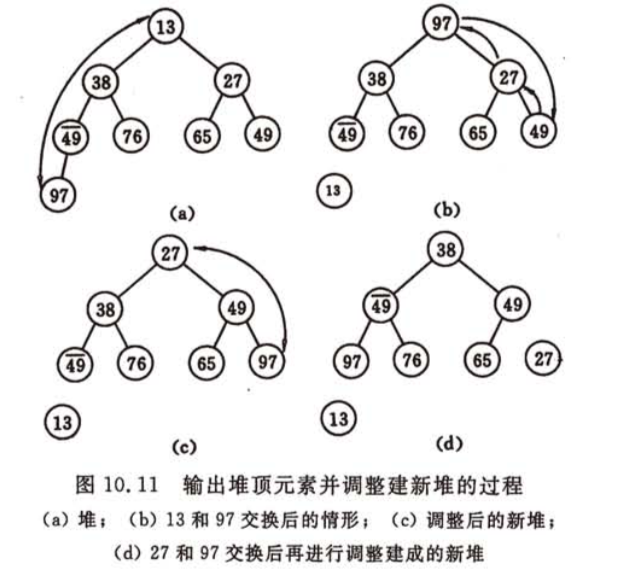

第二的问题：对一个小顶堆来说，堆顶元素是堆中的最小元素，将堆顶元素和完全二叉树中的最后一个元素交换位置。堆结构被破坏，进行一个自上向下的调整，将根节点与左右孩子节点比较，取较小值与根节点交换，并以交换的孩子节点作为根节点，继续进行交换，直至到达叶子节点。这个过程称为”**筛选**“。

从无序序列建成一个堆，就是从**最后一个非叶子节点**`n/2 - 1`开始筛选到第0个元素

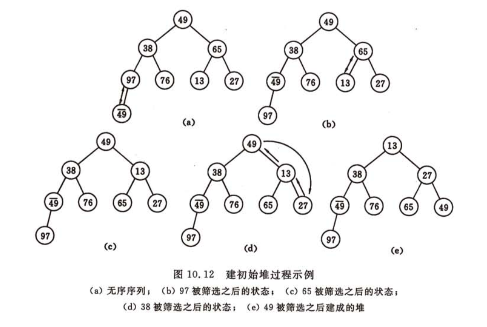

```c++
//大根堆
void HeadAdjust(vector<int> &a, int i, int len)
{
    //筛选的时间复杂度为O(logn)
    int temp = a[i];
    //k = 2*k +1 实现每次向下一层到左子节点
    for(int k = i*2+1; k < length; k=k*2+1)
    {
        //选择左右子节点中较大的与根节点比较
        if(k+1 < len && a[k] > a[k+1])
        {
            k++;
        }
       
        if(temp > a[k])
        {
            a[i] = a[k];
            i = k;
        }
        else
        {
            break;
        }
    }
    a[i] = temp;
}

void HeapSort(vector<int> &a)
{
    //从最后一个非叶子节点开始遍历筛选到0
    for(int i = a.size()/2 - 1; i>=0; i--)
    {
        HeapAdjust(a, i, len);
    }
    
    
    //每次将堆顶元素与数组最后未排序元素交换，重新调整堆，完成排序
    //这步的时间复杂度为O(nlogn)
    for(int i = a.size() - 1, i > 0; i--)
    {
        swap(a, 0, i);
        HeapAdjust(a, 0, j);
    }
}
```

**分析**

堆不适用于记录较少的序列，但是在n较大时表现优秀，其运行时间主要耗费在建立初始堆，以及调整建立新堆的筛选上。堆排序的时间复杂度在最坏的情况下为`O(NlogN)`，其空间复杂度为`O(1)`。

堆十分适用于从一个大序列中寻找第k大/小的数，或者用于寻找中位数。


## 


# 串


# 数组和广义表


# 树

## 基本概念

树表示由边连接的节点。我们将专门讨论二叉树或二叉搜索树。二叉树是一种用于数据存储目的的特殊数据结构。二叉树有一个特殊的条件，即每个节点最多可以有两个子节点。二叉树兼具有序数组和链表的优点，因为搜索和排序数组一样快，插入或删除操作和链表一样快。

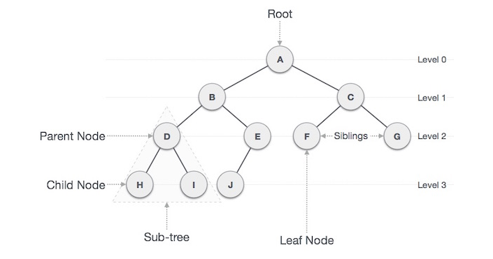


## 满二叉树

两种定义：国内认为，满二叉树的每一层节点数都为最大值，通过层序遍历即可判断

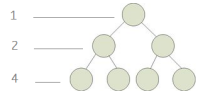

国外认为：满二叉树的每一个节点的度为0或2


通过在遍历时判断左右孩子节点即可判断。

## 完全二叉树

若设二叉树的深度为h，除第 h 层外，其它各层 (1～h-1) 的节点数都达到最大个数(即1~h-1层为一个满二叉树)，第 h 层所有的节点都连续集中在最左边，这就是完全二叉树。

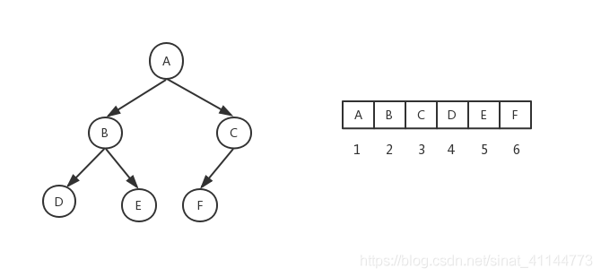

### 完全二叉树的判断方法

```c++
bool isCompleteTree(TreeNode *root)
{
    if(root == nullptr) return true;
    
    std::queue<TreeNode*> q;
    bool nullFlag = false;
    q.push(root);
    while(!q.empty())
    {
        TreeNode *p = q.front();
        q.pop();
        if(p->left == nullptr && p->right)
        {
            return false;
        }
        if(flag && (p->left || p->right))
        {
            return false;
        }
        
        if(p->left)
            q.push(p->left);
        if(p->right)
            q.push(p->right);
        
        if(p->right == nullptr)
            flag == true;
    }
}
```

### 统计完全二叉树节点数的方法

```c++
/*
递归二分判断左右子树高度lh,rh
1. lh = rh：左子树满，最后一层节点在右子树，直接加上左子树节点数2^lh - 1，递归右子树
2. lh > rh：右子树满，最后一层节点在左子树，加上右子树节点数2^lr - 1，递归左子树
*/
class Solution {
public:
    int countNodes(TreeNode* root) {
        if(root == nullptr) return 0;
        int lh = 0;
        int rh = 0;
        TreeNode *p = root;
        while(p->left)
        {
            p = p->left;
            lh++;
        }

        if(root->right)
        {
            p = root->right;
            rh++;
            while(p->left)
            {
                p = p->left;
                rh++;
            }  
        }
        if(lh == rh)
        {
            return pow(2, lh) + countNodes(root->right);
        }
        else
        {
            return pow(2, rh) + countNodes(root->left);
        }
    }
};
```


## 二叉搜索树 BS Tree

二叉搜索树表现出一种特殊的行为。**节点的左子节点的值必须小于其父节点的值，而右子节点的值必须大于其父节点的值。**

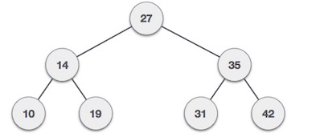

在对二叉搜索树进行搜索时，其本质是一种二分查找，其时间复杂度为O(logN)

## 树的基本算法

### 前序遍历 Pre order Traversal

按照根节点->左节点->右节点的顺序遍历一棵树

```c++
struct TreeNode {
   int val;   
   struct TreeNode *left;
   struct TreeNode *right;
};

//递归
void PreorderTraversal(TreeNode *root)
{
	if(root == NULL) return;
    
    cout << root->val << endl;
    PreorderTraversal(root->left);
    PreorderTraversal(root->right);
    
    return;
}

//循环
void PreorderTraversalLoop(TreeNode *root)
{
    if(root == nullptr)
        return;
    std::stack<TreeNode*> st;
    st.push(root);
    
    while(!st.empty())
    {
        TreeNode *node = st.top();
        st.pop();
        cout << node->val; endl;
        
        if(node->right)
        {
            st.push(node->right);
        }
        if(node->left)
        {
            st.push(node->left);
        }
    }
}
```


### 中序遍历 IN order Traversal

按照左节点->根节点->右节点的顺序遍历一棵树

```c++
struct TreeNode {
   int val;   
   struct TreeNode *left;
   struct TreeNode *right;
};

void InorderTraversal(TreeNode *root)
{
	if(root == NULL) return;
    
    InorderTraversal(root->left);
    cout << root->val << endl;
    InorderTraversal(root->right);
    
    return;
}

//在栈中压入最深左子树，在弹出时压入右子树
void InorderTraversalLoop(TreeNode *root)
{
    if(root == nullptr)
        return;
    
    std::stack<TreeNode*> st;
    TreeNode *node = root;
    while(node)
    {
        st.push(node);
        node = node->left;
    }

    while(!st.empty())
    {
        node = st.top();
        st.pop();
        cout << node->val << endl;
        
        node = node->right;
        while(node)
        {
            st.push(node);
            node = node->left;
        }
    }
}
```


### 后序遍历 Post order Traversal

按照左节点->右节点->根节点的顺序遍历一棵树

```c++
struct TreeNode {
   int val;   
   struct TreeNode *left;
   struct TreeNode *right;
};

void PreorderTraversal(TreeNode *root)
{
	if(root == NULL) return;
    PreorderTraversal(root->left);
    PreorderTraversal(root->right);
    cout << root->val << endl;
    return;
}

void PreorderTraversalLoop(TreeNode *root)
{
    if(root == nullptr)
        return;
    
    std::stack(TreeNode *) st;
    TreeNode * node = root;
    while(node)
    {
        st.push(node);
        if(node->left)
            node = node->left;
        else
            node = node->right;
    }
    
    while(!st.empty())
    {
        node = st.top();
        //node的左右子树必定已经遍历完毕
        //如果node是其父节点的左节点，则需要先遍历其父节点的右子树
        //如果node是其父节点的右节点，则遍历父节点
        st.pop();
        cout << node->val << endl;
        if(!st.empty() && node == st.top()->left)
        {
            node = st.top()->right;
            while(node)
            {
                st.push(node);
                if(node->left)
                    node = node->left;
                else
                    node = node->right;
            }
        }
    }
}
```


## 二叉搜索平衡树 AV Tree

如果二叉搜索树的输入是按顺序(升序或降序)来的，它就会变成这样，在结构上其与链表非常相似，在对其进行查找和插入时，其时间复杂度会十分接近O(N)。

在实时数据中，我们无法预测数据模式和它们的频率。因此，需要平衡现有的BST。

AVL树是以其发明者Adelson, Velski & Landis的名字命名的，AVL树是高度平衡二叉搜索树。AVL树检查左子树和右子树的高度，**确保差异不大于1**。这种差异被称为**平衡因子**。

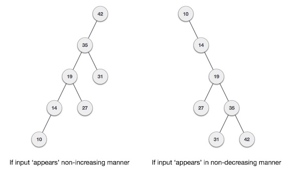


以下三棵树中，第一棵树是平衡的，后两棵树是不平衡的

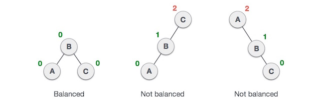

在第二棵树中，C的左子树高为2，右子树高为0，所以差为2。在第三棵树中，A的右子树高度是2而左子树高度没有，所以它是0，差还是2。AVL树允许差异(平衡因子)仅为1。

```
BalanceFactor = height(left) - height(right)
```

如果一棵二叉平衡搜索树在插入一个节点后变的不平衡，就需要通过一些旋转操作来对其进行平衡操作。


## 红黑树 RB Tree

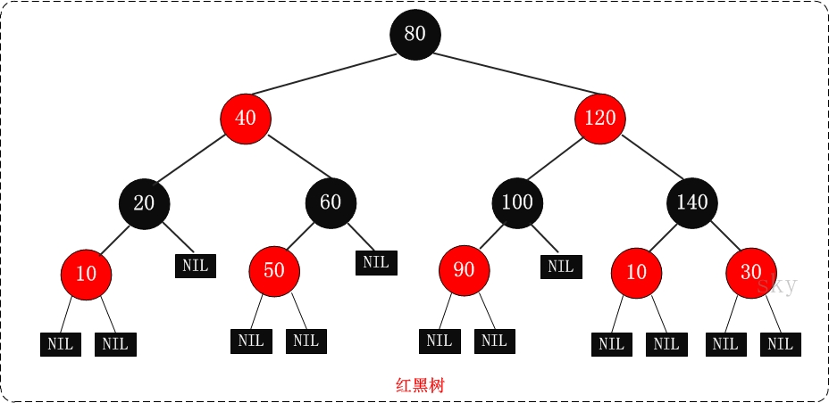

红黑树的特性：

1. 每个节点都有一个存储位标识颜色：红色或黑色
2. 根节点是黑色的
3. 每个叶子节点（指Null节点）都是黑色的
4. **如果一个节点是红色的，那么其的孩子节点必须是黑色的。**
5. **从一个节点到该节点的叶子节点的所有路径上包含相同数目的黑节点**

特性5保证了没有一条路径会比其他路径长出两倍。因此红黑树是相对平衡的二叉树。

C++ STL中的**set、map**，以及Linux虚拟内存的管理都是用红黑树实现的。

在插入和删除节点时，通过旋转和着色来维持树的有效。

## AVL树和红黑树的区别

AVL 树是高度平衡的，频繁的插入和删除，会引起频繁的rebalance，导致效率下降；红黑树不是高度平衡的，算是一种折中。所以红黑树在查找，插入删除的性能都是O(logn)，且性能稳定，所以STL里面很多结构包括map底层实现都是使用的红黑树。


## B树

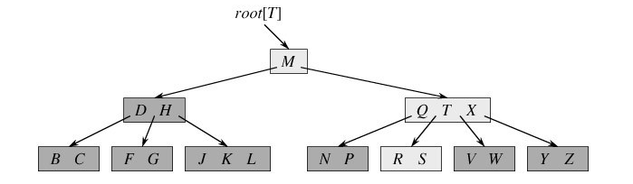

根据磁盘查找的特性设计，磁盘有固定头盘和活动头盘，当想要在磁盘上读写某块数据时，需要3个步骤：

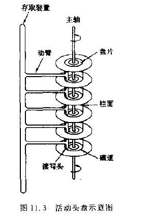

1. **移动活动头盘都指定柱面（耗时）**
2. 固定头盘定位到指定磁道
3. 盘片旋转，开始查找数据

通过减少B树的层数来减少步骤1的次数，从而提高效率。


B树是一种多路查找平衡树，与红黑树相比，其最大的区别在于B树的节点可以有多个孩子节点，从几个到几千个不等。

B树中一个内节点如果有N个关键字，那么这个节点会有N+1个孩子节点。

对于一个**M阶**的B树来说，有以下特点：

1. 树中每个节点最多含有M个孩子（M >= 2）
2. 除根节点和叶子节点外，其他每个节点至少有`[ceil(m/2)]`个孩子节点，`ceil(x)`表示向上取整
3. 如果根节点不是叶子节点，则至少有两个孩子（特殊情况：整棵树只有一个节点）
4. 所有的叶子节点都在同一层，且叶子节点中不包含关键码信息。
5. 在每个非叶子节点的节点中包含有N个关键字信息：`n, p0, k1, p1, k2, p2 ..kn, pn `，其中
   1. ki为关键字，关键字按顺序升序排序,`ki-1 < ki`
   2. pi为指向子树的指针，pi指向节点中的所有关键字大于ki-1，小于ki
   3. 关键字个数满足`[ceil(m/2) - 1] <= n <= m-1`

```c++
#define m 1024
struct BTNode;
typedef struct BTNode * PBTNode;
struct BTNode
{
    int keyNum;	//关键字的个数
    PBTNode parent;	//指向父节点
    PBTNode *ptr;	//子树的指针向量 ptr[0] ... ptr[keyNum]
    KeyType *key;	//关键字向量 key[0] ... key[keyNum - 1]
};

typedef struct BTNode* BTree;
typedef BTree* PBTree;
```

B树的高度：设阶数为m，节点数为n，则B树的高度为
$$
h = 1 + log_{ceil[m/2]}{(N+1)/2}
$$
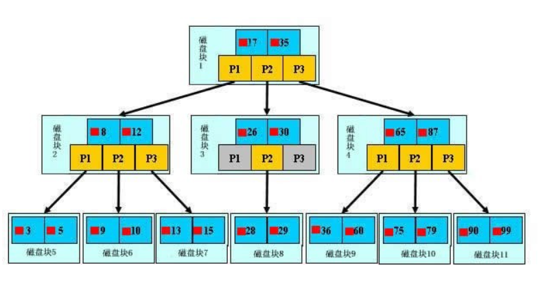

## B+树

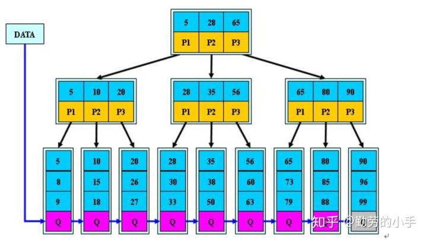

是B树的一种变形，有以下特点

1. B+树的**非叶子节点**不保存关键字记录的指针，只进行数据索引，如此一来每个**非叶子节点**能保存的关键字数量大大增加
2. B+树**叶子**节点保存了父节点的所有关键字记录的指针，所有数据地址必须要到叶子节点才能获取到。所以每次数据查询的次数都一样
3. B+树叶子节点的关键字从小到大有序排列，**左边结尾数据都会保存右边节点开始数据的指针**。
4. 非叶子节点的子节点数=关键字数，也有另一种方式是非叶节点的关键字数=子节点数-1，mysql以第一种方式实现B+树


与B树相比：

1. B+**树的层级更少**
2. B+**树查询速度更稳定**
3. B+**树天然具备排序功能**
4. B+**树全节点遍历更快**：只需要遍历叶子节点，而B树需要每层遍历
5. 只有在访问的数据离根节点很近时，B树的数据检索会比B+树快

# 图


# 动态存储


# 查找


