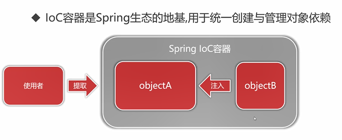
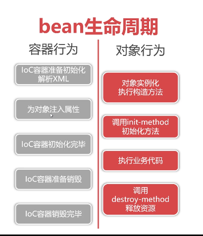
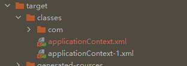
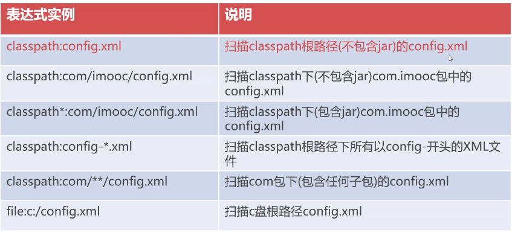
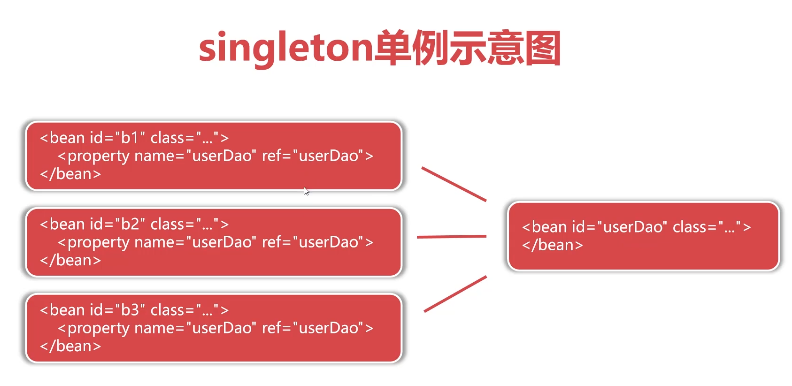
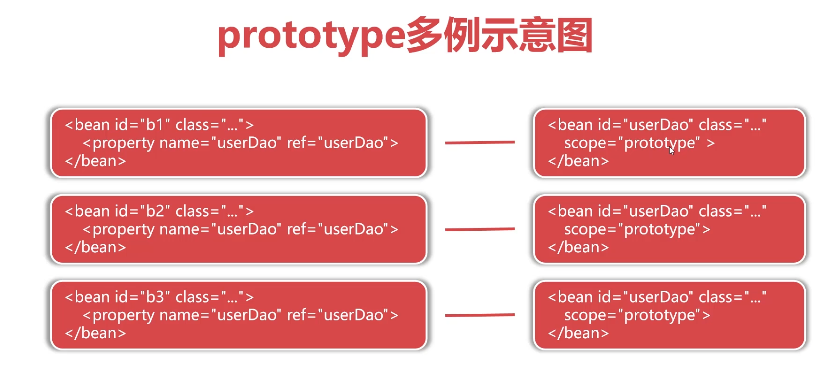
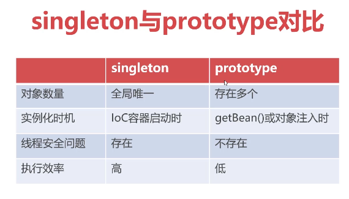

# Java语言基础

##  局部变量

- 局部变量没有默认值，所以局部变量被声明后，必须经过初始化，才可以使用。

## 修饰符

像其他语言一样，Java可以使用修饰符来修饰类中方法和属性。主要有两类修饰符：

- 访问控制修饰符 : default, public , protected, private
- 非访问控制修饰符 : final, abstract, static, synchronized

## 关键字

##### transient

变量修饰符，用于在序列化过程中忽略该变量，在反序列化过程中transient变量将被设为初始值。

##### instanceof

二元操作符，用于判断左侧对象是否是右侧类的实例

```java
public static void displayObjectClass(Object o){
	if(o instanceof Vector)
		sout();
    else if(o instanceof ArrayList)
        sout();
    else
        sout();
}
```

##### volatile


## 参数传递

三种参数传递方法：

- 传值调用
- 传引用调用
- 传共享对象调用

Java的参数传递本质是**传共享对象调用**，也可以理解为把对象地址作为值进行传值调用。传参过程中会发生求值、拷贝、传递的过程。而这个过程的主体是对象的内存地址。

Java的**参数传递不是引用调用**，传值保证作为参数传入的对象在返回是依然指向原对象，但是函数内部可以对该地址指向对象的内部进行修改。

# Spring

狭义的Spring指Spring框架（Spring FrameWork）

广义的Spring指Spring生态：

- 分布式微服务 Microservices
- 响应式编程 Reactive
- 云端技术 cloud
- Spring MVC Web Apps
- 无服务器编程 Serverless
- 事件驱动 Event Driven


#### 1. Data Access/Integration（数据访问／集成）

数据访问/集成层包括 JDBC、ORM、OXM、JMS 和 Transactions 模块，具体介绍如下。

- JDBC 模块：提供了一个 JDBC 的抽象层，大幅度减少了在开发过程中对数据库操作的编码。
- ORM 模块：对流行的对象关系映射 API，包括 JPA、JDO、[Hibernate](http://c.biancheng.net/hibernate/) 和 iBatis 提供了的集成层。
- OXM 模块：提供了一个支持对象/XML 映射的抽象层实现，如 JAXB、Castor、XMLBeans、JiBX 和 XStream。
- JMS 模块：指 [Java](http://c.biancheng.net/java/) 消息服务，包含的功能为生产和消费的信息。
- Transactions 事务模块：支持编程和声明式事务管理实现特殊接口类，并为所有的 POJO。

#### 2. Web 模块

Spring 的 Web 层包括 Web、[Servlet](http://c.biancheng.net/servlet/)、Struts 和 Portlet 组件，具体介绍如下。

- Web 模块：提供了基本的 Web 开发集成特性，例如多文件上传功能、使用的 Servlet 监听器的 IoC 容器初始化以及 Web 应用上下文。
- Servlet模块：包括 Spring 模型—视图—控制器（MVC）实现 Web 应用程序。
- Struts 模块：包含支持类内的 Spring 应用程序，集成了经典的 Struts Web 层。
- Portlet 模块：提供了在 Portlet 环境中使用 MV C实现，类似 Web-Servlet 模块的功能。

#### 3. Core Container（核心容器）

Spring 的核心容器是其他模块建立的基础，由 Beans 模块、Core 核心模块、Context 上下文模块和 Expression Language 表达式语言模块组成，具体介绍如下。

- Beans 模块：提供了 BeanFactory，是工厂模式的经典实现，Spring 将管理对象称为 Bean。
- Core 核心模块：提供了 Spring 框架的基本组成部分，包括 IoC 和 DI 功能。
- Context 上下文模块：建立在核心和 Beans 模块的基础之上，它是访问定义和配置任何对象的媒介。ApplicationContext 接口是上下文模块的焦点。
- Expression Language 模块：是运行时查询和操作对象图的强大的表达式语言。

#### 4. 其他模块

Spring的其他模块还有 AOP、Aspects、Instrumentation 以及 Test 模块，具体介绍如下。

- AOP 模块：提供了面向切面编程实现，允许定义方法拦截器和切入点，将代码按照功能进行分离，以降低耦合性。
- Aspects 模块：提供与 AspectJ 的集成，是一个功能强大且成熟的面向切面编程（AOP）框架。
- Instrumentation 模块：提供了类工具的支持和类加载器的实现，可以在特定的应用服务器中使用。
- Test 模块：支持 Spring 组件，使用 JUnit 或 TestNG 框架的测试。


## Spring IoC 控制反转

Inverse of Control，一种设计理念，是现代程序设计遵循的标准，是宏观目标。

**DI（Dependency Injection）依赖注入**，Java中关于IoC的具体技术实现。

DI在Java中通过**反射**技术实现对象注入（Injection）

由代理人来创建和管理对象，消费者通过代理人来获取对象。

IoC的目的是降低对象之间的直接耦合



## Spring AOP 面向切面编程


## XML管理对象（Bean）

- 必须有默认构造函数

### bean对象的生命周期



## pom.xml配置文件

```xml
<?xml version="1.0" encoding="UTF-8"?>
<project xmlns="http://maven.apache.org/POM/4.0.0"
         xmlns:xsi="http://www.w3.org/2001/XMLSchema-instance"
         xsi:schemaLocation="http://maven.apache.org/POM/4.0.0 http://maven.apache.org/xsd/maven-4.0.0.xsd">
    <modelVersion>4.0.0</modelVersion>

    <groupId>com.imooc.spring</groupId>
    <artifactId>ioc</artifactId>
    <version>1.0-SNAPSHOT</version>

    <properties>
        <maven.compiler.source>15</maven.compiler.source>
        <maven.compiler.target>15</maven.compiler.target>
    </properties>

    <repositories>
        <repository>
            <id>aliyun</id>
            <name>aliyun</name>
            <url>https://maven.aliyun.com/repository/public</url>
        </repository>
    </repositories>

    <dependencies>
        <dependency>
            <groupId>org.springframework</groupId>
            <artifactId>spring-context</artifactId>
            <version>5.3.8</version>
        </dependency>
    </dependencies>
</project>
```


### 三种配置方式

#### 基于XML配置

applicationContext.xml

```xml
<?xml version="1.0" encoding="UTF-8"?>
<beans xmlns="http://www.springframework.org/schema/beans"
       xmlns:xsi="http://www.w3.org/2001/XMLSchema-instance"
       xsi:schemaLocation="http://www.springframework.org/schema/beans
        https://www.springframework.org/schema/beans/spring-beans.xsd">
	<bean id="apple2" class="com.imooc.spring.ioc.entity.Apple">	
	<!-- 没有constructor-arg则代表调用默认构造方法实例化-->
        <constructor-arg name="title" value="红富士"/>
        <constructor-arg name="origin" value="欧洲"/>
        <constructor-arg name="color" value="红色"/>
        <constructor-arg name="price" value="19.8"/>
    </bean>

    <bean id="sweetApple" class="com.imooc.spring.ioc.entity.Apple">
        <!-- IoC容器自动利用反射机制运行时调用setXXX方法为属性赋值-->
        <property name="title" value="红富士"/>
        <property name="origin" value="欧洲"/>
        <property name="color" value="红色"/>
        <property name="price" value="19.8"/>
    </bean>


    <bean id="lily" class="com.imooc.spring.ioc.entity.Child">
        <property name="name" value="莉莉"/>
        <!-- 利用ref setter实现对象参数注入-->
        <property name="apple" ref="sweetApple"/>
    </bean>

    <bean id="andy" class="com.imooc.spring.ioc.entity.Child">
        <!-- 利用构造方法注入对象-->
        <constructor-arg name="name" value="安迪"/>
        <constructor-arg name="apple" ref="sourApple"/>
    </bean>
    
	<!--    利用静态工厂获取对象-->
    <bean id="apple4" class="com.imooc.spring.ioc.factory.AppleStaticFactory"
          factory-method="createSweetApple"/>

	<!--    利用工厂实例方法创建对象-->
    <bean id="factoryInstance" class="com.imooc.spring.ioc.factory.AppleFactoryInstance"/>
    <bean id="apple5" factory-bean="factoryInstance" factory-method="createSweetApple"/>
    
    
</beans>
```

静态工厂的好处，可以在创建函数中进行一些其他的需要的操作，如日志输出等。

随着Spring发展工厂模式也较少使用了


**constructor-arg和property区别**

- constructor-arg调用构造函数创建实例
- property调用setXXX方法为属性赋值


**bean标签中id和name**

相同点

- bean id 和 name都是设置对象在IoC容器中唯一标识
- 两者在同一个配置文件中都不允许重复
- 两者允许在多个配置文件中出现重复，新对象覆盖旧对象

不同点

- id要求更为严格，一次只能定义一个对象标识（推荐）
- name更为宽松，一次允许**定义多个对象标识**
- id与name的命名要求有意义，按驼峰命名书写

**一般只使用id**

```java
//创建IoC容器并根据配置文件创建对象
ApplicationContext context = new ClassPathXmlApplcationContext("classpath:applicationContext.xml");
```



classpath指编译后的运行目录target下的classes



##### 注入集合对象

```xml
<bean id="" class="">
    <propertyname="someList">
        <list>
            <value>123</value>
            <ref bean="beanId"></ref>
        </list>
    </propertyname>
</bean>

<bean id="" class="">
    <propertyname="someSet">
        <set>
            <value>123</value>
            <ref bean="beanId"></ref>
        </set>
    </propertyname>
</bean>

<bean id="" class="">
    <propertyname="someMap">
        <map>
            <entry key="k1" value="v1"></entry>
            <entry key="k2" value-ref="beanId"></entry>
        </map>
    </propertyname>
</bean>

<!--Properties的键和值必须是字符串-->
<bean id="" class="">
    <propertyname="someProperties">
        <props>
            <prop key="k1">v1</entry>
            <prop key="k2">v2</entry>
        </props>
    </propertyname>
</bean>
```


##### 查看容器内对象

```java
String[] beanNames = context.getBeanDefinitionNames();
for(String beanName:beanNames){
    System.out.println(beanName);
    System.out.println("type: " + context.getBean(beanName).getClass().getName());
    System.out.println("context: " + context.getBean(beanName).toString());
}
```


##### bean scope属性

- bean scope属性用于决定对象何时被创建与作用范围
- bean scope配置将影响容器内对象的数量
- bean scope默认值singleton(单例），指全局共享同
  一个对象实例


**scope属性清单**

singleton：单例模式（默认模式）

prototype：多例，每次使用时创建一个实例



上图情况中，左侧三个bean注入的userDao都是同一个实例。

singleton在容器是**单例多线程**的，但是存在**线程安全风险**。







#### 基于注解配置

#### 基于Java代码配置

