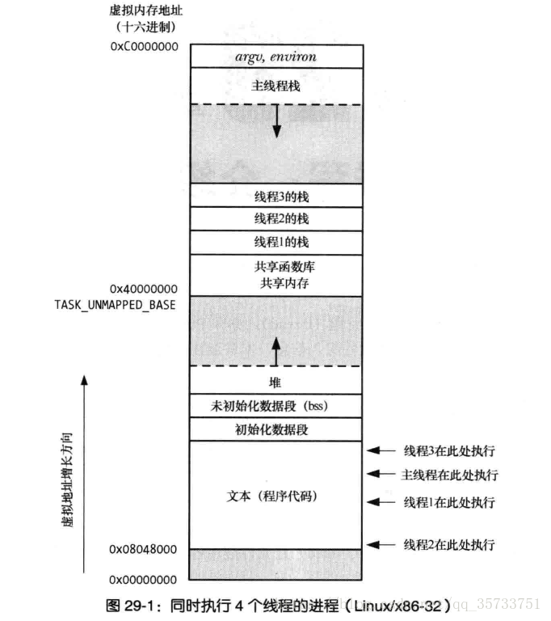

[TOC]

# 一、程序结构和执行

## 1.1	信息存储

大多数计算机使用8位的块（字节byte）作为**最小**的可寻址的内存单位。

**32位机器和64位机器的原理**

每台机器都有一个字长用于表明指针数据的标称大小。虚拟地址是以这样一个字来编码的，字的长度就决定了系统中最重要的参数--虚拟地址空间的最大大小。对于一个字长为$w$位的机器而言，虚拟地址的范围为0~$2^w-1$，程序最多可以访问$2^w$个字节。那么对于32位机器而言，虚拟地址空间上限为4GB，而64位机器的虚拟地址空间最长可以到16EB。

可以通过设定的方式限制编译的可执行程序的运行环境。

```shell
linux> gcc -m32 prog.c
# 可以在32位机器运行
linux> gcc -m64 prog.c
# 只能在64位机器运行
```

不同类型的C声明数据在32位机器和64位机器的字节数有所不同。


**小端法和大端法**

在对一个对象的字节进行存储时，将最低有效字节放在最前面--小端法，将最高有效字节放在最前面--大端法。


大多数Intel兼容机只使用小端模式，许多ARM微处理器系统可以配置选择双端模式，而Android和IOS只能使用小端模式。


**练习题2.6**：int 类型 和 float 类型在存储中的形式


```
0x00359141
0x4A564504
      001101011001000101000001
01001010010101100100010100000100
         101011001000101000001
21位匹配
对于float存储格式
1符号位+8指数位+23尾数部分
符号位0
指数位10010100=148-127=21
尾数位101011001000101000001 = （1/2 + 1/8 + 1/32 + 1/64 + 。。。）
最后的计算方法就是（1/2 + 1/8 + 1/32 + 1/64 + 。。。）* 2 ^ 21 = 2510593
不匹配的部分是用能被2整数用指数位表示的部分
```

### 详细解释float在计算机中的存储方式

32位长度的int类型在计算机中能表示的数字范围为$[-2^{31},2^{31}-1]$，32位长度的数据空间分配为1位符号位+31位数据位。

而对于32位长度的float类型，其存储格式为：1位符号位+8位指数位+23位尾数部分

 


举个例子：32位长度的int类型的12345，用16进制表示为00003039，而float类型的12345.0，用16进制如何表示呢。

float的存储原理是，将数字表示为 尾数*2^指数的形式。

那么对于12345.0，其整数部分的二进制表示为0011 0000 0011 1001，小数部分为0，将小数点左移到第一个1为止，左移了13位，则指数位为13+127 = 140 = 1000 1100，尾数部分为1之后的部分1000000111001，则12345.0的2进制表示为

0100 0110 0100 0000 1110 0100 0000 0000

16进制表示为0x4640E400

那么我们可以看到，对于float格式的，他的取值范围比int类型要大很多，但是，对于在存储时的尾数部分长度超过了23位的数据，会存在精度丢失的情况。

# 编译和链接

链接linking：将各种代码和数据片段收集并组合成为一个单一文件的过程。

## 最简单的编译过程

在Linux系统中，使用GNU编译系统构造示例程序，展示mian.c和sum.c文件如何成为prog可执行文件。

```bash
gcc -0g -o prog mian.c sum.c
```


1. 驱动程序（GCC）首先运行**C预处理器(cpp)**，将mian.c文件翻译成一个ASCII码的中间文件main.i

   ```bash
   cpp main.c main.i
   ```

2. GCC运行**C编译器（cc1）**，将main.i翻译成一个ASCII汇编语言文件main.s

   ```bash
   cc1 main.i -0g -o main.s
   ```

   > cc1是GCC的C编译器，正常情况下不添加在PATH当中，其位置在
   >
   > /usr/lib/gcc/x86_64-linux-gnu/5
   >
   > 在/etc/profile中添加即可

3. 运行**汇编器（as）**将main.s翻译成一个**可重定位目标文件**（relocatable object file）main.o

   ```bash
   as main.s -o main.o
   ```

   通过同样的步骤获得sum.o

4. 运行**链接器（ld）**将main.o和sum.o以及一些必要的**系统目标文件**组合起来，创建一个**可执行目标文件**（executable object file）prog

   ```bash
   ld main.o sum.o -o prog
   ```

   手动进行以上操作会出现一下错误

   ```bash
   ld: warning: cannot find entry symbol _start; defaulting to 00000000004000e8
   ```

   这是因为c程序以start为主函数入口，而汇编以_start为主函数入口，需要手动指定程序入口

   ```
   ld main.o sum.o -o prog -e main
   ```

   无报错，但运行出现Segmentation fault，这是因为手动链接缺少了一些必要的参数，具体详细的可以参考

   ```
   gcc -v main.c sum.c -o prog
   ```

   命令输出的详细链接指令。


**问答：说一说GCC的编译过程**

- **预处理：首先通过预处理器，导入头文件，展开宏定义，获得.i文件**
- **编译：使用编译器将.i文件中的的高级语言编译成汇编语言程序.s**
- **汇编：从汇编语言翻译为机器语言.o**
- **链接：将多个.o文件以及一些必要的系统目标文件组合，创建可执行文件**


## ELF可重定位目标文件格式

一个典型的ELF可重定位目标文件的格式。


- ELF头：以16字节序列开始，该序列描述了生成该文件的系统的字的大小（32、64）和字节顺序（大端、小端）。剩下的部分包含帮助链接器语法**分析和解释目标文件**的信息。其中包括ELF

- .text：已编译程序的机器代码。

- .rodata：read only data，比如printf语句中的格式串和开关语句的跳转表等等。
- .data：已初始化的全局和静态C变量。
- .bss：块存储开始(Block Storage Start)，未初始化的全局和静态C变量，以及所有被初始化为 0 的全局或静态变量。在目标文件中这个节不占据实际的空间， 它仅仅是一个占位符。 目标文件格式区分已初始化和未初始化变量是为了空间效率： 在目标文件中， 未初始化变量不需要占据任何实际的磁盘空间。 运行时， 在内存中分配这些变量， 初始值为 0。
- .symtab：一个符号表，它存放在程序中定义和引用的函数和全局变量的信息。其不包含局部变量的条目，每个可重定位目标文件在其中都有一张符号表，除非特意用STRIP命令去掉它。
- .rel.text：一个 .text 节中位置的列表， 当链接器把这个目标文件和其他文件组合时， 需要修改这些位置。
- .rel.data：被模块引用或定义的所有全局变量的重定位信息。
- .debug：一个调试符号表其条目是程序中定义的局部变量和类型定义， 程序中定义和引用的全局变量， 以及原始的 C 源文件。只有以-g选项调用编译器驱动程序时才会得到这张表。
- .line：原始C源程序中的行号和.text节中机器指令之间的映射。只有以-g选项调用编译器驱动程序时才会得到这张表。
- .strtab：一个字符串表，包括.symtab和.debug节中的符号表，以及节头部中的节名字。

## 符号解析

链接器解析符号引用的方法是将每个引用和它输入的可重定位目标文件的符号表中的一个确定的符号关联起来。

### 链接器对多重定义的全局符号的解析方法

> 《深入理解计算机系统》471-474

向链接器输入的一组可重定位目标模块中，每个模块都定义了一组符号，这些符号有些是局部的，只对定义该符号的模块可见，有些是全局的，对其他模块也可见。如果多个模块定义了多个同名的全局符号，链接器需要对此做出处理。

在编译时，编译器将向汇编器输出的每个全局符号定义为**强符号**或**弱符号**。**函数和已初始化的全局变量**是强符号。**未初始化的全局变量**是弱符号。

对于强弱符号，Linux链接器使用以下规则来处理多重定义的符号名：

- 规则1：不允许有多个同名的强符号。
- 规则2：如果有一个强符号和多个弱符号同名，那么选择强符号。
- 规则3：如果有多个弱符号同名，那么从这些弱符号中任意选择一个。

**规则1例子**如以下两个C模块：

```c
//foo.c
int main()
{
    return 0;
}

//bra1.c
int main()
{
    return 0;
}
```

在进行编译和链接时，会输出错误信息，因为main是**函数，属于强符号**。

```
linux> gcc fool.c barl.c
/trap/ccq2Uxnd.o: In function fmain':
bar1.c:(.text+OxO): multiple definition of ‘main‘
```

相似的如以下两个模块：

```c
//foo2.c
int x = 15213;

int main()
{
    return 0;
}

//bar2.c
int x = 15213;

void f()
{
	return 0;    
}
```

在进行编译和链接时会输出错误信息，因为x在两个模块中都**已经定义，属于强符号**。

**规则2的例子**

然而，如果在一个模块里x未被初始化，那么链接器将选择另一个已经定义的强符号x：

```c
//foo3.c
#include <stdio.h>
void f(void);

int x = 15213;

int main()
{
    f();
    printf("x = %d\n", x);
    return 0;
}

//bar3.c
int x;

void f()
{
    x = 15212;
}
```

程序可以正常编译链接，并且在运行时，函数f将x的值由15213改为15212，这可能会给main函数带来意料之外的错误。**链接器通常不会表明它检测到多个x的定义！**

```
linux> gcc -o foobar3 foo3.c bar3.c
linux> ./foobar3
x = 15212
```

**规则3的例子**

如果x有两个弱定义，也会发生类似的事情，你将无法清楚的定位程序的运行错误发生在哪里，尤其是当重复的符号有不同的类型时，可能会发生难以察觉的严重错误。

```c
//foo5.c
#include <stdio.h>
void f(void);

int y = 15212;
int x = 15213;

int main()
{
    f();
    printf("x = 0x%x y = 0x%x \n", x, y);
    return 0;
}

//bar5.c
double x;

void f()
{	
    x = -0.0;
}
```

当这段程序在一台x86-64/Linux机器上运行时，double类型占用8字节，而int类型占用4字节，当在bar5.c中用双精度浮点幅值给int类型的x时，会覆盖内存中的x和y的位置！

```
linux> gcc -Wall -Og -o foobar5 foo5.c bar5.c
/usr/bin/ld: Warning: alignment 4 of symbol ( x' in /tmp/cclUFK5g.o
is smaller than 8 in /tmp/ccbTLcb9.o
linux> ./foobar5
x = 0x0 y = 0x80000000
```

然而这种显然会导致异常的错误只会触发链接器的一条警告，这种错误也可能在程序运行很久之后才出现，对于一个大型程序系统，这种错误是很难发现和定位的。

当怀疑出现这种错误时，使用类似GCC-fno-common这样的标志选项使链接器将多重定义的全局符号显示为错误。或使用-Werror选项，将所有warning变为错误。

### 与静态库的链接

前文所述的链接方法都是假设链接器读取了一组可重定位目标文件，并将它们链接起来，形成一个输出的可执行文件。编译系统还提供一种机制将所有相关的目标文件打包成为一个单独的文件，称为**静态库(static library)**，可以用作链接器的输入。当链接器构造一个输出的可执行文件时，与之前的复制可重定位目标文件中的所有模块不同，它只复制静态库里被应用程序引用的目标模块，这可以减小可执行文件的磁盘和内存的消耗。

在Linux系统中，静态库以一种称为**存档(archive)**的特殊文件格式存放在磁盘中。存档文件时一组连接起来的可重定位目标文件的合集，有一个头部来描述每个成员目标文件的大小和位置，文件名由后缀.a标识。

以下为两个例程函数：

```c
//addvec.c
int addcnt = 0;
void addvec(int *x, int *y, int *z, int n)
{
    int i;
    addcnt++;
    for(i=0; i<n; i++)
        z[i] = x[i] + y[i];
}

//multvec.c
int multcnt = 0;
void multvec(int *x, int *y, int *z, int n)
{
    int i;
    multcnt++;
    for(i=0; i<n; i++)
        z[i] = x[i] * y[i];    
}

//vector.h
void addvec(int *x, int *y, int *z, int n);
void multvec(int *x, int *y, int *z, int n);
```

使用AR工具来创建一个包含这两个文件的静态库libvector.a

```bash
linux> gcc -c addvec.c multvec.c
linux> ar rcs libvector.a addvec.o multvec.o
```

在使用一个main函数文件来使用静态库中的函数

```c
//main2.c
#include <stdio.h>
#include "vector.h"

int x[2] = {1, 2};
int y[2] = {3, 4};
int z[2];

int main()
{
    addvec(x, y, z, 2);
    printf("z = [%d %d]\n", z[0], z[1]);
    return 0;
}
```

编译链接main.o和libvector.a来创建可执行文件

```bash
linux> gcc -c main2.c
linux> gcc -static -o prog2c main2.o ./libvector.a
#或
linux> gcc -static -o prog2c main2.o -L. -lvector
```

其中-static表示创建一个完全链接的可执行文件，可以直接加载到内存中运行，在加载时无需更进一步的链接。

-L.表示链接器在当前目录查找库，-lvector是库的缩写。


### 链接器如何使用静态库来解析引用

在符号解析阶段，链接器根据静态库**在编译器驱动程序命令行上出现的顺序**来扫描可重定位目标文件和存档文件。一个完整的扫描链接过程如下：

1. 链接器维护一个**可重定位目标文件的集合E**，这个集合中的文件会被合并起来形成可执行文件；一个**未解析的符号集合U**，以及一个**已定义的符号集合D**。初始时，E\U\D均为空。
2. 对于命令行上每个输入文件f，链接器判断f输入目标文件还是存档文件，如果f是目标文件，则将其添加到E，并修改U和D来反映f中的符号定义和引用，并继续输入下一个文件。
3. 如果f是一个存档文件，那么链接器就尝试在该文件中**寻找匹配U中未解析的符号**和**由存档文件成员定义的符号**。如果存档文件中的成员m定义了一个符号来解析了U中的一个引用，那么就将**成员m添加到E中**，并修改U和D来反映m中的符号定义和引用。对存档文件中的所有成员目标文件都依次进行这个过程，知道U和D都不再发生变化。此时所有不包括在E中的成员目标文件都被丢弃，链接器继续处理下一个输入文件。
4. 当链接器完成对命令行上所有的输入文件的扫描后，U是非空的，即还有未定义符号，则链接器会输出一个错误并终止，否则它会合并和重定位E中的目标文件，构建输出的可执行文件。

**因此，在进行编译链接时文件输入顺序非常重要，若A中的某个符号在B中定义，即A依赖B，那么B必须在A之后输入到链接器当中。**

## 重定位


## 加载可执行目标文件

当可执行文件被加载运行时，loader讲可执行目标文件中的代码和数据从磁盘复制到内存，然后通过跳转到程序的第一条指令或入口来运行该程序。

每个Linux程序都有一个运行时内存映像，如图所示。


在Linux x86-64系统中，**代码段**总是从地址0x400000处开始，后面跟随**数据段**。运行时**堆**在数据段之后，并且通过malloc/new等用户分配内存方法向上增长。堆后的区域是为**共享库**保留的内存区域。**用户栈**总是从最大的合法用户地址开始（2^48-1），并向较小的内存地址增长。栈上的区域是为**内核**中的代码和数据保留的。

此图仅用于理解程序运行时内存映像的分布，实际上由于.data段的对齐要求，代码段和数据段之间是有**间隙**的。同时在分配栈、共享库和堆段运行地址时，链接器会使用ASLR（地址空间布局随机化），每次程序运行时这些区域的地址都会改变，但他们的**相对位置保持不变**。


- 代码段：只读，是可执行程序在内存中的镜像
- 数据段：包括已初始化的全局变量
- bss段：未初始化的全局变量，内存中bss全部置零
- 堆：运行时堆，向上扩张，malloc\new\函数分配的内存位于堆上
- 共享库的内存映射区域：
- 栈：用户栈，函数中定义的变量、进程栈、函数栈

## Linux内核装在ELF过程

1. 用户层面，bash进程调用`fork()`系统调用创建一个新的进程，新的进程调用`execvc()`系统调用执行指定的ELF文件

# 虚拟内存

常见问题：

**在只有1G内存的机器上适用malloc分配2g内存可以成功吗？**

可以，应用使用malloc分配的是虚拟内存，与机器的物理内存大小没有直接关系，只有当真正访问到对应虚拟内存中的数据时，会触发缺页异常。


**说说使用虚拟内存的好处和代价？**

优点：

- 扩大了地址空间，不仅仅局限于物理内存大小
- 内存保护，每个进程运行在各自的虚拟内存地址空间，无法互相干扰
- 公平内存分配
- 可以使用虚拟内存共享的方式进行进程间通信
- 动态库等共享库可以共享同一份内存空间，节省内存
- 程序需要连续内存空间时，只需要分配连续的虚拟内存空间，而不需要连续的物理内存空间，可以更加有效的利用内存空间碎片。

缺点：

- 虚拟内存管理需要使用额外的数据结构，会消耗一定的内存
- 虚拟地址到物理地址的转换需要时间
- **页面的换入换出**需要磁盘I\O操作，十分耗时
- 如果一页中的数据只占有一部分，会出现浪费


虚拟内存是一种对主存的抽象概念。虚拟内存的三大重要能力：

1. **虚拟内存将主存看成是一个存储在磁盘上的地址空间的高速缓存，在主存中只保存活动区域，并根据需要在磁盘和主存之间来回传送数据，通过这种方式来高效的使用主存。**
2. **为每一个进程提供一致的地址空间，从而简化内存管理。**
3. **保护每个进程的地址空间不被其他进程破坏。**

## 主存和物理地址

计算机系统的主存被组织成一个由M个连续的字节大小的单元组成数组。每个字节都有唯一的**物理地址Physical Address，PA**。用物理地址寻址的方法称为**物理寻址physical addressing**。


早期的pc，现在的一些数字信号处理器，嵌入式微控制器以及Cray超级计算机这样的系统仍然使用这种寻址方式。在涉及到操作系统以及多进程在共享内存方面的内容时，这种寻址方式显的效率低下且容易出错。

## 虚拟内存和虚拟地址


使用虚拟寻址时，CPU通过生成一个虚拟地址来访问内存，这个虚拟地址在被送到内存之前先通过一定的方式转换称为适当的物理地址。将一个虚拟地址转换为物理地址的任务叫做**地址翻译address translation**。虚拟地址通过CPU芯片上的**内存管理单元Memory Management Unit**进行地址翻译

## 地址空间

地址空间address space是一个**非负整数地址的有序集合**

其中在一个带有虚拟内存的系统中，CPU从一个有N=2^n个地址的地址空间中生成虚拟地址，这个地址空间就是虚拟地址空间。

同理，物理地址空间对应于系统中物理内存的地址。

主存的每个字节都有一个选自虚拟地址空间的虚拟地址和一个选自物理地址空间的物理地址。


## 虚拟内存作为缓存工具

RAM（随机存储器 random access memory）又分为SRAM与DRAM

### **SRAM**: static random access memory

静态随机存储器，中的”静态“，指存储器只要保持通电，其中存储的数据都可以恒常保持，相对的，DRAM中所存储的数据需要**周期性地更新**。

SRAM通常用于CPU与主存间的L1,L2,L3高速缓存

### DRAM: dynamic random access memory

动态随机存储器，是一种半导体存储器，由于晶体管存在漏电电流的情况，对于DRAM来说需要进行周期性地充电来进行数据维持。

与SRAM相比，DRAM的**优势在于结构简单**——每一个比特的数据都只需一个电容跟一个晶体管来处理，相比之下在SRAM上一个比特通常需要六个晶体管。正因这缘故，DRAM拥有非常高的密度，单位体积的容量较高因此成本较低。但相反的，**DRAM也有访问速度较慢，耗电量较大的缺点**。

我们平时计算机中的内存，通常指的就是DRAM。而SRAM通常值用在CPU,GPU中作为缓存。

DRAM的速度比SRAM大概要慢10倍，而磁盘的速度要比DRAM慢大概100000多倍。


## 页表

分页的大小，一般是4kb，即`2^12`

一个 32 位的**操作系统**，页的大小设为 2^12=4Kb，那么就有页号从 0 编到 2^20 的那么多页逻辑空间。

### **多级页表**

多级页表和二级页表类似。多级页表和二级页表是为了节省物理内存空间。使得页表可以在内存中离散存储。（单级页表为了随机访问必须连续存储，如果虚拟内存空间很大，就需要很多页表项，就需要很大的连续内存空间，但是多级页表不需要。）

### 缺页中断

在使用malloc和mmap等内存分配函数时，只是建立了进程的虚拟地址空间，没有分配虚拟内存对应的物理内存，当进程访问到这些没有建立映射关系的虚拟内存时，处理器就会自动触发一个缺页异常。

在请求分页系统中，通过查询页表中的状态位来确定所要访问的页面是否在内存中，每当访问的页面不在内存当中，就会产生一次缺页中断，操作系统根据页表中的外存地址在外存中找到所缺的一页将其调入内存。其跟中断一样需要经过4个步骤

1. 保护现场
2. 分析中断原因
3. 转入缺页中断处理程序进行处理
4. 恢复现场，继续执行

特点：在指令的执行期间产生缺页中断信号，一条指令在执行期间可能产生多次缺页中断，缺页中断返回时**执行产生中断的指令**，而一般中断返回时**执行下一条指令**。

### 页面置换算法

在缺页中断处理程序中，具体选择淘汰那一页的规则就叫做页面置换算法

#### 最佳置换算法(OPT)

理想情况下的页面置换算法，实际无法实现，其原理是置换最后可能被访问的页面，一般用于对可实现算法的性能比较

#### 先进先出置换算法（FIFO）

最简单，总是置换在主存中停留时间最长的页，因为“最早进入内存的页、其不再使用的概率比刚进入内存的可能性大”。仅在按线性顺序访问地址空间时理想。

**当分配的物理页越多，产生缺页现象也会增多**（Belady现象）

#### 最近最久未使用算法(LRU)

选择最近一段时间里最久没有使用的页面予以置换。其问题在于：**如何确定最后使用时间的顺序**

可能的两种方法：

1. ​	计数器，为每个页表添加一个使用时间字段，为CPU增加一个逻辑时钟，每次访问页时将当前时钟记录到页中的时间字段，就可以保留每个页面最后访问的时间。但是这样做，在做置换时，需要查询，还要考虑时钟溢出的问题。
2. 栈：将最近使用的页面从栈中取出置于栈顶，则位于栈底的就是最久未使用的页，可以直接获取指向页的指针，但是每次修改都有开销。

#### 时钟页面置换算法(NRU)

特点：

- LRU的近似，FIFO的改进
- 用到页表项中的访问位
- 页面组织成环形链表，指向最老的页面
- 中断产生时，若指向的页面访问位为0，立即淘汰；若为1，则往下移动

### 页表寻址


在页式内存管理中，内存被分成固定长度的一个个页片。操作系统为每个进程维护了一个**从虚拟地址到物理地址的映射关系的数据结构**，即页表。

CPU中的页表基址寄存器指向当前页表，虚拟地址包含两个部分，一个P为的虚拟页面偏移（VPO Virtual Page Offset）和一个n-p位的虚拟页号(VPN Virtual Page Number)，通过虚拟页号作为索引来寻找物理页号，如果有效位为0则说明缺页，再通过虚拟页面偏移来找到具体的物理地址。

# 进程管理。

## 进程和线程

### 1、进程

进程是对**运行时程序**的封装，是系统进行资源调度和分配的基本单位，用于实现操作系统的并发。

进程控制块(Process Control Block, PCB)描述进程的基本信息和运行状态，创建进程和撤销进程都是对PCB的操作。

#### 孤儿进程

一个父进程退出，但是子进程还在运行，这些子进程就被称为孤儿进程，孤儿进程会被init进程收养，由init进程完成它们的回收。

#### 僵尸进程

一个进程在退出之后，内核会释放该进程所占用的所有资源：打开的文件、占用的内存等，但是也为其保留一定的信息，包括：**进程号、退出状态、运行时间**等，只有当父进程通过**wait或者waitpid获取子进程信息**后才会释放。僵尸进程在ps中会显示Z状态，因为系统的进程号是有限的，僵尸进程过多可能会导致系统无法产生新的进程。

僵尸进程是每个进程都必将经历的一个阶段

#### 守护进程

daemon，守护进程是一个在后台运行并且不受任何终端控制的进程。

用户使守护进程独立于所有终端是因为，在守护进程从一个终端启动的情况下，这同一个终端可能被其他的用户使用。例如，用户从一个终端启动守护进程后退出，然后另外一个人也登录到这个终端。用户不希望后者在使用该终端的过程中，接收到守护进程的任何错误信息。同样，由终端键入的任何信号(例如中断信号)也不应该影响先前在该终端启动的任何守护进程的运行。虽然让服务器后台运行很容易(只要shell命令行以&结尾即可)，但用户还应该做些工作，让程序本身能够自动进入后台，且不依赖于任何终端。


（1）通过创建子进程，结束父进程的方式使其称为一个孤儿进程，被init收养，其所有工作都在子进程中完成。

（2）在子进程中创建新会话，使用系统函数setsid

（3）改变工作目录

（4）重设文件创建掩码

（5）关闭文件描述符

#### fork()

```c++
#include <sys/types.h>
#include <unistd.h>
#include <stdio.h>
#include <stdlib.h>
#include <sys/signal.h>
//pid_t fork(void);

int main()
{
    pid_t pid;
    signal(SIGCHLD, SIG_IGN);

    printf("before fork pid: %d\n", getpid());
    int abc = 10;
    pid = fork();
    if (pid == -1)
    {
        perror("tile");
        return -1;
    }
    else if (pid > 0)
    {
        //父进程空间
        abc++;
        printf("parent pid: %d\n", getpid());
        printf("abc:%d \n", abc);
        sleep(20);
    }
    else if (pid == 0)
    { //子进程空间

        abc++;
        printf("child:%d,parent: %d\n", getpid(), getppid());
        printf("abc:%d\n", abc);
    }
    printf("fork after...\n");
}
```

成功调用fork()会创建一个新的进程，其几乎与调用fork()的进程一模一样，在子进程中的fork()返回0，而父进程中的fork()返回子进程的pid，如果出现错误则返回一个负值。

- 在多线程中的某个线程中fork会出现什么结果？

fork只会拷贝调用它的那个线程，但是子进程的父进程是整个进程，继承了父进程中互斥锁的状态，子进程可能不清楚这个锁的状态，如果在锁已经加锁的状态下再次对这个锁进行加锁，就会导致死锁。通过调用`pthread_atfork()`可以确保子进程有清楚的锁状态，该函数会在fork之前各自释放父进程和子进程中的锁。

```c
#include <pthread.h>
int pthread_atfork(void (*prepare)(void), void (*parent)(void), void (*child)(void));
```

pthread_atfork()在fork()之前调用，当调用fork时，内部创建子进程前在父进程中会调用prepare，内部创建子进程成功后，父进程会调用parent ，子进程会调用child。

#### 写时复制

写时复制使用了一种**惰性优化方法**来避免进程地址空间复制时的系统开销。其原理是，当多个进程要读取属于其自己的资源的副本时，直接从同一份资源的地址中读取，每个进程只需要一个指向该地址空间的指针。这给了进程一个独占资源的假象。当一个进程需要修改自己的那份资源时，会触发缺页中断，对这份资源进行复制，这个操作在内核中实现，对进程来说是透明的。同时其他的进程仍然共享那份没有被修改过的资源。

因为在fork()的使用中往往紧随了exec()加载新的可执行文件，这时对没有使用的父进程资源进行复制十分耗时且无用，写时复制很好的解决了这个问题。

### 2、线程

线程是进程的一个执行单元，是进程内部的调度实体。是CPU调度的和分派的基本单位，实现了进程内部的并发。



### 3、区别

**地址空间：**线程共享本进程的地址空间，而进程之间是独立的地址空间。

**资源：**线程共享本进程的资源，如内存、I/O、CPU等，不利于资源的管理和保护，但是方便线程间通信。而进程之间的资源是独立的，能很好的进行资源管理和保护。

**健壮性：**多进程比多线程要健壮，一个进程崩溃后，在保护模式下不会影响到其他进程，而一个线程崩溃会导致整个进程崩溃。

**调度：**线程是独立调度的基本单位，在统一进程中线程的切换不会引起进程切换，而从一个进程中的线程切换到另一个进程中的线程时，会引起进程 切换。

**系统开销：**在创建和销毁进程时，系统都要分配或回收资源，如内存、I/O设备等，其开销远大于创建或销毁线程时的开销。在进行进程切换时，涉及当前执行进程CPU环境保存及新调度进程CPU环境的设置，而线程切换只需要保存和设置少量的寄存器内容，开销很小。

**通信**：线程间可以直接通过进程的资源进行通信，而进程间的通信则需要借助IPC(Inter-Process Communication)来进行。

**适用：**进程适应于多核、多机分布，线程适用于多核。

# 为什么进程的切换比线程的切换更加耗时？

进程的切换有两步：

1. 切换页目录以使用新的内存空间
2. 切换内核栈和硬件上下文

而对于线程来说，第一步是不需要的，第二部是线程和进程都要做的，所以线程和进程切换都有上下文的切换。

区别在于，线程的上下文切换的虚拟地址空间是相同的，但是进程是不同的。这两种切换都是由内核来完成的，内核做上下文切换过程最显著的性能损耗在于将寄存器中的内容切换出来。

同时，进程在不同地址空间的上下文切换会扰乱处理器的缓存机制。当改变虚拟内存空间时，处理的页表缓冲(processor's Translation Lookaside Buffer TLB)会被刷新。

# 进程的上下文包括什么

其实就是进程的内存管理模型，从上到下包括用户栈、运行堆、静态变量、代码段、通用目的寄存器、程序计数器、打开的文件描述符集合

# 线程的上下文包括什么

线程ID、栈、栈指针、程序计数器、通用目的寄存器、条件码。**线程的上下文是进程上下文的子集**

寄存器包括

- sp：堆栈指针
- pc：程序计数器
- eax：累加寄存器，用于加法乘法

## 进程状态的切换


按进程在执行过程中的不同情况至少要定义三种状态：

- 运行（running）态：进程占有处理器正在运行的状态。

  > 进程已获得CPU，其程序正在执行。在单处理机系统中，只有一个进程处于执行状态； 在多处理机系统中，则有多个进程处于执行状态。

- 就绪（ready）态：进程具备运行条件，等待系统分配处理器以便运行的状态。

  > 当进程已分配到除CPU以外的所有必要资源后，只要再获得CPU，便可立即执行，进程这时的状态称为就绪状态。在一个系统中处于就绪状态的进程可能有多个，通常将它们排成一个队列，称为就绪队列。

- 等待（wait）态：又称阻塞态或睡眠态，指进程不具备运行条件，正在等待某个时间完成的状态。

  > 也称为等待或睡眠状态，一个进程正在等待某一事件发生（例如请求I/O而等待I/O完成等）而暂时停止运行，这时即使把处理机分配给进程也无法运行，故称该进程处于阻塞状态。


引起进程状态转换的具体原因如下：

运行态→等待态：等待使用资源；如等待外设传输；等待人工干预。

等待态→就绪态：资源得到满足；如外设传输结束；人工干预完成。

运行态→就绪态：运行时间片到；出现有更高优先权进程。

就绪态—→运行态：CPU 空闲时选择一个就绪进程。

## 进程调度算法

根据系统的资源分配策略所规定的资源分配算法。

### 先来先服务调度算法（队列）FCFS First Come First Served

### 短作业优点调度算法(优先队列) SJF Shortest Job First

### 优先权调度算法 PSA priority scheduling algorithm

#### 非抢占式

#### 抢占式

### 高响应比优先调度算法 HRRN Highest Response Ratio Next

$$
优先权 = \frac{等待时间 + 要求服务时间}{要求服务时间} 
$$


### 基于时间片的轮转调度算法 Round Robin

### 多级反馈队列调度算法 Feedback

前面介绍的各种用作进程调度的算法都有一定的局限性。如短进程优先的调度算法，仅照顾了短进程而忽略了长进程，而且如果并未指明进程的长度，则短进程优先和基于进程长度的抢占式调度算法都将无法使用。而多级反馈队列调度算法则不必事先知道各种进程所需的执行时间，而且还可以满足各种类型进程的需要，因而它是目前被公认的一种较好的进程调度算法。在采用多级反馈队列调度算法的系统中，调度算法的实施过程如下所述。

(1) 应设置**多个就绪队列**，并为各个队列赋予不同的优先级。第一个队列的优先级最高，第二个队列次之，其余各队列的优先权逐个降低。该算法赋予各个队列中进程执行时间片的大小也各不相同，在优先权愈高的队列中，为每个进程所规定的执行时间片就愈小。例如，第二个队列的时间片要比第一个队列的时间片长一倍，……，**第i+1个队列的时间片要比第i个队列的时间片长一倍**。
(2) 当一个新进程进入内存后，首先将它放入第一队列的末尾，按FCFS原则排队等待调度。当轮到该进程执行时，如它能在该时间片内完成，便可准备撤离系统；如果它在一个时间片结束时**尚未完成**，调度程序便将该进程**转入第二队列的末尾**，再同样地按FCFS原则等待调度执行；如果它在第二队列中运行一个时间片后仍未完成，再依次将它放入第三队列，……，如此下去，当一个长作业(进程)从第一队列依次降到第n队列后，在第n 队列便采取按时间片轮转的方式运行。
(3) 仅当第一队列空闲时，调度程序才调度第二队列中的进程运行；仅当第1～(i-1)队列均空时，才会调度第i队列中的进程运行。如果处理机正在第i队列中为某进程服务时，又有新进程进入优先权较高的队列(第1～(i-1)中的任何一个队列)，则此时新进程将抢占正在运行进程的处理机，即由调度程序把正在运行的进程放回到第i队列的末尾，把处理机分配给新到的高优先权进程。


Q：反馈体现在什么地方

A：体现在不同级别的队列的时间片随着队列等级增加而增长

## 进程同步

### 1. 临界区

如果一个资源可能在多个线程/进程中使用，则该资源是临界资源，对临界资源进行访问的那段代码称为临界区。

为了互斥访问临界资源，每个进程在进入临界区之前哦都要先进行检查。

```c++
//entry section
//critical section
//exit section
```

### 2. 同步和互斥

- 同步：多个进程因为合作产生的直接制约关系，使得进程有一定的先后执行关系。
- 互斥：多个进程在同一时刻只有一个进程能进入临界区。

### 3. 信号量

信号量（Semaphore）是一个整型变量，可以对其执行  P 和 V 操作。

- **P** : 如果信号量大于 0 ，执行 -1 操作；如果信号量等于 0，进程睡眠，等待信号量大于 0；
- **V** ：对信号量执行 +1 操作，唤醒睡眠的进程让其完成 P操作。

P 和 V操作需要被设计成原语，不可分割，通常的做法是在执行这些操作的时候屏蔽中断。

如果信号量的取值只能为 0 或者 1，那么就成为了 **互斥量（Mutex）** ，0 表示临界区已经加锁，1 表示临界区解锁。

```
#include <semaphore.h>

sem_t sem;

int sem_init(sem_t *sem, int pshared, unsigned int value);

int sem_post(sem_t *sem);

int sem_wait(sem_t *sem);
```

#### 生产者-消费者问题

问题描述：使用一个缓冲区来保存物品，只有缓冲区没有满，生产者才可以放入物品；只有缓冲区不为空，消费者才可以拿走物品。

因为缓冲区属于临界资源，因此需要使用一个互斥量 mutex 来控制对缓冲区的互斥访问。

为了同步生产者和消费者的行为，需要记录缓冲区中物品的数量。数量可以使用信号量来进行统计，这里需要使用两个信号量

- empty 记录空缓冲区的数量
- full 记录满缓冲区的数量。

其中，empty 信号量是在生产者进程中使用，当 empty 不为 0 时，生产者才可以放入物品；full 信号量是在消费者进程中使用，当 full 信号量不为 0 时，消费者才可以取走物品。

**先判断缓冲区是否能够继续生产、消费，再对缓冲区加锁**

注意，**不能先对缓冲区进行加锁，再测试信号量**。也就是说，不能先执行 down(mutex) 再执行 down(empty)。如果这么做了，那么可能会出现这种情况：生产者对缓冲区加锁后，执行 down(empty) 操作，发现 empty = 0，此时生产者睡眠。消费者不能进入临界区，因为生产者对缓冲区加锁了，消费者就无法执行 up(empty) 操作，empty 永远都为 0，导致生产者永远等待下，不会释放锁，消费者因此也会永远等待下去。

```
#define N 100
typedef int semaphore;
semaphore mutex = 1;
semaphore empty = N;
semaphore full = 0;

void producer() {
    while(TRUE) {
        int item = produce_item();
        down(&empty);
        down(&mutex);
        insert_item(item);
        up(&mutex);
        up(&full);
    }
}

void consumer() {
    while(TRUE) {
        down(&full);
        down(&mutex);
        int item = remove_item();
        consume_item(item);
        up(&mutex);
        up(&empty);
    }
}
```

#### 哲学家进餐问题

五个哲学家围着一张圆桌，每个哲学家面前放着食物。哲学家的生活有两种交替活动：吃饭以及思考。当一个哲学家吃饭时，需要先拿起自己左右两边的两根筷子，并且一次只能拿起一根筷子。

下面是一种错误的解法，如果所有哲学家同时拿起左手边的筷子，那么所有哲学家都在等待其它哲学家吃完并释放自己手中的筷子，导致死锁。

```
#define N 5

void philosopher(int i) {
    while(TRUE) {
        think();
        take(i);       // 拿起左边的筷子
        take((i+1)%N); // 拿起右边的筷子
        eat();
        put(i);
        put((i+1)%N);
    }
}
```

为了防止死锁的发生，可以设置两个条件：

- 必须同时拿起左右两根筷子；
- 只有在两个邻居都没有进餐的情况下才允许进餐。

```
#define N 5
#define LEFT (i + N - 1) % N // 左邻居
#define RIGHT (i + 1) % N    // 右邻居
#define THINKING 0
#define HUNGRY   1
#define EATING   2
typedef int semaphore;
int state[N];                // 跟踪每个哲学家的状态
semaphore mutex = 1;         // 临界区的互斥，临界区是 state 数组，对其修改需要互斥
semaphore s[N];              // 每个哲学家一个信号量

void philosopher(int i) {
    while(TRUE) {
        think(i);
        take_two(i);
        eat(i);
        put_two(i);
    }
}

void take_two(int i) {
    down(&mutex);
    state[i] = HUNGRY;
    check(i);
    up(&mutex);
    down(&s[i]); // 只有收到通知之后才可以开始吃，否则会一直等下去
}

void put_two(i) {
    down(&mutex);
    state[i] = THINKING;
    check(LEFT); // 尝试通知左右邻居，自己吃完了，你们可以开始吃了
    check(RIGHT);
    up(&mutex);
}

void eat(int i) {
    down(&mutex);
    state[i] = EATING;
    up(&mutex);
}

// 检查两个邻居是否都没有用餐，如果是的话，就 up(&s[i])，使得 down(&s[i]) 能够得到通知并继续执行
void check(i) {         
    if(state[i] == HUNGRY && state[LEFT] != EATING && state[RIGHT] !=EATING) {
        state[i] = EATING;
        up(&s[i]);
    }
}
```

## 进程通信（IPC Inter-Process Communication）

进程同步与进程通信很容易混淆，它们的区别在于：

- 进程同步：**控制多个进程按一定顺序执行；**
- 进程通信：**进程间传输信息。**

进程通信是一种手段，而进程同步是一种目的。也可以说，为了能够达到进程同步的目的，需要让进程进行通信，传输一些进程同步所需要的信息。

### 1. 匿名管道

管道是通过pipr函数创建的，fd[0]用于读，fd[1]用于写。

```
#include <unistd.h>
int pipe(int fd[2]);
```

它具有以下限制：

- 只支持半双工通信（单向交替传输）；
- 只能在父子进程或者兄弟进程中使用。

### 2. 命名管道 FIFO

也称为命名管道，去除了管道只能在父子进程中使用的限制。

```
#include <sys/stat.h>
int mkfifo(const char *path, mode_t mode);
int mkfifoat(int fd, const char *path, mode_t mode);
```

FIFO 常用于客户-服务器应用程序中，FIFO 用作汇聚点，在客户进程和服务器进程之间传递数据。

### 3. 消息队列

消息队列是消息的连接表，存放在内核中，一个消息队列由一个标识符来标记。具有写权限的进程可以按照规则向队列中添加新信息，而对消息队列由读权限的进程则可以从消息队列中读取消息。

相比于 FIFO，消息队列具有以下优点：

- 消息队列可以独立于读写进程存在，从而避免了 FIFO 中同步管道的打开和关闭时可能产生的困难；
- 避免了 FIFO 的同步阻塞问题，不需要进程自己提供同步方法；
- 读进程可以根据消息类型有选择地接收消息，而不像 FIFO 那样只能默认地接收。 

### 4. 信号


### 5. 信号量semphore

它是一个计数器，用于为多个进程提供对共享数据对象的访问。通常用于实现进程间的互斥和同步，基于操作系统的PV操作，不局限于+1或者-1，而是可以加减任意正整数。

### 6. 共享内存

允许多个进程共享一个给定的存储区。因为数据不需要在进程之间复制，所以这是最快的一种 IPC。

需要使用信号量用来同步对共享存储的访问。

多个进程可以将同一个文件映射到它们的地址空间从而实现共享内存。另外 XSI 共享内存不是使用文件，而是使用内存的匿名段。

### 7. 套接字 socket

套接字还可以用于不通机器之间的进程通信。

## 不同锁的区别

### 原子操作 atomic

原子操作：由处理器在物理层面提供的一组不可能交错执行的指令。**原子操作是其他同步方法的基石**，其保证了锁的内部不会发生竞争条件。

```c
typedef struct {
    volatile int counter;
} atomic_t;
```

原子操作只允许对原子整数进行加减1的操作

### 自旋锁 spin lock

一个自旋锁最多只能被一个可执行线程持有，如果一个执行线程试图获得一个已经被持有的自旋锁，那么该线程就会执行**忙循环**，旋转，等待锁重新可用。

其自旋即不停的循环查询，十分占用处理器时间，所以自旋锁不应该被长时间持有，适用于轻量级加锁。

使用自旋锁会导致线程忙循环，不会使线程进入睡眠状态，相对应的，也就省下了上下文切换的开销。

> **自旋锁不可递归**，尝试去自选等待一个正持有的锁会导致死锁

### 信号量  semaphone

**一种睡眠锁**

- 争用信号量的进程在等待锁可用时会进入睡眠状态，因此信号量适用于锁会被**长时间持有**的情况
- 短时间持有的锁，如果使用信号量，**睡眠、维护等待队列以及唤醒的开销**可能比锁被占用的全部时间还要长。
- 只能在**进程上下文**中才能获取信号量锁，在中断上下文不能执行调度
- 在占用信号量时不能使用自旋锁，因为持有自旋锁时是不允许睡眠的。

计数信号量和二值信号量，等待队列。

### 互斥锁 mutex

**允许睡眠的锁**

- 任何时刻只有一个任务可以持有mutex，其使用计数永远是1
- 给mutex上锁者必须负责给其解锁，适用于在同一上下文上锁和解锁
- 不允许递归的上锁和解锁
- 持有一个mutex时，进程不允许退出

**自旋锁和互斥锁的选用：**

**在中断上下文中只能使用自旋锁，在任务睡眠时只能使用互斥锁**

### 条件变量 condition_variable


# 死锁 

## 产生死锁的原因主要是：

　　（1） 因为系统资源不足。
　　（2） 进程运行推进的顺序不合适。
　　（3） 资源分配不当等。
如果系统资源充足，进程的资源请求都能够得到满足，死锁出现的可能性就很低，否则就会因争夺有限的资源而陷入死锁。其次，进程运行推进顺序与速度不同，也可能产生死锁。

## 产生死锁的四个必要条件：

　　（1） 互斥条件：一个资源每次只能被一个进程、线程使用。
　　（2） 请求与保持条件：一个进程、线程因请求资源而阻塞时，对已获得的资源保持不放。
　　（3） 不剥夺条件:进程已获得的资源，在末使用完之前，不能强行剥夺。
　　（4） 循环等待条件:若干进程之间形成一种头尾相接的循环等待资源关系。

这四个条件是死锁的必要条件，只要系统发生死锁，这些条件必然成立，而只要上述条件之一不满足，就不会发生死锁。

## 死锁的解除与预防：

理解了死锁的原因，尤其是产生死锁的四个必要条件，就可以最大可能地避免、预防和解除死锁。所以，在系统设计、进程调度等方面注意如何不让这四个必要条件成立，如何确定资源的合理分配算法，避免进程永久占据系统资源。此外，也要防止进程在处于等待状态的情况下占用资源。因此，对资源的分配要给予合理的规划。


## 读写锁 条件变量 线程安全map

rwlock，分为读锁和写锁，处于读操作时，可以允许多个线程同时进行读操作，但是同一时刻只有一个线程可以获得写锁。写锁会阻塞其他所有读写锁，写者优先于读者。适用于读数据频率远远大于写数据频率的场合。

```c++
// RWLock Safe Map

#include <iostream>
#include <condition_variable>
#include <mutex>
#include <thread>
#include <map>

class RWLock
{
public:
    RWLock() : m_stat(0)
    {
    }

    void readLock()
    {
        std::unique_lock<std::mutex> uniLock(m_mtx);
        while (m_stat < 0)
            m_cond.wait(uniLock);
        m_stat++;
    }

    void readUnlock()
    {
        std::unique_lock<std::mutex> uniLock(m_mtx);
        if (m_stat <= 0)
            return;

        if(--m_stat == 0)
            m_cond.notify_one();
    }

    void writeLock()
    {
        std::unique_lock<std::mutex> uniLock(m_mtx);
        while (m_stat != 0)
            m_cond.wait(uniLock);
        m_stat = -1;
    }

    void writeUnlock()
    {
        std::unique_lock<std::mutex> uniLock(m_mtx);
        m_stat = 0;
        m_cond.notify_all();
    }

private:
    std::mutex m_mtx;
    std::condition_variable m_cond;
    int m_stat;
};

template <typename KeyType, typename ValueType>
class SafeMap
{
public:
    void Set(const KeyType &key, const ValueType &val);

    ValueType Find(const KeyType &key);

private:
    std::map<KeyType, ValueType> m_map;
    RWLock m_rwLock;
};

template <typename KeyType, typename ValueType>
void SafeMap<KeyType, ValueType>::Set(const KeyType &key, const ValueType &val)
{
    m_rwLock.writeLock();
    if(m_map.find(key) != m_map.end())
    {
        m_map[key] = val;
    }
    else
    {
        m_map.insert(std::pair<KeyType, ValueType>(key, val));
    }
    printf("success write [%d %d]\n", key, val);
    m_rwLock.writeUnlock();
}

template <typename KeyType, typename ValueType>
ValueType SafeMap<KeyType, ValueType>::Find(const KeyType &key)
{
    ValueType tmp = -1;
    m_rwLock.readLock();
    if(m_map.find(key) != m_map.end())
    {
        tmp = m_map[key];
    }
    printf("success read [%d %d]\n", key, tmp);
    m_rwLock.readUnlock();
    return tmp;
}

void writeMapThread(SafeMap<int, int> &safeMap)
{
    printf("writeMapThread start...\n");

    int loop = 10;
    while(loop--)
    {
        safeMap.Set(loop, loop*10);
        
    }

    printf("writeMapThread end...\n");
}

void readMapThread(SafeMap<int ,int> &safeMap)
{
    printf("readMapThread start...\n");
    int loop = 10;
    while(loop--)
    {
        safeMap.Find(loop);
    }
}

int main()
{
    SafeMap<int ,int> safeMap;

    std::thread t1(writeMapThread, std::ref(safeMap));
    std::thread t2(readMapThread, std::ref(safeMap));

    t1.join();
    t2.join();

    std::cout << std::endl;
}


```

## std::unique_lock和std::lock_guard的区别

lock_guard是`raii模板类`的简单实现，即通过构造加锁，析构解锁。

unique_lock是通用互斥包装器，**有延迟锁定、锁定的有限时尝试、递归锁定、所有权转移和与条件变量一同使用**等特点。

unique_lock比lock_guard功能更加强大，更加灵活，相应的，开销也更多。

## 多线程操作哈希表如何加锁

```
fh    哈希表(链表解决散列冲突)

foo    哈希表节点(指向对象)

foo_alloc    申请节点
    1、申请节点内存
    2、插入到哈希表
        2.1、哈希表加锁(hashlock)
        2.2、插入新节点
        2.3、节点加锁(此时节点已经添加到哈希表中了)
        2.4、哈希表解锁
        2.5、其他初始化动作
        2.6、节点解锁

foo_hold    拿住节点
    1、节点加锁(所有节点都应该是通过foo_alloc获取的，所以使用的时候已经在哈希表中了)
    2、节点引用计数加1
    2、节点解锁

foo_find    查找节点
    1、哈希表加锁(避免此时有申请或者释放节点)
    2、查找节点
    3、哈希表解锁

foo_rele    释放节点
    1、节点加锁
    2、判断节点引用计数是否为1
        2.1、节点引用计数为1，做以下动作
            a. 节点解锁，哈希表加锁
            b. 节点加锁
                判断此时节点引用计数是否为1，不为1则将引用计数减1
                然后解锁节点、解锁哈希表，函数返回
            c. 从哈希表中移除节点
            d. 哈希表解锁
            e. 节点解锁
            f. 释放节点内存(需要释放锁)
        2.2、节点引用计数不为1
            节点引用计数减1
            节点解锁
```

释放节点这里的操作与线程安全单例模式十分类似，

- 首先，释放节点时，如果这个节点的引用计数不为1，则说明该节点还正在被其他线程hold，因此无法释放，直接返回，此时不需要对哈希表加锁。
- 但是如果首次检查节点引用计数为1，则说明该节点**当前**没有其他线程使用，可以**尝试**释放。但是释放节点之前，需要先解锁当前节点（**又因为需要同时对两者加锁时，要保持同样的顺序，防止死锁发生**），同时要**先对哈希表加锁**，否则可能会有线程使用find拿到这个节点。
- 对哈希表加锁之后，对节点重新加锁，此时需要二次检查节点的引用计数是否为1，因为可能有其他线程在上一步中的解锁节点->加锁哈希表中间的过程中hold了当前节点。若此时计数仍为1，则说明在哈希表和节点都加锁的情况下也没有其他线程使用该节点，可正常释放。释放后解锁即可。

# 并发相关

## 并发(concurrency)和并行(parallelism)区别

并发指宏观层面看起来两个程序在同时运行，如单核CPU上运行的多任务。但是从微观层面上两个程序的指令是交叉运行的，在单个周期内只能执行一个指令，这种并发不能提高计算机的性能，只能提高效率，如减少程序等待的耗时等

并行指严格物理意义上的同时运行，如多核CPU中，两个程序分别运行在两个核上，两者之间互不影响。每个核在单个周期内都运行自己的指令，并行能够提高计算机的效率。


# 用户态 内核态

#### 系统调用

system call，运行在用户态的程序向操作系统请求需要更高权限运行的服务。是用户进程主动要求切换到内核态的一种方式。系统调用提供了用户程序与操作系统之间的接口。系统调用的机制是由操作系统为用户特别开放的一个中断来实现的

操作系统中的状态分为内核态和用户态，大多数系统交互式操作都在内核态进行，如设备IO、进程间通信。特权指令：只能在内核态下运行。系统调用用于保护系统其他用户内存安全、用于更好的管理系统资源。


如文件io中的open、write、read、close等都是系统调用

创建进程时用的fork、vfork等都是系统调用

#### 异常

用户态下执行的程序因为某些事件触发了异常，会嵌入到内核态当中去处理异常。如缺页异常

#### 外围设备中断

当外围设备完成用户请求的操作后，会像CPU发送相应的中断。如硬盘读写操作完成。

# 微内核与宏内核

**宏内核**：除了最基本的进程、线程管理、内存管理外，还有文件系统、驱动、网络协议等集成在内核中，如linux内核

优点：效率高

缺点：稳定性差，开发过程中出现的某些bug很容易导致系统崩溃

**微内核**：内核中只有基本的调度、内存管理。驱动、文件系统等都由用户态的守护进程实现。

优点：稳定、驱动等出现错误只会导致对应的进程崩溃，不会导致整个系统崩溃

缺点：效率低。


# 五种IO模型

## **阻塞IO**

调用者调用了某个函数之后，等待这个函数返回，等待期间不做其他任何操作，必须等这个函数返回才能进行下一步动作。

```c++
data = socket.read()
```

## **非阻塞IO**

非阻塞等待，每隔一段时间去检测IO事件是否就绪(轮询)，没有就绪则进行其他操作

## IO复用 select poll epoll

有select、poll、epoll三种IO复用模型，用于监视指定文件描述符的数据是否就绪。

### select

select的使用原理：

1. 当想要加载某个文件时，如httpd想要发起read()系统调用，可以通过Select主动去监控
2. 当调用Select时，进程被select所阻塞，这个阻塞可以设置时常
3. 当select监控的对象就绪时，httpd进程通过轮询判断就知道可以执行read了，于是httpd发起read系统调用，此时从kernel buffer中将数据拷贝到add buffer中，read成功

```c++
//int select(nfds, readfds, writefds, exceptfds, timeout);
//nfds is the highest-numbered file descriptor in any of the three sets,
fd_set read_set;

FD_ZERO(&read_set);
FD_SET(STDIN_FILENO, &read_set);

while(1)
{
    select(STDIN_FILENO + 1, &read_set, NULL, NULL, NULL);
    if(FD_ISSET(STDIN_FILENO, &read_set))
    {
        //do something
    }
}
```


**select实现原理：**

1. 首先使用`copy_from_user`从用户空间拷贝`fd_set`（描述符集合）到内核空间
3. 在`do_select`函数中遍历所有的fd，调用其对应的poll方法
3. 其主要工作为每一个文件描述符申请一个等待队列元素，然后将其添加到对应的驱动程序等待队列，等待条件满足时唤醒。


`do_select`函数中会有两次遍历描述符，第一次是调用poll方法添加到等待队列，调度，睡眠，等待唤醒。第二次是当唤醒条件满足时，获取掩码，设置每一个文件描述符的bitmap，然后将结果拷贝回用户空间。

### poll

poll与select的机制类似，都是使用轮询的机制，其与select最大的区别在于poll没有最大文件描述符数量的限制。poll和select同样的缺点是，**包含有大量文件描述符的数组被整体在内核空间和用户空间之间拷贝**，无论其是否就绪，开销都会随着文件描述符的数量线性增大。

```c
#include<poll.h>
struct pollfd
{
	/* 每一个 pollfd 结构体指定了一个被监视的文件描述符，
	可以传递多个结构体，指示 poll() 监视多个文件描述符。*/
	int fd;
    
	/*指定监测fd的事件（输入、输出、错误），每一个事件有多个取值*/
	short events;
    
	/*revents 域是文件描述符的操作结果事件，内核在调用返回时设置这个域。	
	events 域中请求的任何事件都可能在 revents 域中返回。*/
	short revents;
};

int poll(struct pollfd *fds, nfds_t nfds, int timeout);
//fds:结构体数组的第一个元素的指针
//nfds:结构体数组的元素个数

```

用户通过设置events告诉内核我们关注什么，内核通过设置revents说明该描述符发生的事件


### epoll

在面对大量用户连接，少量用户活跃的情况下性能较好。

```c
// 返回epoll文件描述符，size表示要监听的数目 （这个返回的fd要记得close）
int epoll_create(int size); 
// epoll事件注册函数
int epoll_ctl(int epfd, int op, int fd, struct epoll_event *event); 
// 等待事件发生，events是返回的事件链表
int epoll_wait(int epfd, struct epoll_event *events, int maxevents, int timeout);  
```

**事件注册**

先注册要监听的事件类型。

```c
// epoll事件注册函数
int epoll_ctl(int epfd, int op, int fd, struct epoll_event *event); 

/* epfd : epoll_create()的返回值
	op : 操作类型
		EPOLL_CTL_ADD
		EPOLL_CTL_MOD
		EPOLL_CTL_DEL
	fd : 监听的fd
	event： 监听的事件
*/
struct epoll_event {
 __uint32_t events; /* Epoll events */
 epoll_data_t data; /* User data variable */
};
```

**工作模式**

epoll对文件描述符的操作有两种模式：LT（level trigger）和ET（edge trigger）。LT模式是默认模式，LT模式与ET模式的区别如下：

**LT模式：**高电平触发模式，当epoll_wait检测到描述符事件发生并将此事件通知应用程序，应用程序可以不立即处理该事件。下次调用epoll_wait时，会再次响应应用程序并通知此事件。

**ET模式：**边缘触发模式，当epoll_wait检测到描述符事件发生并将此事件通知应用程序，应用程序必须立即处理该事件。如果不处理，下次调用epoll_wait时，不会再次响应应用程序并通知此事件。

ET模式在很大程度上减少了epoll事件被重复触发的次数，因此效率要比LT模式高。epoll工作在ET模式的时候，必须使用**非阻塞套接口**，以避免由于一个文件句柄的阻塞读/阻塞写操作把处理多个文件描述符的任务饿死。


在内核实现中，epoll是根据每个fd上面的callback函数实现的，只有活跃的socket才会主动去调用callback函数，其他idle状态的socket都不会。当大量的socket保持活跃时，其效率并不比select高。

## **信号驱动IO**

使用信号驱动io时，需要进程配置信号SIGIO的信号处理程序，当文件描述符就绪时，内核会向进程发送SIGIO信号，进程接收到信号后就会去执行配置的信号处理程序。也是一种异步的过程。

## 异步IO模型

aio_read()，aio_write()等异步io读写函数实现，通过调用时设置信号或者回调函数来实现异步读写


# 句柄

句柄一般是指获取另一个对象的方法——一个广义的指针，它的具体形式可能是一个整数、一个对象或就是一个真实的指针，而它的目的就是建立起与被访问对象之间的唯一的联系。

Handle本身是一个**32位的无符号整数**，它用来代表一个内核对象。它**并不指向实际的内核对象**，用户模式下的程序永远不可能获得一个内核对象的实际地址（一般情况下）。那么Handle的意义何在？它实际上是作为一个索引在一个表中**查找对应的内核对象的实际地址**。那么这个表在哪里呢？每个进程都有这样的一个表，叫**句柄表**。

linux中默认设置单个进程可以打开的最大文件句柄数量为1024

通过`ulimit -a`可以查看系统的各项设置，其中-n选项即系统设置的最大文件句柄数

用户级可以通过`ulimit -n xx`进行设置

系统级通过`echo fs.file-max = 65535  >> /etc/sysctl.conf`修改


# LINUX启动过程

- 开机自检，加载BIOS

- 读取MBR：分区表

- BOOT LOADER

- 加载内核

- 运行init进程

- init进程依据inittab文件夹来设定运行级别

其实/etc/inittab文件最主要的作用就是设定Linux的运行等级，其设定形式是“：id:5:initdefault:”，这就表明Linux需要运行在等级5上。Linux的运行等级设定如下：

0：-halt  关机

1：-single user mode 单用户模式

2：-Multi-user,without NFS无网络支持的多用户模式　　类似于下面的run level3

3：-Full multi-user mode 有网络支持的多用户模式

4：-unused 保留，未使用

5：-X11  有网络支持有X-Window支持的多用户模式

6：- reboot 重新引导系统，即重启

- init进程执行rc.sysinit

- 启动内核模块

- 执行不同运行级别的脚本程序

- 执行/etc/rc.d/rc.local

- 执行/bin/login程序，启动mingetty,进入登录状态

# LINUX命令

#### cat

```shell
cat 输出到标准设备
cat [-AbeEnstTuv] [--help] [--version] fileName

-n 或 --number：由 1 开始对所有输出的行数编号。

-b 或 --number-nonblank：和 -n 相似，只不过对于空白行不编号。

-s 或 --squeeze-blank：当遇到有连续两行以上的空白行，就代换为一行的空白行。

-v 或 --show-nonprinting：使用 ^ 和 M- 符号，除了 LFD 和 TAB 之外。

-E 或 --show-ends : 在每行结束处显示 $。

-T 或 --show-tabs: 将 TAB 字符显示为 ^I。

-A, --show-all：等价于 -vET。

-e：等价于"-vE"选项；

-t：等价于"-vT"选项；
```

#### **tac**

可将文本文件的文本行倒序排列输出。

#### chmod

```


chmod change mode 控制用户对文件的权限和命令

Owner Group Other Users


```


#### find

```
find path -option [-print] [-exec -ok command]
```

**参数说明** :

find 根据下列规则判断 path 和 expression，在命令列上第一个 - ( ) , ! 之前的部份为 path，之后的是 expression。如果 path 是空字串则使用目前路径，如果 expression 是空字串则使用 -print 为预设 expression。

expression 中可使用的选项有二三十个之多，在此只介绍最常用的部份。

-mount, -xdev : 只检查和指定目录在同一个文件系统下的文件，避免列出其它文件系统中的文件

-amin n : 在过去 n 分钟内被读取过

-anewer file : 比文件 file 更晚被读取过的文件

-atime n : 在过去n天内被读取过的文件

-cmin n : 在过去 n 分钟内被修改过

-cnewer file :比文件 file 更新的文件

-ctime n : 在过去n天内被修改过的文件

-empty : 空的文件-gid n or -group name : gid 是 n 或是 group 名称是 name

-ipath p, -path p : 路径名称符合 p 的文件，ipath 会忽略大小写

-name name, -iname name : 文件名称符合 name 的文件。iname 会忽略大小写

-size n : 文件大小 是 n 单位，b 代表 512 位元组的区块，c 表示字元数，k 表示 kilo bytes，w 是二个位元组。

-type c : 文件类型是 c 的文件。

d: 目录

c: 字型装置文件

b: 区块装置文件

p: 具名贮列

f: 一般文件

l: 符号连结

s: socket

-pid n : process id 是 n 的文件

你可以使用 ( ) 将运算式分隔，并使用下列运算。

exp1 -and exp2

! expr

-not expr

exp1 -or exp2

exp1, exp2

#### &、&&、|、||

&表示任务在后台运行

&&&表示前一条命令执行成功时，才执行后一条指令

|表示管道，上一条命令的输出作为下一条命令的参数

||表示上一条命令执行失败后，才执行下一条指令

#### netstat

```shell
#查看占用某端口号的进程pid
netstat -anp | grep "80"

# -a all
# -n 

#查看某端口有多少tcp连接

```

