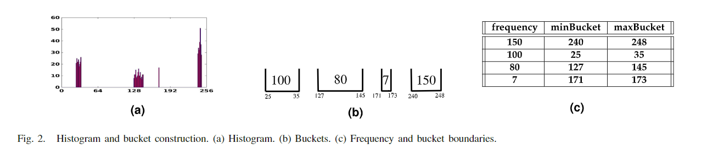
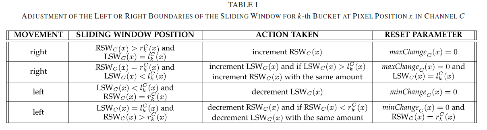
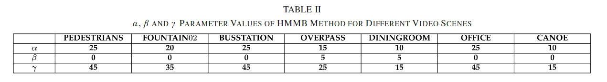
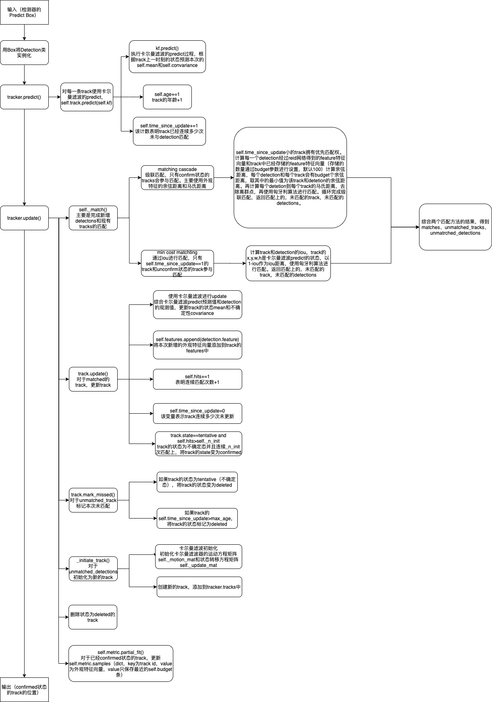

# Real-Time Adaptive Histogram Min-MaxBucket (HMMB) Model forBackground Subtraction

# 简介

本文提出了一种高效的实时背景减法算法。为图像中每个像素构建一个时域上的直方图。 根据时间强度直方图的连续非零频率的最小值和最大值构造背景模型，即直方图最小-最大桶。 该算法的一个新颖特征是使用**单个滑动窗口**来自适应地更新系统，即使在场景中突然或逐渐发生光照变化的情况下，也能捕获适当的背景。 

# 算法

## 0、算法总览

对视频图像中的每个像素点的每个通道都创建并初始化一个背景模型，将一开始的少数几帧图像作为训练图像，初始化后的背景模型包括一系列的**桶Buckets**，桶其中为该像素点出现过的像素值，桶的边界为该连续像素值的局部最小值和局部最大值，桶之间由未出现过的像素值分割开来。在完成对桶的初始化之后，新的输入图像帧为测试帧，我们对每个像素点的每个通道的值分为以下情况：

1. 新的像素值落在已经存在的背景模型当中。

2. 新的像素值由于**缓慢的光照变化**（局部或全局）落在了背景模型之外。3、新的像素值由于**剧烈的光照变化**落在背景模型之外。

对每一帧图像，我们计算了一个**局部时间差分图像**和**全局时间差分图像**，用于检测光照的缓慢和剧烈变化。通过以上的局部和全局差分图像来判断是否有平缓的或剧烈的光照变化发生。

如果由平缓的或剧烈的光照变化发生，我们通过一定的方式来更新模型使新的像素值落在更新后的模型内，如果没有以上三种情况发生且新的像素值仍落在模型外，则我们认定该像素点为前景图像。


## 1、模型初始化

输入：前n帧图像初始化模型(Algorithm 1)

 ```
for N帧中的每一帧 do

	for 一帧中的每个像素x do

		for 多通道 C ∈ {R, G ,B} do

			取n帧中的每个灰度值构造直方图

			将直方图分为连续的K_C(x)个Buckets(区间)，创建数组 minBucket_C(x) maxBucket_C(x) ，用于记录区间的左值和右值。

			统计所有的像素值，并更新Buckets

			将Buckets按照降序排序

		end for

	end for

end for

 ```

$$
minBucket_c(x) = {l_1^C(x), l_1^C(x),...,l_K^C(x)}
$$

$$
maxBucket_c(x) = {r_1^C(x), r_1^C(x),...,r_K^C(x)}
$$

用$K_C(x)$表示桶的数量，设定$LSW_C(x)$和$RSW_C(x)$表示一组桶



以上表为例，对前n帧的x位置的像素点进行直方图统计后得到**图A**的直方图，其中像素值分布可以划分为四个开区间: (25, 35), (127, 145), (171, 173), (240, 248)，如**图B**，再根据每个区间中统计的像素数量进行降序排序得到**表C**。

## 2、三种检测情况

1、对于当前像素点P_C(x)，在Buckets中搜索包含该像素点值的区间。如果找到了一个区间包含该像素点，则我们将x设定为**预定背景**

2、若第一步未查找到，则进入第二步：针对视频中局部和全局的平滑缓慢光照变化，我们在桶的左(右)区域寻找正(负)的渐变。如果第k个bucket的搜索成功，则将x设定为**预定背景**

3、若前二步未查找到，则进入第三步：在第三步中查找图像中的光照突变，通过计算当前帧与前一帧之间的局部时间差值的中值。如果该中值表明第k个桶附近的光照发生突变，则更新该桶并将x设定为**预定背景**

在以上三种情况中全部查找失败的像素将被认定为**前景**

## 3、局部和全局像素强度变化

对于视频序列中的局部的和全局的光照变化，模型需要一个自适应的更新来识别前景像素。

本文为局部和全局的光照变化给予相同的权重，为每个像素的每个通道设定**4个参数**

前两个参数用于捕获由于照明变化而导致的**初始桶附近的微小变化**。

1. 第一个参数用于记录连续两帧之间的x位置的像素差值，用于捕捉局部光照变化

$$
newDiffold_C^t(x) = P_C^t(x) - P_C^{t-1}
$$

2. 第二个参数用于记录这个变化的累积和

$$
diifSum_C^t(x) = \sum_{i=2}^tnewDiffold_C^i(x)
$$

后两个参数$minChange_C(x)$和$maxChange_C(x)$用于视频场景中**大的（突然的）正负光照变化**。将在后文讨论

## 4、HMMB模型的自适应更新过程



为了适应视频序列中的突然\缓慢的光照变化，通过一个滑动窗口扩展桶的边界。

### 1、为光照缓变更新模型

如果一个测试帧的像素点不属于HMMB模型，要么该像素点属于前景像素点，要么该像素位置的光照发生了变化。

如果一个像素$P_C^t(x)$不落在任何一个桶的边界内，我们有以下两个选择：

1. 当$newDiffold_C^t(x)$和$diffSum_C^t(x)$都是正值，我们检测以下两个条件，如果两个条件都满足，则我们根据Table1中的策略将$diffSum_C^t(x)$添加到$l_k^C$或$r_k^C$或两者。
   1. $newDiffold_C^t(x) \in [0,\alpha], (\alpha > 0)$
   2. $diffSum_C^t(x) \in [\beta, \gamma], (\gamma > \beta > 0)$

其中$(\alpha, \beta, \gamma)$是一个三元参数，用于度量初始桶需要在任意一侧扩展多少才能同时捕获局部和全局光照变化。

2. 当$newDiffold_C^t(x)$和$diffSum_C^t(x)$都是负值，我们检测以下两个条件，如果两个条件都满足，则我们根据Table1中的策略将$diffSum_C^t(x)$的绝对值添加到$l_k^C$或$r_k^C$或两者。
   1. $newDiffold_C^t(x) \in [-\alpha， 0], (\alpha > 0)$
   2. $diffSum_C^t(x) \in [-\gamma， -\beta], (\gamma > \beta > 0)$

通过$diffSum_C^t(x)$来跟踪像素点在当前帧与第一个测试帧之间的差异。

如果在视频序列中没有发现光照缓变，那么就尝试去寻找光照突变。通过将正值或负值的$newDiffold_C^t(x)$加到$maxChange_C(x)$或$minChange_C(x)$来捕获光照突变。

### 2、为光照突变更新模型

在一些可能引起光照突变的场景（室内场景中的开关灯、车道上的突降大雨），大多数像素的$newDiffold_C^t(x)$绝对值都很高。

对第t帧的测试图像的通道C，我们取得一个中位值m，使得$newDiffold_C^t(x)$大于m和小于m的像素数量都占50%。

如果这个**中位值m大于用户指定的一个阈值**$\zeta$，那么我们就可以得出结论：有50%的像素变化大于$\zeta$。这说明了视频序列中出现了光照突变。

如果第k个桶的领域发生光照突变，则通过滑动窗口来更新bucket。

**if** $median(newDiffold_C^t) \ge \zeta$， **add** $maxChange_C(x)$ with $r_k^C(x)$ or $l_k^C(x)$ or both, and after that reset $maxChange_C(x)$ to 0(see Table Ⅰ)

**if** $median(newDiffold_C^t) \le -\zeta$， **add absolute value of ** $minChange_C(x)$ with $r_k^C(x)$ or $l_k^C(x)$ or both, and after that reset $minChange_C(x)$ to 0

### 3、寻找中位值

利用传统的中位值寻找方法，其时间复杂度会达到O(NxN)，而采用O(N)的线性查找算法又会占用大量的内存空间，因此**当我们预先知道输入数据集的范围时**，本文设计了一种寻找中位值的算法【Algorithm 2】。

在本文中$newDiffold_C^t(x) \in [-255, 255]$，其取511个连续整数中的整数值。我们为每个整数统计频率，从一侧开始累加直到其达到总频率值的一半。（这算法也太简单了）

```c++
std::vector<int> diffArr(511, 0);
for(c : {R,G,B})
{
    for(x : all position)
    {
        diffArr[newDiffold[c][x]]++;
    }
    int N = {pixel number};
    int sum = 0;
    int j = 0;
    for(; sum < N/2 ; j++)
    {
        sum += diffArr[j];
    }
	//分情况讨论结果
    if(N%2 == 1)
    {
        if(N/2 and (N − 1)/2 both are in j-th cell)
            return j-255;
		if(N/2 in j-th cell and (N − 1)/2 in ( j − 1)-th cell)
            return j-255.5; 
    }
    else
    {
        return j-255;
    }

}


```

### 4、面向背景划分的二分类

如果像素在上述三种情况中的任意一种匹配成功，则认为其为背景像素。否则为前景像素。

### 5、复杂度的计算

Algorithm 1: O(NCn) = O(N)

Algorithm 2: O(C*(N+511)) = O(N)

# 参数设置

本文中只有4个需要用户设定的参数

1. $\alpha$ 用于局部光照变化
2. $\beta$ 和 $\gamma$ 用于全局光照变化
3. $\zeta$ 用于光照突变



其中$\zeta$设置为20


# SIMPLE ONLINE AND REALTIME TRACKING WITH A DEEP ASSOCIATION METRIC(DeepSort)



