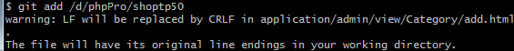

# 基本配置

```
git config --global user.name "YWYSurFace"
git config --global user.email "937577027@qq.com"
```


# 为GITHUB添加SSH Keys

```shell
ssh-keygen -t ed25519 -C "937577027@qq.com"

eval `ssh-agent -s`

ssh-add ~/.ssh/id_ed25519

clip < ~/.ssh/id_ed25519.pub

#github.com user -> settings -> SSH and GPG keys -> New SSH key
```


## LF will be replaced by CRLF

出现这个问题的原因是像缓存区中提交文件时出现的



原因：

windows中的换行符为 CRLF，而在Linux下的换行符为LF，所以在执行add . 时出现提示

也就是，

工作区的文件都应该用 CRLF 来换行。如果 改动文件时引入了 LF,提交改动时，git 会警告你哪些文件不是纯 CRLF 文件，但 git 不会擅自修改工作区的那些文件，而是对暂存区（我们对工作区的改动）进行修改。也因此，当我们进行 git add 的操作时，只要 git 发现改动的内容里有 LF 换行符，就还会出现这个警告。


git工作区默认为CRLF来作为换行符，所以当我们项目文件里有用的地方使用LF作为换行符，这个时候我们再继续git add 或则git commit的时候就会弹出警告，当最终push到远程仓库的时候git会统一格式全部转化为用CRLF作为换行符 


**解决方式：** 

**情况一：**

Git 可以在你提交时自动地把回车（CR）和换行（LF）转换成换行（LF），而在检出代码时把换行（LF）转换成回车（CR）和换行（LF）。 你可以用`git config --global core.autocrlf true` 来打开此项功能。 如果是在 Windows 系统上，把它设置成 true，这样在检出代码时，换行会被转换成回车和换行：

```
#提交时转换为LF，检出时转换为CRLF

$ git config --global core.autocrlf true
```

**情况二：**

如果使用以换行（LF）作为行结束符的 Linux 或 Mac，你不需要 Git 在检出文件时进行自动的转换。然而当一个以回车（CR）和换行（LF）作为行结束符的文件不小心被引入时，你肯定想让 Git 修正。 所以，你可以把 core.autocrlf 设置成 input 来告诉 Git 在提交时把回车和换行转换成换行，检出时不转换：（这样在 Windows 上的检出文件中会保留回车和换行，而在 Mac 和 Linux 上，以及版本库中会保留换行。）

```
#提交时转换为LF，检出时不转换

$ git config --global core.autocrlf input
```

**情况三：**

如果你是 Windows 程序员，且正在开发仅运行在 Windows 上的项目，可以设置 false 取消此功能，把回车保留在版本库中：

```
#提交检出均不转换

$ git config --global core.autocrlf false
```

你也可以在文件提交时进行safecrlf检查

```
#拒绝提交包含混合换行符的文件

git config --global core.safecrlf true   

#允许提交包含混合换行符的文件

git config --global core.safecrlf false   

#提交包含混合换行符的文件时给出警告

git config --global core.safecrlf warn
```

**建议：**遇到了这种问题可以直接忽略，对我们整体工作不会造成影响！


# error: src refspec main does not match any

出现这个错误的原因是因为本地分支的默认名称为master，而远程分支的默认名称为main，修改分支名称同步即可

```
git branch -m <new branch name>
```


# 添加代理

```
git config --global http.proxy http://127.0.0.1:7890
git config --global https.proxy https://127.0.0.1:7890
```


# ignore更新

```
git rm -r --cached . 
git add . 
git commit -m 'update .gitignore'
```


# 撤销push，版本回退

git reset --soft