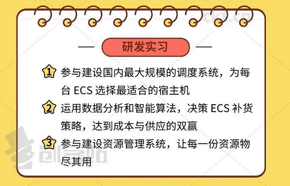
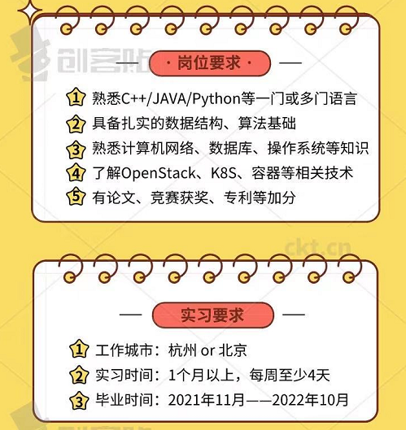
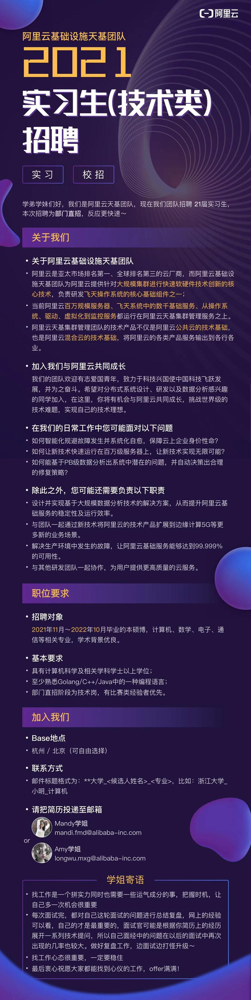
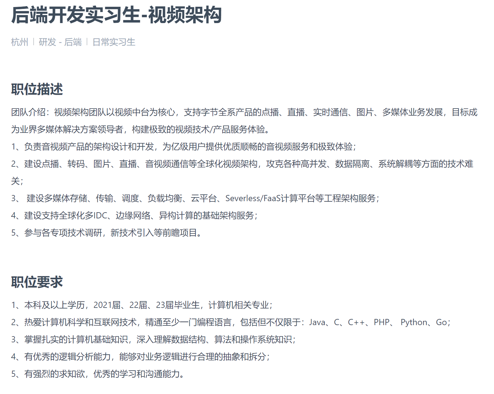
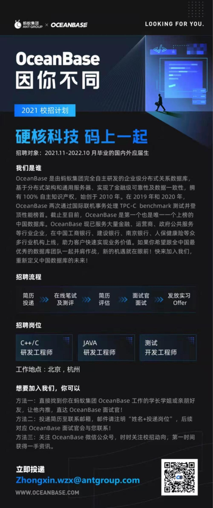

# 2021.1.14 阿里云上层网络实习

## 一面

投递时间2020.12.22

自我介绍

求职意向

介绍一个项目：RPC服务器

背景、任务、输出

说一说技术难点：需要保证从硬件采集到的脑机数据能够实时的读取，并发送到算法开发板做建模和预测、以及发送到客户端做显示。难点在于数据采集显示的实时性，以及算法建模对数据传输稳定性的要求。

**数据量多大？RPC服务器在接收到数据之后如何对数据进行处理？**	

首先通过read从fpga读取硬件驱动采集的数据，，服务器每次读取的数据大小是258通道x1024点x2字节大小的数据，并对数据进行重构，便于算法和客户端读取。这一段数据作为数据的主体内容，再发送时，对数据进行一个报文Message的封装，添加一个Message头部，其中包含了头部定义校验码、命令号、序列号、消息长度等信息。之后再将这个Message作为数据主体通过TCP发送出去。

**序列化和反序列化是怎么完成的？**

主机端字节序到网络端字节序的转换。使用xml文件对数据类型进行定义，实现序列化操作的解耦，在添加新的数据类型时，可以通过配置xml文件的方式动态序列化。

**发送数据时以什么形式发送？**

通过与客户端之间共同维护一个数据结构体，在发送时通过序列化将数据序列化为网络字节流发送，客户端接收到数据后再进行反序列化。

**不同客户端的不同消息是怎么通过多线程的方式处理的？**

通过一个单例模式的会话管理器来对不同客户端与服务器建立的连接进行管理。

每当一个客户端与服务器建立建立连接时，就会创建一个新的会话，每个会话是一个独立的线程，其中维护了这个连接的所有信息，然后将这个会话添加到会话管理器的活动列表中。通过在主进程中为每个会话注册回调函数，当会话接收到来自客户端的指令时，就会调用回调函数，在回调函数中对指令信息进行解析，并作出相应的操作，比如客户端发送指令设定采样率、开始建模等指令。

**如果在传输过程中遇到网络问题、传输中断，会怎么去解决？**

因为数据传输是基于会话的，因为这套设备是运行与自建组网中，网络中不会有其他设备抢占带宽，所以在设计的时候就会使用可以满足最大采样率的网络容量，可以避免出现在软件层面上出现网络拥塞的问题。然后因为设备之间的数据传输是基于会话的，如果发生了传输中断的情况，比如某个设备下线，那么之间建立的连接就会从服务器的会话管理器中删除，服务器就不会继续通过该会话发送数据，当客户端重新上线，再次建立连接时，服务器会与其建立一个新的连接，并在客户端进行消息订阅后重新开始向其发送数据。

**TCP是怎么保证可靠性的？**

超时重传、

为什么不用UDP协议？区别在哪里？

对数据有做分包吗?


人脸项目

多线程的使用场景？

多线程的原理是什么？为什么可以实现多线程？

多线程和多进程的区别是什么？

为什么多进程的上下文切换会比多线程消耗更大?

计算线程和IO线程切换时，数据是从哪里来的？（一开始没理解，提醒之后才知道是问内核态和用户态）

TCP的拥塞控制？

超时重传的时间具体是怎么样的？重试次数和间隔是怎么去定义的？

TCP为什么要四次挥手？

客户端在发起关闭连接之后，服务器还能继续处理数据吗？

客户端释放连接后，为什么要在TIME_WAIT状态等待2个超时间隔？

实现一个单例模式

```c++
mutex mt;

class Singleton
{
    public:
    	Singleton* Instance();
    	~Singleton();
    
    private:
    	Singleton(){};
    	
  		static Singleton* m_singleton;
};

Singleton* Singleton::m_singleton = nullptr;

Singleton* Singleton::Instance()
{
    if(m_singleton == nullptr)
    {
        mt.lock();
        if(m_singleton == nullptr)
            m_singleton = new Singleton();
        mt.unlock();
    }
    return m_singleton;
}
```


自己的总结：

内存管理的知识了解，线程、进程上下文切换的原理了解不够

内核态用户态交互了解不够

项目的思考不够深入：还有哪些问题，有没有改进的方法？

最好是针对岗位投递简历


# 阿里云智能弹性计算 

时间表：

- 2021/2/21 投递简历

投递邮箱：desy.dsy@alibaba-inc.com






> 尊敬的面试官：
>
>    您好，我叫俞伟勇，本科就读于浙江大学生物医学工程与仪器科学学院 测控技术与仪器专业，与2019年毕业保研至本校本专业，预计将于2022年3月毕业。
>
>    现希望能够申请贵部门的暑期研发实习生，以下附简历及自我介绍。
>    在研究生期间，我的研究内容是基于海思的智能视频平台的软件开发、算法部署、性能调优，以及基于Terga X1、T1等高性能嵌入式设备的终端软件设计。
>    我通过在线课堂自学了数据结构、算法、操作系统、计算机网络等计算机基础知识。积极参加实验室项目，以优异的成绩以及科研、工作成果获得了2020年国家奖学金。
>
>    我个人在生活中为人开朗、广交朋友、乐于助人，积极参加志愿者活动，有五星级志愿者称号，在学习、工作中兢兢业业，刻苦钻研、能够很好的完成手头的任务，并针对不足之处提出见解并改进。
>
>    以上。感谢阅读。
>
> 俞伟勇
>
> 2021/2/21


# 阿里云网络平台齐天

投递邮箱：
guanhuo.ys@alibaba-inc.com
投递时请备注 岗位-学校-姓名 哦

# 阿里云搜索推荐事业部


# 阿里云基础设施天基团队

投递邮箱：mandi.fmd@alibaba-inc.com

- 2021/2/21 投递简历
- 


# 字节跳动 后端开发实习生 视频架构



https://jobs.bytedance.com/referral/pc/position/6925716311843260680/detail?token=MzsxNjEyMTYxMTA3NDAxOzY4NDYwODc0MzcxNDQzOTMyMjk7MA


# 华为 Cloud & AI BG

https://career.huawei.com/reccampportal/portal5/campus-recruitment-detail.html?jobId=119004


# 阿里巴巴数据库2022届校园招聘PolarDB数据库内核开发工程师（C/C++）

招聘岗位： 

阿里巴巴数据库2022届校园招聘PolarDB数据库内核开发工程师（C/C++） 

工作地点为杭州、北京 

团队介绍： 数据库产品事业部承载着阿里巴巴的所有数据库产品。通过服务于海量用户、数十万数据库实例的产品级系统实践，我们逐步凝练出团队特有的具备高度创新的系统级先进技术。PolarDB是我们最核心的自研云数据库产品，技术上具有对其他厂商的代差优势。PolarDB采用存储计算分离、多节点集群架构，节点间采用实时内存复制技术，具有超高的可靠性、可用性，支持Serverless；使用RDMA+25G网络，存储采用创新的Parallel-Raft三副本协议，数据链路全用户态，性能澎湃。从DB层到存储层我们在全链路上做了大量创新，基于这些创新，近年来每年团队在VLDB、SIGMOD等数据库顶级会议上均有独立科研文章发表，同时也为开源社区贡献了大量代码。目前团队正在快速扩充，具有极好的职业发展机会。 

岗位要求： 

算法和编程能力、项目经验、在校成绩有一项或多项比较突出 

掌握一门编程语言（种类不限，包括JAVA、Python等），有良好编程功底 

无需任何数据库技术背景，不过需要对做底层技术比较感兴趣，有志于毕业后在阿里从事数据库内核工作 - 计算机及相关专业，博士、硕士、本科生均可  

联系人：[zunbao.fengzb@alibaba-inc.com](http://zunbao.fengzb@alibaba-inc.com/) （标题注明：实习简历）， 微信：fengzunxiaobao

# 蚂蚁集团 OCEANBASE

